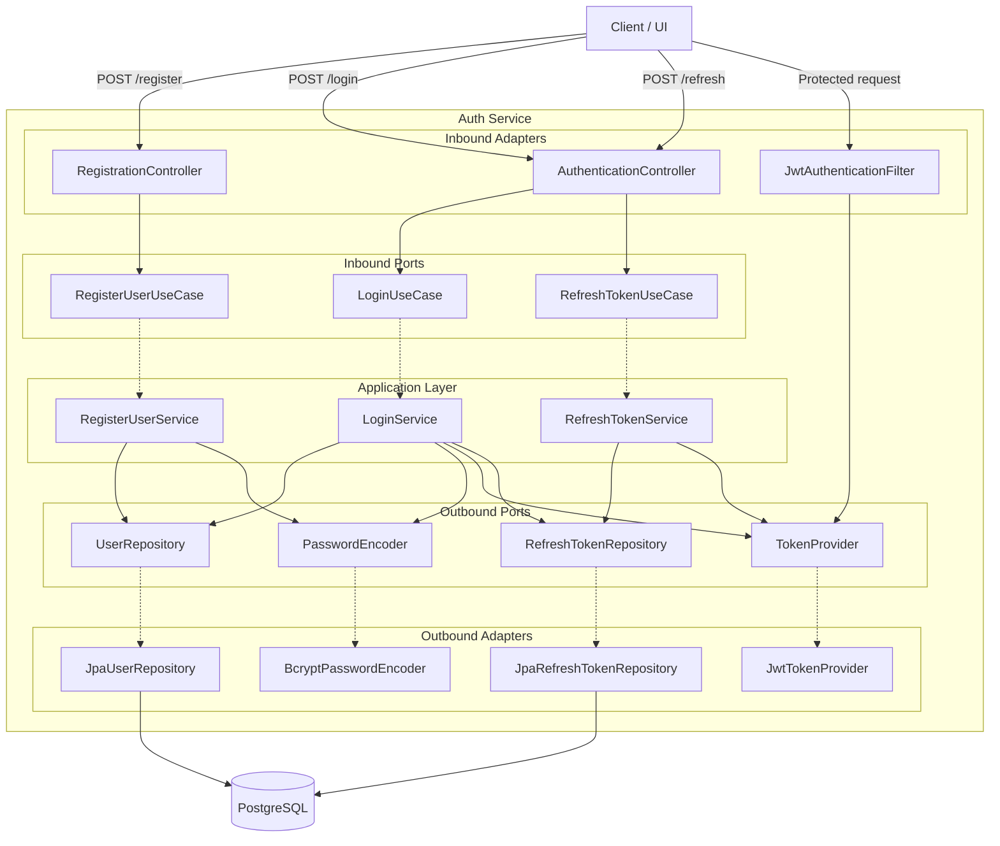

# Design Document — Auth Service (MVP1)

## Overview

The Auth Service MVP1 provides user registration, authentication, and token management for the HybridStrength platform. It is the foundational service that all other microservices depend on for identity verification. The service issues RS256-signed JWT access tokens and HttpOnly refresh cookies, enabling stateless authentication across the platform.

This design covers:
- User registration with email/password credentials
- Login with JWT access token + refresh token issuance
- Token refresh without re-authentication
- 401 rejection for invalid/missing JWTs on protected endpoints
- Bcrypt password hashing (cost factor 12)
- Exclusive ownership of the User data store
- Flyway-managed PostgreSQL schema

**Key design decisions and rationale:**
- **RS256 (asymmetric)** over HS256: allows other services to verify tokens using the public key without sharing a secret. Trade-off: slightly larger tokens and slower signing, but this is negligible for auth workloads.
- **HttpOnly refresh cookies** over body-delivered refresh tokens: prevents XSS from stealing refresh tokens. Trade-off: requires SameSite/Secure cookie configuration and CORS awareness.
- **Hexagonal architecture**: keeps domain logic framework-free, making it testable with plain JUnit and swappable adapters. Trade-off: more interfaces/files than a layered approach, but pays off in maintainability.
- **Stateless sessions**: no server-side session store needed. Trade-off: token revocation requires a separate mechanism (out of scope for MVP1).

---

## Architecture

### Hexagonal Architecture Mapping

The Auth Service follows the hexagonal (ports and adapters) pattern mandated by the platform architecture.

```
com.gmail.ramawthar.priyash.hybridstrength.authservice/
├── AuthServiceApplication.java
├── config/
│   ├── SecurityConfig.java          # SecurityFilterChain, CORS, CSRF, session policy
│   ├── JwtConfig.java               # RSA key pair loading, token expiry config
│   └── FlywayConfig.java            # Flyway configuration (if custom needed)
├── registration/
│   ├── domain/
│   │   └── User.java                # Domain entity (no framework imports)
│   ├── ports/
│   │   ├── inbound/
│   │   │   └── RegisterUserUseCase.java
│   │   └── outbound/
│   │       └── UserRepository.java
│   ├── application/
│   │   └── RegisterUserService.java  # Implements RegisterUserUseCase
│   └── adapters/
│       ├── inbound/
│       │   └── RegistrationController.java
│       └── outbound/
│           └── JpaUserRepository.java
├── authentication/
│   ├── domain/
│   │   ├── TokenPair.java            # Value object: access token + refresh token
│   │   └── RefreshToken.java         # Domain entity for stored refresh tokens
│   ├── ports/
│   │   ├── inbound/
│   │   │   ├── LoginUseCase.java
│   │   │   └── RefreshTokenUseCase.java
│   │   └── outbound/
│   │       ├── RefreshTokenRepository.java
│   │       ├── PasswordEncoder.java
│   │       └── TokenProvider.java
│   ├── application/
│   │   ├── LoginService.java         # Implements LoginUseCase
│   │   └── RefreshTokenService.java  # Implements RefreshTokenUseCase
│   └── adapters/
│       ├── inbound/
│       │   └── AuthenticationController.java
│       └── outbound/
│           ├── BcryptPasswordEncoder.java
│           ├── JwtTokenProvider.java
│           └── JpaRefreshTokenRepository.java
└── common/
    ├── dto/
    │   └── ErrorResponse.java        # Standard error response shape
    ├── exception/
    │   ├── DuplicateEmailException.java
    │   ├── InvalidCredentialsException.java
    │   ├── InvalidRefreshTokenException.java
    │   └── GlobalExceptionHandler.java
    └── security/
        └── JwtAuthenticationFilter.java  # OncePerRequestFilter for JWT validation
```

### Component Interaction Flow



---

## Components and Interfaces

### Inbound Ports

#### `RegisterUserUseCase`
```java
public interface RegisterUserUseCase {
    User register(String email, String rawPassword);
}
```

#### `LoginUseCase`
```java
public interface LoginUseCase {
    TokenPair login(String email, String rawPassword);
}
```

#### `RefreshTokenUseCase`
```java
public interface RefreshTokenUseCase {
    String refresh(String refreshTokenValue);
}
```

### Outbound Ports

#### `UserRepository`
```java
public interface UserRepository {
    Optional<User> findByEmail(String email);
    User save(User user);
    boolean existsByEmail(String email);
}
```

#### `RefreshTokenRepository`
```java
public interface RefreshTokenRepository {
    RefreshToken save(RefreshToken token);
    Optional<RefreshToken> findByToken(String tokenValue);
    void deleteByUserId(UUID userId);
}
```

#### `PasswordEncoder`
```java
public interface PasswordEncoder {
    String encode(String rawPassword);
    boolean matches(String rawPassword, String encodedPassword);
}
```

#### `TokenProvider`
```java
public interface TokenProvider {
    String generateAccessToken(UUID userId, String email, String role);
    String generateRefreshToken();
    UUID extractUserId(String accessToken);
    boolean validateAccessToken(String accessToken);
}
```

### Inbound Adapters (REST Controllers)

#### `RegistrationController`

| Method | Path | Auth | Description |
|--------|------|------|-------------|
| POST | `/api/v1/auth/register` | Public | Register a new user |

**Request body:**
```json
{
  "email": "[email]",
  "password": "[password]"
}
```

**Success response (201 Created):**
```json
{
  "id": "uuid",
  "email": "[email]",
  "createdAt": "2026-04-22T10:15:30Z"
}
```

**Error responses:**
- 400 Bad Request — validation failure (invalid email format, password < 8 chars)
- 409 Conflict — duplicate email

#### `AuthenticationController`

| Method | Path | Auth | Description |
|--------|------|------|-------------|
| POST | `/api/v1/auth/login` | Public | Authenticate and receive tokens |
| POST | `/api/v1/auth/refresh` | Cookie | Refresh the access token |

**Login request body:**
```json
{
  "email": "[email]",
  "password": "[password]"
}
```

**Login success response (200 OK):**
```json
{
  "accessToken": "eyJhbGciOiJSUzI1NiIs...",
  "tokenType": "Bearer",
  "expiresIn": 900
}
```
Plus `Set-Cookie: refreshToken=<opaque-value>; HttpOnly; Secure; SameSite=Strict; Path=/api/v1/auth/refresh; Max-Age=604800`

**Refresh request:** No body. The refresh token is read from the HttpOnly cookie.

**Refresh success response (200 OK):**
```json
{
  "accessToken": "eyJhbGciOiJSUzI1NiIs...",
  "tokenType": "Bearer",
  "expiresIn": 900
}
```
A new refresh token cookie is also set (token rotation).

**Error responses:**
- 401 Unauthorised — invalid credentials or invalid/expired refresh token

### JWT Token Structure

**Access token claims:**
```json
{
  "sub": "<user-uuid>",
  "email": "[email]",
  "role": "USER",
  "iat": 1719000000,
  "exp": 1719000900
}
```

- Signed with RS256 using the service's private key
- Expiry: 15 minutes
- Delivered in the response body

**Refresh token:**
- Opaque random string (UUID or secure random hex), not a JWT
- Stored hashed in the database (prevents stolen DB dump from yielding usable tokens)
- Expiry: 7 days
- Delivered as an HttpOnly cookie
- Token rotation: each refresh invalidates the old token and issues a new one

### Security Configuration

`SecurityConfig.java` configures the `SecurityFilterChain` bean:

- **Session management:** `STATELESS`
- **CSRF:** disabled (stateless JWT auth, no form-based flows)
- **Public endpoints:** `/api/v1/auth/register`, `/api/v1/auth/login`, `/api/v1/auth/refresh`
- **All other endpoints:** require valid JWT via `JwtAuthenticationFilter`
- **CORS:** explicitly configured (no wildcard origins in production)
- **No `WebSecurityConfigurerAdapter`** — uses `SecurityFilterChain` bean

`JwtAuthenticationFilter` (extends `OncePerRequestFilter`):
1. Extracts `Authorization: Bearer <token>` header
2. Validates the token signature and expiry via `TokenProvider`
3. Sets `SecurityContextHolder` authentication on success
4. Passes through (results in 401) on failure — Spring Security handles the rejection

---

## Data Models

### Domain Entities

#### `User` (domain object — no framework imports)

| Field | Type | Constraints |
|-------|------|-------------|
| `id` | `UUID` | PK, generated |
| `email` | `String` | Unique, not null, valid email format |
| `passwordHash` | `String` | Not null, bcrypt hash |
| `role` | `String` | Not null, default `"USER"` |
| `createdAt` | `Instant` | Not null, set on creation |
| `updatedAt` | `Instant` | Not null, updated on modification |

#### `RefreshToken` (domain object)

| Field | Type | Constraints |
|-------|------|-------------|
| `id` | `UUID` | PK, generated |
| `tokenHash` | `String` | Unique, not null, SHA-256 hash of the opaque token |
| `userId` | `UUID` | FK → users.id, not null |
| `expiresAt` | `Instant` | Not null |
| `createdAt` | `Instant` | Not null |

### Database Schema

Flyway migration range: V001–V099 (reserved for auth-service).

#### `V001__create_users_table.sql`

```sql
CREATE TABLE users (
    id          UUID PRIMARY KEY DEFAULT gen_random_uuid(),
    email       VARCHAR(255) NOT NULL UNIQUE,
    password_hash VARCHAR(255) NOT NULL,
    role        VARCHAR(50)  NOT NULL DEFAULT 'USER',
    created_at  TIMESTAMP WITH TIME ZONE NOT NULL DEFAULT now(),
    updated_at  TIMESTAMP WITH TIME ZONE NOT NULL DEFAULT now()
);

CREATE UNIQUE INDEX idx_users_email ON users (email);
```

#### `V002__create_refresh_tokens_table.sql`

```sql
CREATE TABLE refresh_tokens (
    id          UUID PRIMARY KEY DEFAULT gen_random_uuid(),
    token_hash  VARCHAR(255) NOT NULL UNIQUE,
    user_id     UUID NOT NULL REFERENCES users(id) ON DELETE CASCADE,
    expires_at  TIMESTAMP WITH TIME ZONE NOT NULL,
    created_at  TIMESTAMP WITH TIME ZONE NOT NULL DEFAULT now()
);

CREATE INDEX idx_refresh_tokens_user_id ON refresh_tokens (user_id);
CREATE UNIQUE INDEX idx_refresh_tokens_token_hash ON refresh_tokens (token_hash);
```

### Request/Response DTOs

#### `RegisterRequest`
```java
public record RegisterRequest(
    @NotNull @Email String email,
    @NotNull @Size(min = 8) String password
) {}
```

#### `RegisterResponse`
```java
public record RegisterResponse(UUID id, String email, Instant createdAt) {}
```

#### `LoginRequest`
```java
public record LoginRequest(
    @NotNull @Email String email,
    @NotNull String password
) {}
```

#### `AccessTokenResponse`
```java
public record AccessTokenResponse(String accessToken, String tokenType, long expiresIn) {}
```

#### `ErrorResponse`
```java
public record ErrorResponse(int status, String error, String message, String path, Instant timestamp) {}
```

#### `ValidationErrorResponse`
```java
public record ValidationErrorResponse(
    int status,
    String error,
    List<FieldError> errors,
    String path,
    Instant timestamp
) {
    public record FieldError(String field, String message) {}
}
```


---

## Correctness Properties

*A property is a characteristic or behavior that should hold true across all valid executions of a system — essentially, a formal statement about what the system should do. Properties serve as the bridge between human-readable specifications and machine-verifiable correctness guarantees.*

### Property 1: Registration round-trip

*For any* valid email address and password (≥ 8 characters), registering a user and then looking up by email should return a user with the same email and a non-null bcrypt password hash that is not equal to the raw password.

**Validates: Requirements 1.1**

### Property 2: Duplicate email rejection

*For any* email address, if a user with that email already exists in the repository, attempting to register a second user with the same email should be rejected (throw `DuplicateEmailException`) and the repository should still contain exactly one user with that email.

**Validates: Requirements 1.2**

### Property 3: Login produces valid JWT

*For any* registered user (valid email and password), calling login with the correct credentials should return a non-null access token that: (a) is parseable as a valid JWT, (b) contains the correct `sub` (user ID) and `email` claims, and (c) has an expiry in the future.

**Validates: Requirements 1.3**

### Property 4: Token refresh produces new access token

*For any* user with a valid (non-expired) refresh token, calling refresh should return a new access token that is parseable as a valid JWT with the correct `sub` claim, and the old refresh token should be invalidated (no longer usable).

**Validates: Requirements 1.4**

### Property 5: Invalid tokens are rejected

*For any* string that is not a validly-signed, non-expired JWT (including random strings, empty strings, expired tokens, and tokens signed with a different key), the `TokenProvider.validateAccessToken` method should return `false`.

**Validates: Requirements 1.5**

### Property 6: Password hashing round-trip with cost factor invariant

*For any* raw password string, encoding it with the `PasswordEncoder` should produce a hash where: (a) `matches(rawPassword, hash)` returns `true`, (b) the hash is not equal to the raw password, and (c) the bcrypt hash prefix indicates a cost factor of at least 12 (i.e., the hash matches the pattern `$2a$1[2-9]$...` or `$2b$1[2-9]$...`).

**Validates: Requirements 1.6**

---

## Error Handling

### Exception Hierarchy

| Exception | HTTP Status | When |
|-----------|-------------|------|
| `DuplicateEmailException` | 409 Conflict | Registration with an already-registered email |
| `InvalidCredentialsException` | 401 Unauthorised | Login with wrong email or password |
| `InvalidRefreshTokenException` | 401 Unauthorised | Refresh with expired, missing, or invalid refresh token |
| `MethodArgumentNotValidException` (Spring) | 400 Bad Request | Jakarta validation failure on request body |
| Unhandled exceptions | 500 Internal Server Error | Unexpected errors |

### `GlobalExceptionHandler` (`@RestControllerAdvice`)

- Catches each custom exception and maps it to the standard `ErrorResponse` shape defined in api-standards.md
- Catches `MethodArgumentNotValidException` and maps it to `ValidationErrorResponse` with per-field errors
- Catches generic `Exception` as a fallback, returns 500 with a safe message (no stack traces, no internal class names)
- All error responses include `status`, `error`, `message`, `path`, and `timestamp`
- Never exposes SQL, internal identifiers, or stack traces in any error response

### Security Error Handling

- `JwtAuthenticationFilter` does not throw exceptions on invalid tokens — it simply does not set the `SecurityContext`, allowing Spring Security to return 401
- The `AuthenticationEntryPoint` is configured to return the standard `ErrorResponse` JSON shape for 401 responses (not the default Spring HTML error page)

### Sensitive Data Rules

- Passwords are never logged, returned in responses, or stored in plaintext
- JWT tokens and refresh tokens are never logged
- Error messages for invalid credentials are generic ("Invalid email or password") — do not reveal whether the email exists

---

## Testing Strategy

### Testing Layers

#### 1. Unit Tests (JUnit 5 + Mockito)

Test domain logic and use cases in isolation. No Spring context.

| Target | What to test |
|--------|-------------|
| `RegisterUserService` | Successful registration, duplicate email rejection, password encoding delegation |
| `LoginService` | Successful login with correct credentials, rejection with wrong password, rejection with unknown email |
| `RefreshTokenService` | Successful refresh, expired token rejection, invalid token rejection, token rotation |
| `JwtTokenProvider` | Token generation, claim extraction, validation of valid/invalid/expired tokens |
| `User` domain object | Construction invariants, email/password constraints |

Naming convention: `MethodName_StateUnderTest_ExpectedBehaviour`

Mock all outbound ports (`UserRepository`, `RefreshTokenRepository`, `PasswordEncoder`, `TokenProvider`).

#### 2. Property-Based Tests (jqwik)

Used to verify the correctness properties defined above. Each property is implemented as a single `@Property(tries = 100)` test method.

| Test Class | Properties Covered |
|------------|-------------------|
| `RegistrationPropertyTest` | Property 1 (registration round-trip), Property 2 (duplicate rejection) |
| `AuthenticationPropertyTest` | Property 3 (login produces valid JWT), Property 4 (token refresh) |
| `JwtValidationPropertyTest` | Property 5 (invalid tokens rejected) |
| `PasswordEncodingPropertyTest` | Property 6 (bcrypt round-trip + cost factor) |

Each test method must include a comment tag referencing the design property:
```java
// Feature: auth-service-mvp1, Property 1: Registration round-trip
@Property(tries = 100)
void registrationRoundTrip(@ForAll @Email String email, @ForAll @StringLength(min = 8, max = 72) String password) {
    // ...
}
```

Property tests use in-memory fakes (not mocks) for outbound ports to test real behavior without Spring context.

#### 3. Integration Tests (Testcontainers + @SpringBootTest)

Full request/response cycle tests against real PostgreSQL via Testcontainers.

| Test Suite | Scenarios |
|------------|-----------|
| `AuthIntegrationTest` | Register → login → access protected endpoint → refresh → access again |
| | Register with duplicate email → 409 |
| | Login with wrong password → 401 |
| | Access protected endpoint without token → 401 |
| | Access protected endpoint with expired token → 401 |
| | Flyway migrations run successfully on startup |

Configuration:
- `@SpringBootTest(webEnvironment = RANDOM_PORT)` with `WebTestClient`
- Testcontainers PostgreSQL 16
- `@Transactional` rollback or explicit teardown between tests
- Flyway migrations validated as part of context startup

### Test Data

- Use builder/factory methods for `User`, `RefreshToken`, and request DTOs
- Never use production data
- Generate random valid emails and passwords for property tests using jqwik's built-in providers

