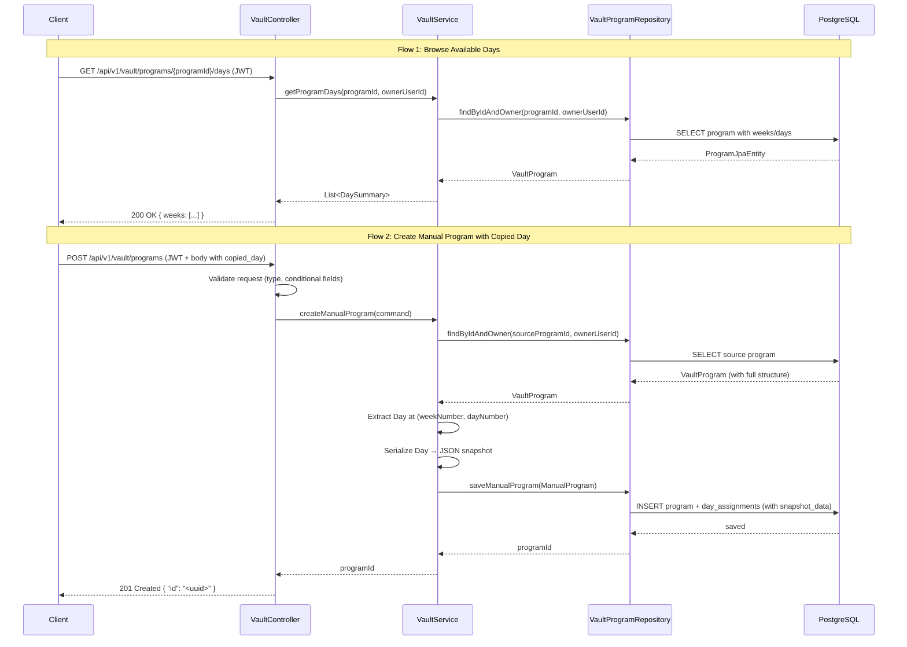
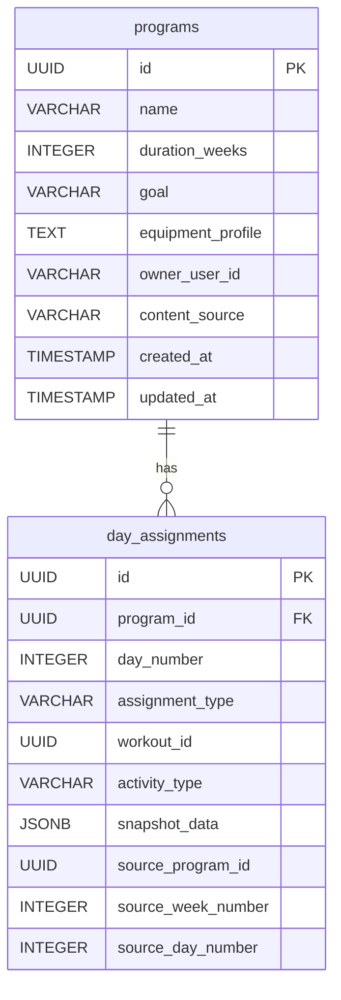

# Design Document: Copy Day to Manual Program

## Overview

This design extends the manual program feature to support copying a specific day from an existing vault program as an independent JSON snapshot. The feature spans both the backend (workout-creator-service) and frontend (workout-coach-ui).

**Backend:** A new `COPIED_DAY` assignment type is added to the `day_assignments` table with a `snapshot_data` column (JSONB) storing the full day structure and provenance columns (`source_program_id`, `source_week_number`, `source_day_number`) for tracking. A new `GET /api/v1/vault/programs/{programId}/days` endpoint enables browsing available days. The existing `POST /api/v1/vault/programs` endpoint is extended to accept `"copied_day"` assignments alongside the existing `"activity"` type.

**Frontend:** The `DayAssignmentModal` drops the unused "Workout" tab and adds a "Copy Day" tab containing a two-step program picker → day picker flow. The `DayTile` component renders copied day metadata, and the `ProgramDetailPage` renders the full snapshot structure using the existing exercise display components.

**Key Design Decisions:**

| Decision | Rationale | Trade-off |
|----------|-----------|-----------|
| Store snapshot as JSONB in `day_assignments` | The snapshot must survive source deletion. A JSON column keeps everything in one row, enables indexing if needed, and avoids a separate table join. | Slightly larger row size (~1–50 KB typical), but well within PostgreSQL's TOAST handling. |
| No FK from `source_program_id` to `programs` | The snapshot must be independent. A hard FK would block source deletion and violate requirement 5. | Dangling provenance references are intentional — they're informational only. |
| Reuse existing `Day` domain model for snapshot | The `Day` object already represents the exact structure we need to copy. Jackson handles serialization/deserialization to JSONB natively. | Couples the snapshot schema to the domain model. If `Day` changes, old snapshots still deserialize correctly (Jackson ignores unknown fields, uses defaults for missing ones). |
| Two-step modal flow (program list → day picker) | Provides clear context at each step. Users know what they're selecting. | Requires two API calls (program list + program days), but both are fast reads. |

## Architecture



## Components and Interfaces

### Backend Changes

#### 1. Domain Model Changes

**`DayAssignmentType` enum** — add `COPIED_DAY`:

```java
public enum DayAssignmentType {
    WORKOUT,
    ACTIVITY,
    COPIED_DAY
}
```

**`DayAssignment` record** — extend with snapshot and provenance fields:

```java
public record DayAssignment(
    int dayNumber,
    DayAssignmentType type,
    UUID workoutId,          // non-null when type = WORKOUT
    String activityType,     // non-null when type = ACTIVITY
    String snapshotData,     // non-null when type = COPIED_DAY (serialized JSON)
    UUID sourceProgramId,    // non-null when type = COPIED_DAY
    Integer sourceWeekNumber,// non-null when type = COPIED_DAY
    Integer sourceDayNumber  // non-null when type = COPIED_DAY
) {
    /** Backwards-compatible constructor for ACTIVITY/WORKOUT types. */
    public DayAssignment(int dayNumber, DayAssignmentType type, UUID workoutId, String activityType) {
        this(dayNumber, type, workoutId, activityType, null, null, null, null);
    }
}
```

**`DaySummary` record** — lightweight day info for the browse endpoint:

```java
public record DaySummary(
    int weekNumber,
    int dayNumber,
    String label,
    String focusArea
) {}
```

#### 2. New Inbound Port

**`GetProgramDaysUseCase`** (in `vault/ports/inbound/`):

```java
public interface GetProgramDaysUseCase {
    List<DaySummary> getProgramDays(UUID programId, String ownerUserId);
}
```

#### 3. Controller Changes

**New endpoint** on `VaultController`:

```java
@GetMapping(path = "/{id}/days", produces = MediaType.APPLICATION_JSON_VALUE)
public ResponseEntity<?> getProgramDays(@PathVariable String id, HttpServletRequest request) {
    UUID programId = parseUuid(id);
    if (programId == null) {
        return badRequest("Invalid program ID format", request);
    }

    String ownerUserId = resolveOwnerUserId();
    List<DaySummary> days = getProgramDaysUseCase.getProgramDays(programId, ownerUserId);

    // Group by week for the response
    ProgramDaysResponse response = ProgramDaysResponse.from(days);
    return ResponseEntity.ok(response);
}
```

**Updated `validateDayAssignments`** — accept both `"activity"` and `"copied_day"`:

```java
private ResponseEntity<?> validateDayAssignments(List<DayAssignmentRequest> days, HttpServletRequest request) {
    Set<Integer> seenDayNumbers = new HashSet<>();

    for (DayAssignmentRequest day : days) {
        String type = day.type();
        if (!"activity".equalsIgnoreCase(type) && !"copied_day".equalsIgnoreCase(type)) {
            return badRequest(
                "Invalid day type '" + type + "'. Valid types are: activity, copied_day",
                request);
        }

        if ("activity".equalsIgnoreCase(type)) {
            if (day.activityType() == null || day.activityType().isBlank()) {
                return badRequest("Activity type is required for activity-type days", request);
            }
        }

        if ("copied_day".equalsIgnoreCase(type)) {
            if (day.sourceProgramId() == null || day.sourceProgramId().isBlank()) {
                return badRequest("sourceProgramId is required for copied_day assignments", request);
            }
            if (day.sourceWeekNumber() == null || day.sourceWeekNumber() < 1) {
                return badRequest("sourceWeekNumber must be a positive integer for copied_day assignments", request);
            }
            if (day.sourceDayNumber() == null || day.sourceDayNumber() < 1) {
                return badRequest("sourceDayNumber must be a positive integer for copied_day assignments", request);
            }
        }

        if (!seenDayNumbers.add(day.dayNumber())) {
            return badRequest("Day numbers must be unique", request);
        }
    }

    return null;
}
```

#### 4. Request/Response DTOs

**`DayAssignmentRequest`** — extended with source fields:

```java
public record DayAssignmentRequest(
    @Min(value = 1, message = "Day number must be positive")
    int dayNumber,

    @NotBlank(message = "Day type is required")
    String type,

    String workoutId,
    String activityType,
    String sourceProgramId,     // required when type = "copied_day"
    Integer sourceWeekNumber,   // required when type = "copied_day"
    Integer sourceDayNumber     // required when type = "copied_day"
) {}
```

**`ProgramDaysResponse`** — response for the browse days endpoint:

```java
public record ProgramDaysResponse(List<WeekDays> weeks) {

    public static ProgramDaysResponse from(List<DaySummary> days) {
        Map<Integer, List<DaySummary>> grouped = days.stream()
            .collect(Collectors.groupingBy(DaySummary::weekNumber));

        List<WeekDays> weeks = grouped.entrySet().stream()
            .sorted(Map.Entry.comparingByKey())
            .map(e -> new WeekDays(e.getKey(), e.getValue().stream()
                .map(d -> new DayEntry(d.dayNumber(), d.label(), d.focusArea()))
                .toList()))
            .toList();

        return new ProgramDaysResponse(weeks);
    }

    public record WeekDays(int weekNumber, List<DayEntry> days) {}
    public record DayEntry(int dayNumber, String label, String focusArea) {}
}
```

**`VaultProgramDetailResponse.DayAssignmentResponse`** — extended:

```java
public record DayAssignmentResponse(
    int dayNumber,
    String type,
    String workoutId,
    String activityType,
    Object snapshotData,         // deserialized JSON for copied_day (null for others)
    String sourceProgramId,
    Integer sourceWeekNumber,
    Integer sourceDayNumber
) {
    static DayAssignmentResponse from(DayAssignment da) {
        Object snapshot = null;
        if (da.snapshotData() != null) {
            // Deserialize JSON string to Object for Jackson serialization
            snapshot = deserializeSnapshot(da.snapshotData());
        }
        return new DayAssignmentResponse(
            da.dayNumber(),
            da.type().name().toLowerCase(),
            da.workoutId() != null ? da.workoutId().toString() : null,
            da.activityType(),
            snapshot,
            da.sourceProgramId() != null ? da.sourceProgramId().toString() : null,
            da.sourceWeekNumber(),
            da.sourceDayNumber()
        );
    }
}
```

#### 5. Service Layer Changes

The `VaultService` `createManualProgram` method is extended to handle `COPIED_DAY` assignments:

```java
@Override
public UUID createManualProgram(CreateManualProgramCommand command) {
    List<DayAssignment> resolvedAssignments = new ArrayList<>();

    for (DayAssignment day : command.dayAssignments()) {
        if (day.type() == DayAssignmentType.COPIED_DAY) {
            // Validate source program exists and belongs to user
            VaultProgram sourceProgram = vaultProgramRepository
                .findByIdAndOwner(day.sourceProgramId(), command.ownerUserId())
                .orElseThrow(() -> new SourceProgramNotFoundException(day.sourceProgramId()));

            // Find the specified week and day
            Day sourceDay = findDay(sourceProgram, day.sourceWeekNumber(), day.sourceDayNumber());

            // Serialize the day structure to JSON snapshot
            String snapshotJson = objectMapper.writeValueAsString(sourceDay);

            resolvedAssignments.add(new DayAssignment(
                day.dayNumber(), DayAssignmentType.COPIED_DAY,
                null, null, snapshotJson,
                day.sourceProgramId(), day.sourceWeekNumber(), day.sourceDayNumber()
            ));
        } else if (day.type() == DayAssignmentType.ACTIVITY) {
            resolvedAssignments.add(day);
        }
    }

    // Construct and persist
    Instant now = Instant.now();
    UUID programId = UUID.randomUUID();
    ManualProgram manualProgram = new ManualProgram(
        programId, command.programName(), command.ownerUserId(),
        ContentSource.MANUAL, resolvedAssignments, now, now
    );
    vaultProgramRepository.saveManualProgram(manualProgram);
    return programId;
}

private Day findDay(VaultProgram program, int weekNumber, int dayNumber) {
    return program.program().getWeeks().stream()
        .filter(w -> w.getWeekNumber() == weekNumber)
        .flatMap(w -> w.getDays().stream())
        .filter(d -> d.getDayNumber() == dayNumber)
        .findFirst()
        .orElseThrow(() -> new SourceDayNotFoundException(weekNumber, dayNumber));
}
```

The `VaultService` also implements `GetProgramDaysUseCase`:

```java
@Override
@Transactional(readOnly = true)
public List<DaySummary> getProgramDays(UUID programId, String ownerUserId) {
    VaultProgram program = vaultProgramRepository.findByIdAndOwner(programId, ownerUserId)
        .orElseThrow(ProgramAccessDeniedException::new);

    return program.program().getWeeks().stream()
        .flatMap(week -> week.getDays().stream()
            .map(day -> new DaySummary(week.getWeekNumber(), day.getDayNumber(),
                                       day.getLabel(), day.getFocusArea())))
        .toList();
}
```

#### 6. Entity Changes

**`DayAssignmentJpaEntity`** — add new columns:

```java
@Column(name = "snapshot_data", columnDefinition = "jsonb")
private String snapshotData;

@Column(name = "source_program_id")
private UUID sourceProgramId;

@Column(name = "source_week_number")
private Integer sourceWeekNumber;

@Column(name = "source_day_number")
private Integer sourceDayNumber;
```

### Frontend Changes

#### 1. Type Updates (`types/vault.ts` or `DayTile.tsx`)

```typescript
export interface DayAssignment {
  type: "workout" | "activity" | "copied_day" | null;
  workoutId?: string;
  workoutName?: string;
  activityType?: string;
  // Copied day fields
  sourceProgramId?: string;
  sourceProgramName?: string;
  sourceWeekNumber?: number;
  sourceDayNumber?: number;
  dayLabel?: string;
  focusArea?: string;
}
```

#### 2. DayAssignmentModal Changes

- Remove the "💪 Workout" tab entirely
- Add a "📋 Copy Day" tab
- Default active tab: `"activity"`
- New tab type: `type Tab = "activity" | "copyDay"`

The "Copy Day" tab content is a new `CopyDaySelector` component with two steps:
1. **Program list** — fetch from `GET /api/v1/vault/programs`, display name + content source
2. **Day picker** — fetch from `GET /api/v1/vault/programs/{id}/days`, display grouped by week

#### 3. New Components

**`CopyDaySelector`** — manages the two-step flow:

```typescript
interface CopyDaySelectorProps {
  onSelect: (assignment: DayAssignment) => void;
  excludeProgramId?: string; // the program being created (if saved)
}
```

States: `"programList"` → `"dayPicker"` with a back button.

**`ProgramPicker`** — renders the program list with loading/error states.

**`DayPicker`** — renders days grouped by week for a selected program.

#### 4. DayTile Changes

Update `getDisplayName` to handle `copied_day`:

```typescript
function getDisplayName(assignment: DayAssignment): string {
  if (assignment.type === "copied_day") {
    const label = assignment.dayLabel || `Week ${assignment.sourceWeekNumber} Day ${assignment.sourceDayNumber}`;
    return `📋 ${assignment.sourceProgramName} — ${label}`;
  }
  // ... existing logic
}
```

Add a visual badge/icon for copied_day tiles to differentiate from activity tiles.

#### 5. ProgramDetailPage Changes

When rendering day assignments for manual programs, add a branch for `type === "copied_day"` that:
1. Renders the full snapshot structure (warm-up, sections, exercises, cool-down) using the existing `DaySection`/`SectionBlock` components
2. Shows provenance: "Copied from [Program Name] — Week X, Day Y" (or "Deleted Program" if source is gone)

## Data Models

### Schema Migration: `V104__add_copied_day_support.sql`

```sql
-- Add new columns to day_assignments for copied_day support
ALTER TABLE day_assignments
    ALTER COLUMN assignment_type TYPE VARCHAR(30);

ALTER TABLE day_assignments
    ADD COLUMN snapshot_data JSONB,
    ADD COLUMN source_program_id UUID,
    ADD COLUMN source_week_number INTEGER,
    ADD COLUMN source_day_number INTEGER;

-- Note: source_program_id intentionally has NO foreign key to programs table
-- to ensure snapshot independence from the source program lifecycle.

COMMENT ON COLUMN day_assignments.snapshot_data IS 'JSON snapshot of the copied day structure (label, focus area, modality, warm-up, sections, exercises, cool-down). Null for activity-type assignments.';
COMMENT ON COLUMN day_assignments.source_program_id IS 'UUID of the program from which the day was copied. Provenance only — no FK constraint.';
COMMENT ON COLUMN day_assignments.source_week_number IS 'Week number in the source program at time of copy.';
COMMENT ON COLUMN day_assignments.source_day_number IS 'Day number within the source week at time of copy.';
```

### Snapshot JSON Structure

The `snapshot_data` column stores a serialized `Day` domain object. Example:

```json
{
  "dayNumber": 1,
  "label": "Push Day",
  "focusArea": "Push",
  "modality": "HYPERTROPHY",
  "warmUp": [
    { "movement": "Arm Circles", "instruction": "20 each direction" }
  ],
  "sections": [
    {
      "name": "Tier 1: Compound",
      "sectionType": "STRENGTH",
      "format": "Sets/Reps",
      "timeCap": null,
      "exercises": [
        {
          "name": "Bench Press",
          "modalityType": null,
          "sets": 4,
          "reps": "8-10",
          "weight": "80kg",
          "restSeconds": 120,
          "notes": "Pause at bottom"
        }
      ]
    }
  ],
  "coolDown": [
    { "movement": "Chest Stretch", "instruction": "30 seconds each side" }
  ],
  "methodologySource": null
}
```

### Updated Entity Relationship




## Correctness Properties

*A property is a characteristic or behavior that should hold true across all valid executions of a system — essentially, a formal statement about what the system should do. Properties serve as the bridge between human-readable specifications and machine-verifiable correctness guarantees.*

### Property 1: Snapshot serialization round-trip

*For any* valid `Day` domain object (with arbitrary label, focus area, modality, warm-up entries, sections with exercises including nullable fields, and cool-down entries), serializing it to JSON and then deserializing it back SHALL produce a `Day` object with identical field values for all fields defined in the snapshot structure.

**Validates: Requirements 4.2, 7.2**

### Property 2: Conditional required field validation for copied_day

*For any* day assignment request with `type` equal to `"copied_day"` where any of `sourceProgramId`, `sourceWeekNumber`, or `sourceDayNumber` is null or missing, the endpoint SHALL reject the request with HTTP 400 Bad Request.

**Validates: Requirements 1.2, 1.3**

### Property 3: Non-existent source program is rejected

*For any* UUID that does not exist in the authenticated user's vault when used as `sourceProgramId` in a `copied_day` assignment, the service SHALL reject the request with HTTP 400 Bad Request with a message indicating the source program was not found.

**Validates: Requirements 1.4, 3.1, 3.2**

### Property 4: Non-existent week/day combination is rejected

*For any* source program and any (`sourceWeekNumber`, `sourceDayNumber`) pair that does not correspond to an actual week and day within that program's structure, the service SHALL reject the request with HTTP 400 Bad Request.

**Validates: Requirements 1.5, 3.3**

### Property 5: Non-positive week/day numbers are rejected

*For any* `sourceWeekNumber` or `sourceDayNumber` value less than 1 (zero or negative) in a `copied_day` assignment, the endpoint SHALL reject the request with HTTP 400 Bad Request.

**Validates: Requirements 3.4**

### Property 6: Unrecognised assignment type is rejected

*For any* string value for the `type` field that is not `"activity"` or `"copied_day"`, the endpoint SHALL reject the request with HTTP 400 Bad Request listing the valid types.

**Validates: Requirements 8.3**

### Property 7: Browse days returns correct structure

*For any* vault program with an arbitrary number of weeks and days, the `GET /api/v1/vault/programs/{programId}/days` endpoint SHALL return a response where every day in the program appears exactly once, grouped under its correct week number, with the correct day number, label, and focus area.

**Validates: Requirements 2.1, 2.2**

## Error Handling

| Scenario | HTTP Status | Response Shape | Source |
|----------|-------------|----------------|--------|
| Bean validation failure (blank name, null days, size exceeded) | 400 | `ValidationErrorResponse` with `errors` array | Spring `MethodArgumentNotValidException` handler |
| Custom validation: missing conditional fields for copied_day | 400 | `ErrorResponse` — identifies missing field | Controller `validateDayAssignments` |
| Custom validation: unrecognised type value | 400 | `ErrorResponse` — lists valid types | Controller `validateDayAssignments` |
| Custom validation: non-positive week/day numbers | 400 | `ErrorResponse` — "must be a positive integer" | Controller `validateDayAssignments` |
| Custom validation: duplicate day numbers | 400 | `ErrorResponse` — "Day numbers must be unique" | Controller `validateDayAssignments` |
| Source program not found in user's vault | 400 | `ErrorResponse` — "Source program not found" | `SourceProgramNotFoundException` → `GlobalExceptionHandler` |
| Source week/day combination not found | 400 | `ErrorResponse` — "Day not found in source program" | `SourceDayNotFoundException` → `GlobalExceptionHandler` |
| Invalid UUID format for programId path param | 400 | `ErrorResponse` — "Invalid program ID format" | Controller `parseUuid` |
| Program not found for GET /days endpoint | 404 | `ErrorResponse` — via `ProgramAccessDeniedException` | Existing handler |
| Corrupted/unparseable snapshot_data in DB | 500 | `ErrorResponse` — "Snapshot could not be loaded" | Logged at ERROR level, generic message returned |
| Unexpected database error during copy | 500 | `ErrorResponse` — "An unexpected error occurred" | Existing generic `Exception` handler |
| Missing/invalid JWT | 401 | Spring Security default | Existing security filter chain |

### New Exception Classes

**`SourceProgramNotFoundException`** (in `common/exception/`):

```java
public class SourceProgramNotFoundException extends RuntimeException {
    private final UUID sourceProgramId;

    public SourceProgramNotFoundException(UUID sourceProgramId) {
        super("Source program not found in vault: " + sourceProgramId);
        this.sourceProgramId = sourceProgramId;
    }

    public UUID getSourceProgramId() { return sourceProgramId; }
}
```

**`SourceDayNotFoundException`** (in `common/exception/`):

```java
public class SourceDayNotFoundException extends RuntimeException {
    private final int weekNumber;
    private final int dayNumber;

    public SourceDayNotFoundException(int weekNumber, int dayNumber) {
        super("Day not found in source program: week " + weekNumber + ", day " + dayNumber);
        this.weekNumber = weekNumber;
        this.dayNumber = dayNumber;
    }

    public int getWeekNumber() { return weekNumber; }
    public int getDayNumber() { return dayNumber; }
}
```

**Handlers in `GlobalExceptionHandler`:**

```java
@ExceptionHandler(SourceProgramNotFoundException.class)
public ResponseEntity<ErrorResponse> handleSourceProgramNotFound(
        SourceProgramNotFoundException ex, HttpServletRequest request) {
    HttpStatus status = HttpStatus.BAD_REQUEST;
    ErrorResponse body = new ErrorResponse(
        status.value(), status.getReasonPhrase(),
        "Source program not found", request.getRequestURI(), Instant.now());
    return ResponseEntity.status(status).body(body);
}

@ExceptionHandler(SourceDayNotFoundException.class)
public ResponseEntity<ErrorResponse> handleSourceDayNotFound(
        SourceDayNotFoundException ex, HttpServletRequest request) {
    HttpStatus status = HttpStatus.BAD_REQUEST;
    ErrorResponse body = new ErrorResponse(
        status.value(), status.getReasonPhrase(),
        ex.getMessage(), request.getRequestURI(), Instant.now());
    return ResponseEntity.status(status).body(body);
}
```

## Testing Strategy

### Property-Based Tests (jqwik)

Property-based testing is appropriate here because the core logic involves serialization round-trips, input validation over large input spaces (arbitrary strings, integers, UUID combinations, nested structures), and structural transformations of the `Day` domain model.

**Library:** jqwik (already in the project)
**Configuration:** `@Property(tries = 100)` minimum per property
**Test class:** `CopyDayPropertyTest` in `src/test/java/.../workoutcreator/property/`

| Property | Test Method | Tag |
|----------|-------------|-----|
| Property 1 | `snapshotSerializationRoundTrip` | Feature: copy-day-to-manual-program, Property 1: Snapshot serialization round-trip |
| Property 2 | `missingCopiedDayFieldsRejected` | Feature: copy-day-to-manual-program, Property 2: Conditional required field validation for copied_day |
| Property 3 | `nonExistentSourceProgramRejected` | Feature: copy-day-to-manual-program, Property 3: Non-existent source program is rejected |
| Property 4 | `nonExistentWeekDayRejected` | Feature: copy-day-to-manual-program, Property 4: Non-existent week/day combination is rejected |
| Property 5 | `nonPositiveWeekDayNumbersRejected` | Feature: copy-day-to-manual-program, Property 5: Non-positive week/day numbers are rejected |
| Property 6 | `unrecognisedTypeRejected` | Feature: copy-day-to-manual-program, Property 6: Unrecognised assignment type is rejected |
| Property 7 | `browseDaysReturnsCorrectStructure` | Feature: copy-day-to-manual-program, Property 7: Browse days returns correct structure |

**Generator strategy:**
- `Day` objects: generate with arbitrary strings for label/focusArea, random Modality enum value, random-length lists of WarmCoolEntry/Section/Exercise with nullable fields randomly set to null
- `DayAssignmentRequest` for Property 2: generate with type = "copied_day" and randomly null out one or more of the three required fields
- For Property 3: generate random UUIDs, mock repository to return `Optional.empty()`
- For Property 4: generate programs with known structure, then reference week/day combos outside that structure
- For Property 7: generate programs with 1–5 weeks, 1–7 days per week, verify response structure matches

### Unit Tests (JUnit 5 + Mockito)

**Service layer:**
- `CreateManualProgram_WithCopiedDay_PersistsSnapshotAndProvenance` — happy path
- `CreateManualProgram_SourceProgramNotFound_ThrowsSourceProgramNotFoundException`
- `CreateManualProgram_SourceDayNotFound_ThrowsSourceDayNotFoundException`
- `CreateManualProgram_MixedTypes_ProcessesAllCorrectly` — activity + copied_day in same request
- `GetProgramDays_ValidProgram_ReturnsDaySummaries`
- `GetProgramDays_EmptyProgram_ReturnsEmptyList`
- `GetProgramDays_ProgramNotOwned_ThrowsProgramAccessDeniedException`

**Controller layer:**
- `ValidateDayAssignments_CopiedDayMissingSourceProgramId_Returns400`
- `ValidateDayAssignments_CopiedDayNonPositiveWeekNumber_Returns400`
- `ValidateDayAssignments_UnknownType_Returns400WithValidTypesList`
- `ValidateDayAssignments_ValidCopiedDay_PassesValidation`

### Integration Tests

- `POST /api/v1/vault/programs` with copied_day → 201 + verify day_assignments row has snapshot_data
- `POST /api/v1/vault/programs` with copied_day referencing non-existent source → 400
- `GET /api/v1/vault/programs/{id}/days` → 200 with correct structure
- `GET /api/v1/vault/programs/{id}/days` for non-owned program → 404
- `GET /api/v1/vault/programs/{id}` for manual program with copied_day → 200 with full snapshot in response
- Delete source program → `GET /api/v1/vault/programs/{id}` for target manual program still returns 200 with snapshot intact

### Frontend Tests (Vitest + React Testing Library)

- `DayAssignmentModal` renders only "Activity" and "Copy Day" tabs (no "Workout")
- `DayAssignmentModal` defaults to "Activity" tab on open
- `CopyDaySelector` shows loading state, then renders program list
- `CopyDaySelector` excludes current program from list
- `CopyDaySelector` shows day picker when program is selected
- `CopyDaySelector` calls onSelect with correct copied_day assignment data
- `DayTile` renders copied_day assignment with source program name and day label
- `DayTile` renders copied_day with distinct visual treatment (icon/badge)
- `ProgramDetailPage` renders full snapshot structure for copied_day assignments
- `ProgramDetailPage` shows "Deleted Program" provenance when source is gone
