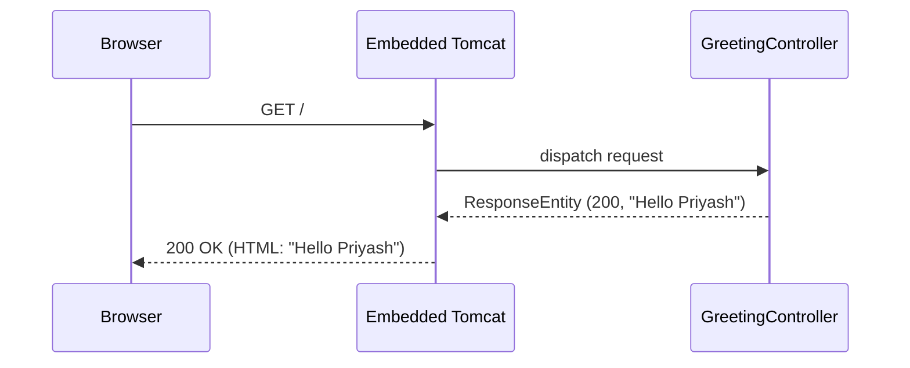

# Design Document: Hello World App

## Overview

The Hello World App is a minimal Spring Boot web application that serves a "Hello Priyash" greeting to users who navigate to its URL in a browser. The application starts an embedded Tomcat HTTP server, listens on a configured port, and responds to GET requests with an HTML page displaying the greeting message. It is designed to be simple, fast, and reliable — completing startup within 1 second and responding with the correct HTTP status and body on every request.

## Architecture

The application follows a single-tier Spring MVC architecture: an embedded Tomcat server managed by Spring Boot handles incoming requests and routes them to a `@RestController` that returns the greeting response.



There are no external dependencies, databases, or background workers. Spring Boot auto-configures the embedded server and wires the controller automatically.

## Components and Interfaces

### GreetingController

A `@RestController` that handles HTTP GET requests to `/` and returns the greeting response.

```java
@RestController
public class GreetingController {

    private final GreetingService greetingService;

    public GreetingController(GreetingService greetingService) {
        this.greetingService = greetingService;
    }

    @GetMapping("/")
    public ResponseEntity<String> greet() {
        String html = greetingService.renderGreeting();
        return ResponseEntity.ok()
                .contentType(MediaType.TEXT_HTML)
                .body(html);
    }
}
```

### GreetingService

Encapsulates the greeting message and HTML rendering logic.

```java
@Service
public class GreetingService {

    static final String MESSAGE = "Hello Priyash";

    public String renderGreeting() {
        return "<html><body><h1>" + MESSAGE + "</h1></body></html>";
    }
}
```

### Application Entry Point

Standard Spring Boot main class.

```java
@SpringBootApplication
public class HelloWorldApplication {
    public static void main(String[] args) {
        SpringApplication.run(HelloWorldApplication.class, args);
    }
}
```

## Data Models

There are no persistent data models. The only domain value is the greeting response, represented as a plain `ResponseEntity<String>`:

| Field | Type | Value |
|---|---|---|
| status | int | 200 |
| Content-Type | String | `text/html` |
| body | String | HTML containing `"Hello Priyash"` |

The greeting message constant is defined in `GreetingService.MESSAGE = "Hello Priyash"`.

## Correctness Properties

*A property is a characteristic or behavior that should hold true across all valid executions of a system — essentially, a formal statement about what the system should do. Properties serve as the bridge between human-readable specifications and machine-verifiable correctness guarantees.*

### Property 1: Greeting message is always present in the response body

*For any* HTTP GET request made to the server's root path, the response body SHALL contain the string "Hello Priyash".

**Validates: Requirements 1.1, 1.2**

### Property 2: Response always has HTTP 200 status

*For any* HTTP GET request made to the server's root path, the response status code SHALL be 200.

**Validates: Requirements 2.1**

### Property 3: Greeting renderer always embeds the message

*For any* greeting message string, the HTML produced by the renderer SHALL contain that message as a substring.

**Validates: Requirements 1.1**

## Error Handling

| Scenario | Behavior |
|---|---|
| Port already in use at startup | Spring Boot logs the error and the JVM exits with a non-zero exit code |
| Unhandled exception in controller | Spring MVC returns HTTP 500; error is logged |
| JVM receives SIGTERM | Spring Boot shutdown hook stops Tomcat gracefully; JVM exits with code 0 |

If the application cannot bind to the configured port, it SHALL exit with a non-zero exit code per Requirement 1.3.

## Testing Strategy

### Unit Tests (JUnit 5)

Use `@WebMvcTest` for controller-layer tests and plain JUnit 5 for service tests. Focus on specific examples and edge cases.

- Verify `GreetingService.renderGreeting()` returns a string containing `"Hello Priyash"`
- Verify `GET /` returns HTTP 200 with `Content-Type: text/html`
- Verify `GET /` response body contains `"Hello Priyash"`
- Verify the application context loads without errors (`@SpringBootTest`)

```java
@WebMvcTest(GreetingController.class)
class GreetingControllerTest {

    @Autowired MockMvc mockMvc;

    @MockBean GreetingService greetingService;

    @Test
    void rootReturns200WithGreeting() throws Exception {
        when(greetingService.renderGreeting())
            .thenReturn("<html><body><h1>Hello Priyash</h1></body></html>");

        mockMvc.perform(get("/"))
               .andExpect(status().isOk())
               .andExpect(content().contentTypeCompatibleWith(MediaType.TEXT_HTML))
               .andExpect(content().string(containsString("Hello Priyash")));
    }
}
```

### Property-Based Tests (jqwik)

Use [jqwik](https://jqwik.net/) for property-based testing. Each property test runs a minimum of 100 tries (jqwik default is 1000).

**Property 1 & 2: Controller always returns 200 with greeting**

```java
// Feature: hello-world-app, Property 1 & 2: response always has HTTP 200 and contains "Hello Priyash"
@Property(tries = 100)
void controllerAlwaysReturns200WithGreeting() throws Exception {
    // For any invocation of GET /, the status is 200 and body contains "Hello Priyash"
    mockMvc.perform(get("/"))
           .andExpect(status().isOk())
           .andExpect(content().string(containsString("Hello Priyash")));
}
```

**Property 3: Renderer always embeds the message**

```java
// Feature: hello-world-app, Property 3: greeting renderer always embeds the message
@Property(tries = 100)
void rendererAlwaysEmbedsMessage(@ForAll @NotBlank String message) {
    // For any non-blank message string, the rendered HTML contains that message
    GreetingService svc = new GreetingService() {
        @Override public String renderGreeting() {
            return "<html><body><h1>" + message + "</h1></body></html>";
        }
    };
    assertThat(svc.renderGreeting()).contains(message);
}
```

Both unit and property tests are required for comprehensive coverage: unit tests catch concrete bugs and edge cases, property tests verify general correctness across all inputs.
