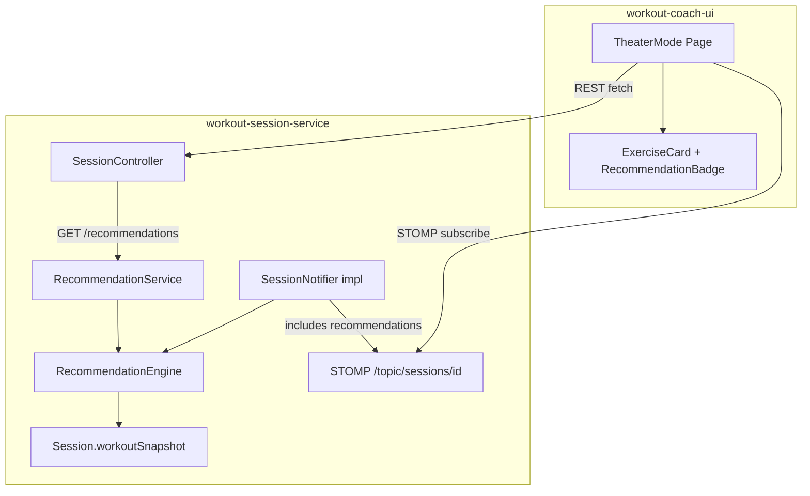

# Design Document: Theater Mode Recommendations

## Overview

Theater Mode Recommendations adds a pure domain component (`RecommendationEngine`) to the existing `workout-session-service` that extracts prescribed exercise parameters (weight, reps, sets) from the workout snapshot stored on the Session aggregate. The engine produces `ExerciseRecommendation` value objects which are served to the UI through two channels: a new REST endpoint and the existing STOMP WebSocket session state messages.

The feature is entirely read-derived — it computes recommendations from data already present on the Session (the `workoutSnapshot` JSONB field) without any new database tables, external service calls, or state mutations. This makes it a low-risk addition to the session service with high testability through property-based testing.

### Design Rationale

- **No new persistence**: Recommendations are computed on-the-fly from the existing workout snapshot. Adding a cache or table would introduce synchronization concerns with zero benefit given the small JSON payload size.
- **Domain component, not a separate service**: The recommendation logic is tightly coupled to the session's workout snapshot. Extracting it to a separate service would add network latency for no isolation benefit.
- **Modality-aware**: The engine branches on the Day's `modality` field (HYPERTROPHY vs CROSSFIT) to determine which fields to populate. This mirrors how the UI will render recommendations differently per modality.

## Architecture



The recommendation flow is:

1. **REST path**: UI calls `GET /api/v1/sessions/{sessionId}/recommendations` → `RecommendationController` → `RecommendationService` → `RecommendationEngine.computeAll(session)` → returns full list grouped by section.
2. **WebSocket path**: Whenever `SessionNotifier.notifySessionUpdate(session)` fires, the adapter enriches the STOMP payload with recommendations for the *current section only* via `RecommendationEngine.computeForSection(session, currentSectionIndex)`.

### Hexagonal Placement

| Layer | Artifact |
|-------|----------|
| `domain` | `ExerciseRecommendation` (value object), `Modality` enum (reuse from snapshot parsing) |
| `ports/inbound` | `GetRecommendationsUseCase` interface |
| `application` | `RecommendationService` (implements use case, orchestrates engine + session lookup) |
| `domain` (engine) | `RecommendationEngine` (pure function class, no dependencies) |
| `adapters/inbound` | `RecommendationController` (REST), enrichment logic in `StompSessionNotifier` |

The `RecommendationEngine` lives in the domain layer because it is a pure function operating on domain data (the workout snapshot JSON + modality). It has no framework imports.

## Components and Interfaces

### 1. ExerciseRecommendation (Value Object)

```java
package ...workoutsession.session.domain;

/**
 * Immutable value object representing the prescribed parameters for one exercise.
 * All fields are nullable — a fully-null recommendation means "no prescription available."
 */
public record ExerciseRecommendation(
    int sectionIndex,
    int exerciseIndex,
    String prescribedWeight,    // nullable, max 50 chars, non-blank if present
    String prescribedReps,      // nullable, max 50 chars, non-blank if present
    Integer prescribedSets      // nullable, range [1, 100] if present
) {
    public ExerciseRecommendation {
        if (prescribedWeight != null && prescribedWeight.isBlank()) {
            throw new IllegalArgumentException("prescribedWeight must not be blank");
        }
        if (prescribedWeight != null && prescribedWeight.length() > 50) {
            throw new IllegalArgumentException("prescribedWeight must not exceed 50 characters");
        }
        if (prescribedReps != null && prescribedReps.isBlank()) {
            throw new IllegalArgumentException("prescribedReps must not be blank");
        }
        if (prescribedReps != null && prescribedReps.length() > 50) {
            throw new IllegalArgumentException("prescribedReps must not exceed 50 characters");
        }
        if (prescribedSets != null && (prescribedSets < 1 || prescribedSets > 100)) {
            throw new IllegalArgumentException("prescribedSets must be between 1 and 100");
        }
    }

    /** Returns true if all prescription fields are null. */
    public boolean isEmpty() {
        return prescribedWeight == null && prescribedReps == null && prescribedSets == null;
    }
}
```

### 2. RecommendationEngine (Domain Service)

```java
package ...workoutsession.session.domain;

/**
 * Pure domain service that computes exercise recommendations from the workout snapshot.
 * No framework dependencies — testable with plain JUnit and jqwik.
 */
public class RecommendationEngine {

    /**
     * Computes recommendations for ALL exercises across all sections in the session.
     *
     * @param workoutSnapshot the raw JSON program snapshot from the Session
     * @param weekNumber      the week number for navigation within the snapshot
     * @param dayNumber       the day number for navigation within the snapshot
     * @return ordered list of ExerciseRecommendation grouped by section, then exercise index
     */
    public List<ExerciseRecommendation> computeAll(String workoutSnapshot, int weekNumber, int dayNumber);

    /**
     * Computes recommendations for exercises in a single section.
     *
     * @param workoutSnapshot    the raw JSON program snapshot
     * @param weekNumber         the week number
     * @param dayNumber          the day number
     * @param sectionIndex       the target section index (0-based)
     * @return ordered list of ExerciseRecommendation for the specified section
     */
    public List<ExerciseRecommendation> computeForSection(String workoutSnapshot, int weekNumber,
                                                           int dayNumber, int sectionIndex);
}
```

Key behaviours:
- Parses the snapshot JSON to locate the Day node (weeks[weekNumber-1].days[dayNumber-1])
- Reads the Day's `modality` field to determine HYPERTROPHY vs CROSSFIT logic
- For each exercise in the target section(s), extracts `weight`, `reps`, `sets` fields
- **HYPERTROPHY**: populates all three fields; treats `sets == 0` as null
- **CROSSFIT**: populates only `prescribedWeight`; sets `prescribedReps` and `prescribedSets` to null
- If the section or exercise index is out of bounds in the snapshot, returns an all-null recommendation
- If the snapshot cannot be parsed, throws `SnapshotParseException`

### 3. GetRecommendationsUseCase (Inbound Port)

```java
package ...workoutsession.session.ports.inbound;

public interface GetRecommendationsUseCase {
    List<ExerciseRecommendation> getRecommendations(UUID sessionId, String userId);
    List<ExerciseRecommendation> getRecommendationsForSection(UUID sessionId, String userId, int sectionIndex);
}
```

### 4. RecommendationService (Application Layer)

```java
package ...workoutsession.session.application;

@Service
public class RecommendationService implements GetRecommendationsUseCase {
    // Dependencies: SessionRepository, RecommendationEngine
    // 1. Load session, verify ownership
    // 2. Delegate to RecommendationEngine with session.workoutSnapshot, weekNumber, dayNumber
    // 3. Return computed recommendations
}
```

### 5. RecommendationController (Inbound Adapter)

```java
package ...workoutsession.session.adapters.inbound;

@RestController
@RequestMapping("/api/v1/sessions")
public class RecommendationController {

    @GetMapping("/{sessionId}/recommendations")
    public ResponseEntity<RecommendationsResponse> getRecommendations(
            @PathVariable UUID sessionId, Authentication auth) {
        // Returns 200 with grouped recommendations
        // 404 if session not found
        // 403 if not owner
        // 500 if snapshot parse fails
    }
}
```

### 6. RecommendationsResponse (DTO)

```java
public record RecommendationsResponse(
    List<SectionRecommendations> sections
) {
    public record SectionRecommendations(
        int sectionIndex,
        List<ExerciseRecommendationDto> exercises
    ) {}

    public record ExerciseRecommendationDto(
        int exerciseIndex,
        String prescribedWeight,
        String prescribedReps,
        Integer prescribedSets
    ) {}
}
```

### 7. WebSocket Enrichment (StompSessionNotifier modification)

The existing `StompSessionNotifier` (which implements `SessionNotifier`) will be enhanced to include a `recommendations` field in the session state message. The field contains recommendations for the *current section only*:

```java
// In the session state message DTO:
public record SessionStateMessage(
    // ... existing fields (status, currentSectionIndex, sectionProgresses, etc.)
    List<ExerciseRecommendationDto> recommendations  // NEW: current section only
) {}
```

If `RecommendationEngine.computeForSection(...)` throws, the `recommendations` field is set to an empty list and the message is still published.

### 8. Frontend Components

| Component | Location | Responsibility |
|-----------|----------|---------------|
| `useRecommendations` hook | `src/hooks/useRecommendations.ts` | Fetches recommendations via REST on section change, merges with WebSocket data |
| `RecommendationBadge` | `src/features/theater/RecommendationBadge.tsx` | Renders "80kg · 8-10 · 4" or "60kg" badge |
| `ExerciseCard` (modified) | `src/features/theater/ExerciseCard.tsx` | Integrates `RecommendationBadge` above set-logging controls |

## Data Models

### ExerciseRecommendation (Domain Value Object)

| Field | Type | Constraints |
|-------|------|-------------|
| `sectionIndex` | `int` | ≥ 0 |
| `exerciseIndex` | `int` | ≥ 0 |
| `prescribedWeight` | `String?` | null or non-blank, max 50 chars |
| `prescribedReps` | `String?` | null or non-blank, max 50 chars |
| `prescribedSets` | `Integer?` | null or [1, 100] |

### Workout Snapshot JSON Structure (existing, read-only)

```json
{
  "weeks": [
    {
      "weekNumber": 1,
      "days": [
        {
          "dayNumber": 1,
          "modality": "HYPERTROPHY",
          "sections": [
            {
              "name": "Main Lifts",
              "type": "STRENGTH",
              "exercises": [
                {
                  "name": "Barbell Squat",
                  "sets": 4,
                  "reps": "8-10",
                  "weight": "80kg",
                  "restSeconds": 120
                }
              ]
            }
          ]
        }
      ]
    }
  ]
}
```

### REST Response Shape

```json
{
  "sections": [
    {
      "sectionIndex": 0,
      "exercises": [
        {
          "exerciseIndex": 0,
          "prescribedWeight": "80kg",
          "prescribedReps": "8-10",
          "prescribedSets": 4
        },
        {
          "exerciseIndex": 1,
          "prescribedWeight": null,
          "prescribedReps": "12",
          "prescribedSets": 3
        }
      ]
    }
  ]
}
```

### WebSocket Message Extension

The existing session state STOMP message gains a new `recommendations` field:

```json
{
  "sessionId": "...",
  "status": "IN_PROGRESS",
  "currentSectionIndex": 0,
  "recommendations": [
    {
      "exerciseIndex": 0,
      "prescribedWeight": "80kg",
      "prescribedReps": "8-10",
      "prescribedSets": 4
    }
  ]
}
```


## Correctness Properties

*A property is a characteristic or behavior that should hold true across all valid executions of a system — essentially, a formal statement about what the system should do. Properties serve as the bridge between human-readable specifications and machine-verifiable correctness guarantees.*

### Property 1: HYPERTROPHY extraction preserves snapshot values

*For any* valid workout snapshot containing a HYPERTROPHY day with arbitrary exercises (each having a name, weight string or null, reps string or null, and sets integer), the `RecommendationEngine.computeAll(...)` SHALL produce an `ExerciseRecommendation` at each (sectionIndex, exerciseIndex) where:
- `prescribedWeight` equals the exercise's `weight` field from the snapshot (null if absent/null)
- `prescribedReps` equals the exercise's `reps` field from the snapshot (null if absent/null)
- `prescribedSets` equals the exercise's `sets` field if > 0, or null if sets == 0

**Validates: Requirements 1.1, 1.3, 2.1, 2.2, 2.3, 2.4**

### Property 2: CROSSFIT extraction returns only weight

*For any* valid workout snapshot containing a CROSSFIT day with arbitrary exercises (each having a weight string or null, reps string, and sets integer), the `RecommendationEngine.computeAll(...)` SHALL produce an `ExerciseRecommendation` at each (sectionIndex, exerciseIndex) where:
- `prescribedWeight` equals the exercise's `weight` field from the snapshot (null if absent/null)
- `prescribedReps` is always null regardless of the snapshot's reps value
- `prescribedSets` is always null regardless of the snapshot's sets value

**Validates: Requirements 3.1, 3.2, 3.3**

### Property 3: Output domain invariants

*For any* valid workout snapshot (HYPERTROPHY or CROSSFIT, with any number of sections and exercises), every `ExerciseRecommendation` produced by the `RecommendationEngine` SHALL satisfy:
- `prescribedSets` is either null or an integer in [1, 100]
- `prescribedReps` is either null or a non-blank string of at most 50 characters
- `prescribedWeight` is either null or a non-blank string of at most 50 characters

**Validates: Requirements 7.1, 7.2, 7.3**

### Property 4: Value object rejects invalid construction

*For any* `prescribedSets` value that is ≤ 0, or any `prescribedReps`/`prescribedWeight` value that is blank (whitespace-only or empty), constructing an `ExerciseRecommendation` SHALL throw `IllegalArgumentException`.

**Validates: Requirements 7.4**

### Property 5: Serialization round-trip

*For any* valid workout snapshot, computing the full list of `ExerciseRecommendation` objects, serializing them to JSON via Jackson, and deserializing back SHALL produce a list where each element has identical field values (null-equality for null fields, value-equality for non-null fields) to the original.

**Validates: Requirements 7.6**

### Property 6: WebSocket message scoped to current section

*For any* session with multiple sections and any `currentSectionIndex` value, the recommendations included in the STOMP session state message SHALL contain only `ExerciseRecommendation` objects whose `sectionIndex` equals `currentSectionIndex`. No recommendations for other sections shall be present.

**Validates: Requirements 5.1, 5.3**

### Property 7: Recommendation badge format correctness

*For any* non-empty `ExerciseRecommendation` (at least one non-null field), the UI badge format function SHALL produce a string that contains exactly the non-null field values joined by " · " in the order [weight, reps, sets], omitting null fields entirely. For CROSSFIT recommendations (only weight present), the string equals the weight value alone.

**Validates: Requirements 6.1, 6.2, 6.4**

## Error Handling

| Scenario | Layer | Behaviour |
|----------|-------|-----------|
| Snapshot JSON is malformed (not valid JSON) | `RecommendationEngine` | Throws `SnapshotParseException` (custom unchecked) |
| Snapshot is valid JSON but missing expected structure (no `weeks` array, missing `days`) | `RecommendationEngine` | Returns all-null recommendations for missing indices |
| Section/exercise index out of bounds in snapshot | `RecommendationEngine` | Returns `ExerciseRecommendation` with all fields null |
| Session not found | `RecommendationService` | Throws `SessionNotFoundException` → 404 |
| User does not own session | `RecommendationService` | Throws `AccessDeniedException` → 403 |
| Snapshot parse failure during REST call | `RecommendationController` | Catches `SnapshotParseException` → 500 with "Workout snapshot is corrupted" message |
| Snapshot parse failure during WebSocket push | `StompSessionNotifier` | Catches exception, sets `recommendations` to empty list, still publishes the state update |
| `prescribedReps` or `prescribedWeight` exceeds 50 chars in snapshot | `RecommendationEngine` | Truncates to 50 chars to satisfy value object constraint |
| `prescribedSets` in snapshot exceeds 100 | `RecommendationEngine` | Clamps to 100 to satisfy value object constraint |
| REST request with invalid UUID format | Spring framework | 400 Bad Request (automatic) |
| Missing Authorization header | Spring Security filter | 401 Unauthorized (automatic) |
| Frontend fetch fails (network error or non-200) | `useRecommendations` hook | Sets recommendations to empty, hides badge, does not block set logging |
| Frontend WebSocket disconnects | STOMP client | Falls back to REST fetch on next section change |

### Error Design Decisions

1. **Truncation vs rejection for oversized snapshot values**: The engine truncates rather than rejects because the snapshot was previously validated by the workout-creator-service. If a value somehow exceeds limits, it's better to show a truncated recommendation than no recommendation at all.

2. **Empty list fallback on WebSocket errors**: The session state message is the primary real-time update channel. Suppressing it because recommendations failed would break the entire Theater Mode experience. An empty recommendations list is a graceful degradation.

3. **SnapshotParseException as domain exception**: Not a generic `RuntimeException` — it signals a specific data integrity issue that the adapter layer can handle differently from other errors.

## Testing Strategy

### Property-Based Tests (jqwik)

The `RecommendationEngine` is a pure function operating on JSON input — an ideal candidate for property-based testing. All 7 correctness properties will be implemented as jqwik property tests.

**Library**: jqwik (already in project dependencies)
**Configuration**: Minimum 100 iterations per property (`@Property(tries = 100)`)
**Test class**: `RecommendationEnginePropertyTest`
**Location**: `workout-session-service/src/test/java/.../property/RecommendationEnginePropertyTest.java`

Each property test will:
1. Use custom `@Provide` methods to generate valid workout snapshots (arbitrary exercises, modalities, section counts)
2. Reference its design property via tag comment: `// Feature: theater-mode-recommendations, Property N: <title>`
3. Run at minimum 100 iterations

**Generators needed:**
- `validHypertrophySnapshot(int sections, int exercisesPerSection)` — generates JSON with HYPERTROPHY modality and random exercise parameters
- `validCrossFitSnapshot(int sections, int exercisesPerSection)` — generates JSON with CROSSFIT modality and random exercise parameters
- `validExerciseRecommendation()` — generates valid `ExerciseRecommendation` instances for round-trip testing
- `invalidExerciseRecommendationArgs()` — generates invalid construction arguments (blank strings, zero/negative sets)

**Additional property test class**: `ExerciseRecommendationPropertyTest` for Properties 4 and 5 (value object construction and serialization round-trip).

**Frontend property test**: `RecommendationBadge.property.test.ts` using `fast-check` for Property 7 (badge format correctness). Configuration: minimum 100 iterations.

### Unit Tests (JUnit 5 + Mockito)

| Test Class | Scope | Key Cases |
|-----------|-------|-----------|
| `RecommendationEngineTest` | Domain logic | Out-of-bounds indices return all-null; malformed JSON throws `SnapshotParseException`; empty sections array returns empty list |
| `RecommendationServiceTest` | Application layer (mocked ports) | Happy path delegates to engine; session not found throws; ownership check enforced |
| `RecommendationControllerTest` | Adapter (MockMvc) | 200 response shape; 404/403/500 mapping; auth header required |
| `ExerciseRecommendationTest` | Value object | All-null allowed (Req 7.5); boundary values (sets=1, sets=100); blank weight throws |

### Frontend Unit Tests (Vitest + React Testing Library)

| Test File | Component | Key Cases |
|-----------|-----------|-----------|
| `RecommendationBadge.test.tsx` | Badge rendering | HYPERTROPHY format; CROSSFIT format; all-null hides badge; partial nulls; loading state; error state |
| `useRecommendations.test.ts` | Hook logic | REST fetch on mount; WebSocket update merges; error fallback to empty |
| `ExerciseCard.test.tsx` | Integration | Badge does not overlap inputs; badge is read-only |

### Integration Tests

| Test | Scope |
|------|-------|
| `RecommendationEndpointIT` | Full REST round-trip: start session → GET recommendations → verify response shape and values |
| `WebSocketRecommendationIT` | Start session → subscribe STOMP → advance section → verify recommendations field in message |

### Test Data Strategy

- Snapshot fixtures stored as JSON resource files under `src/test/resources/snapshots/`
- jqwik generators build snapshots programmatically for property tests
- No production data used; all exercises have synthetic names and values
