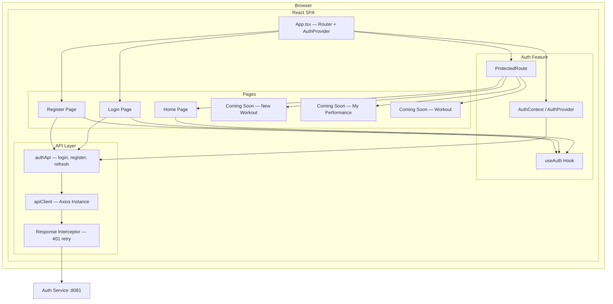
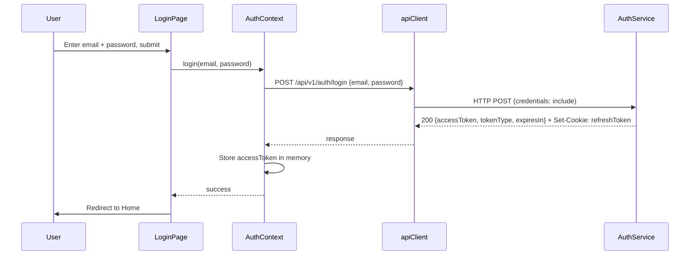
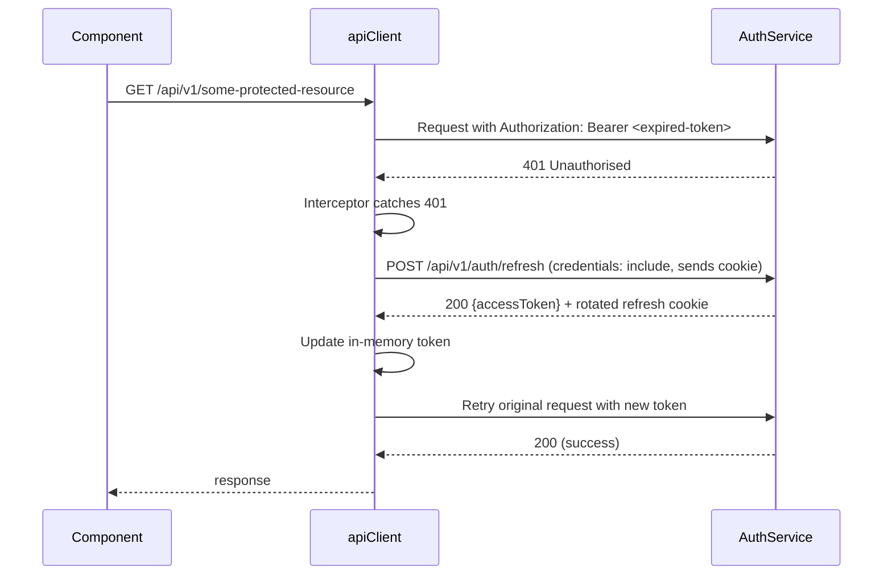

# Design Document — Workout Coach UI MVP1

## Overview

The Workout Coach UI MVP1 is the first frontend deliverable for the HybridStrength platform. It provides a working authentication flow (register, login, logout, silent token refresh) connected to the already-running Auth Service, and a stubbed home screen that establishes the application shell, routing structure, and navigation patterns for future features.

This design covers:
- Project scaffolding with Vite + React 18 + TypeScript + React Router v6
- API client layer with automatic JWT attachment and cookie-based refresh
- Auth context/provider for in-memory token management
- Token refresh interceptor (retry on 401)
- Route protection via an auth guard component
- Login and Registration page components with client-side validation
- Stubbed Home screen with "New Workout", "My Performance", and "Workout" actions routing to Coming Soon pages
- Vite dev proxy to the Auth Service on port 8081

**Key design decisions and rationale:**

- **In-memory token storage** over localStorage/sessionStorage: prevents XSS from stealing the access token. Trade-off: token is lost on page refresh, but the HttpOnly refresh cookie allows silent re-authentication. This is the recommended approach for SPAs handling JWTs.
- **Axios** over raw fetch: provides interceptor support out of the box, making the 401-retry-with-refresh pattern straightforward. Trade-off: adds a dependency (~13 KB gzipped), but the interceptor ergonomics justify it for an auth-heavy MVP.
- **React Context** for auth state over a state management library (Redux, Zustand): the auth state is simple (token + user info + loading flag). A full state library is unnecessary at this stage. Trade-off: if state grows significantly in later MVPs, migration to a dedicated store may be needed.
- **Vite proxy** for dev: avoids CORS issues during local development by proxying `/api` requests to `localhost:8081`. In production, a reverse proxy or API gateway will handle this. Trade-off: dev-only configuration that doesn't reflect production topology, but this is standard practice.
- **No logout endpoint**: the Auth Service does not currently expose a logout endpoint. The UI clears the in-memory token and attempts to clear the refresh cookie by navigating to a known path. A proper server-side logout can be added later without changing the UI contract significantly.

---

## Architecture

### Component Architecture



### Request Flow — Login



### Request Flow — Silent Token Refresh (401 Interceptor)



### Project Structure

```
workout-coach-ui/
├── index.html
├── src/
│   ├── main.tsx                    # ReactDOM.createRoot, BrowserRouter
│   ├── App.tsx                     # Route definitions, AuthProvider wrapper
│   ├── pages/
│   │   ├── Home.tsx                # Stubbed home with action cards
│   │   ├── ComingSoon.tsx          # Generic "Coming Soon" stub page
│   │   └── auth/
│   │       ├── Login.tsx           # Login form
│   │       └── Register.tsx        # Registration form
│   ├── components/
│   │   ├── ui/                     # Button, Input, Card, Alert primitives
│   │   └── layout/
│   │       └── ProtectedRoute.tsx  # Auth guard wrapper
│   ├── features/
│   │   └── auth/
│   │       ├── AuthContext.tsx      # React context + provider
│   │       └── useAuth.ts          # Convenience hook
│   ├── hooks/                      # Shared custom hooks (future)
│   ├── lib/
│   │   ├── apiClient.ts            # Axios instance + interceptors
│   │   └── authApi.ts              # Auth endpoint functions
│   └── types/
│       └── auth.ts                 # TypeScript interfaces for auth DTOs
├── public/
├── vite.config.ts                  # Dev proxy to :8081
├── tsconfig.json
└── package.json
```

---

## Components and Interfaces

### API Client Layer (`src/lib/apiClient.ts`)

A single Axios instance configured for the Auth Service:

```typescript
import axios from "axios";

const apiClient = axios.create({
  baseURL: "/api/v1",
  headers: { "Content-Type": "application/json" },
  withCredentials: true, // Required: sends HttpOnly cookies on every request
});
```

**Interceptor behaviour:**
- On 401 response (except from `/auth/login`, `/auth/register`, `/auth/refresh`):
  1. Pause the failed request
  2. Call `POST /api/v1/auth/refresh` (cookie sent automatically due to `withCredentials`)
  3. On success: update the in-memory token, retry the original request with the new token
  4. On failure: clear auth state, redirect to login
- A queue mechanism prevents multiple concurrent refresh calls when several requests fail simultaneously
- The interceptor attaches the `Authorization: Bearer <token>` header to every outgoing request via a request interceptor

### Auth API Functions (`src/lib/authApi.ts`)

```typescript
interface LoginRequest {
  email: string;
  password: string;
}

interface RegisterRequest {
  email: string;
  password: string;
}

interface AccessTokenResponse {
  accessToken: string;
  tokenType: string;
  expiresIn: number;
}

interface RegisterResponse {
  id: string;
  email: string;
  createdAt: string;
}

function login(data: LoginRequest): Promise<AccessTokenResponse>;
function register(data: RegisterRequest): Promise<RegisterResponse>;
function refresh(): Promise<AccessTokenResponse>;
```

### Auth Context (`src/features/auth/AuthContext.tsx`)

Provides auth state to the entire component tree:

```typescript
interface AuthState {
  accessToken: string | null;
  isAuthenticated: boolean;
  isLoading: boolean;  // true during initial refresh attempt on mount
}

interface AuthContextValue extends AuthState {
  login: (email: string, password: string) => Promise<void>;
  register: (email: string, password: string) => Promise<RegisterResponse>;
  logout: () => void;
}
```

**Behaviour:**
- On mount, the provider attempts a silent refresh (`POST /auth/refresh`). If the refresh cookie is valid, the user is seamlessly re-authenticated. If it fails, `isAuthenticated` remains `false` and `isLoading` becomes `false`.
- `login()` calls the login API, stores the access token in memory, sets `isAuthenticated = true`.
- `logout()` clears the in-memory token, sets `isAuthenticated = false`, and redirects to `/login`. Since there is no server-side logout endpoint, the refresh cookie will expire naturally (7 days) or be overwritten on next login.
- The access token is never written to localStorage or sessionStorage.

### Protected Route (`src/components/layout/ProtectedRoute.tsx`)

```typescript
function ProtectedRoute({ children }: { children: React.ReactNode }): JSX.Element;
```

- If `isLoading` is true: renders a loading indicator (spinner or skeleton)
- If `isAuthenticated` is false: redirects to `/login` via `<Navigate to="/login" replace />`
- If `isAuthenticated` is true: renders `children`

### Route Definitions (`src/App.tsx`)

| Path | Component | Auth Required |
|------|-----------|---------------|
| `/login` | `Login` | No |
| `/register` | `Register` | No |
| `/` | `Home` | Yes |
| `/new-workout` | `ComingSoon` | Yes |
| `/my-performance` | `ComingSoon` | Yes |
| `/workout` | `ComingSoon` | Yes |

Public routes (`/login`, `/register`) redirect to `/` if the user is already authenticated.

### Page Components

#### `Login.tsx`
- Email and password fields with client-side validation (email format, password non-empty)
- Submits via `useAuth().login()`
- Displays server-side errors (invalid credentials, validation errors) mapped from the API error response shape
- Link to registration page
- On success: redirects to `/` (or the originally requested URL if stored)

#### `Register.tsx`
- Email and password fields with client-side validation (email format, password ≥ 8 characters)
- Submits via `useAuth().register()`
- Displays server-side errors (duplicate email, validation errors)
- Link to login page
- On success: redirects to `/login` with a success message

#### `Home.tsx`
- Displays three action cards: "New Workout", "My Performance", "Workout"
- Each card is a `<Link>` to its respective stub route
- Shows the user's email (decoded from the JWT or stored during login) and a logout button

#### `ComingSoon.tsx`
- Generic stub page accepting a `title` prop (or reading from route state)
- Displays "Coming Soon" message and a back/home link

### Vite Configuration (`vite.config.ts`)

```typescript
export default defineConfig({
  plugins: [react()],
  server: {
    port: 5173,
    proxy: {
      "/api": {
        target: "http://localhost:8081",
        changeOrigin: true,
        secure: false,
      },
    },
  },
});
```

This proxies all `/api/*` requests to the Auth Service during development, avoiding CORS issues. The `withCredentials: true` on Axios ensures cookies are forwarded through the proxy.

---

## Data Models

### TypeScript Types (`src/types/auth.ts`)

```typescript
// --- Request DTOs ---

export interface LoginRequest {
  email: string;
  password: string;
}

export interface RegisterRequest {
  email: string;
  password: string;
}

// --- Response DTOs ---

export interface AccessTokenResponse {
  accessToken: string;
  tokenType: string;   // Always "Bearer"
  expiresIn: number;   // Seconds (900 = 15 minutes)
}

export interface RegisterResponse {
  id: string;          // UUID
  email: string;
  createdAt: string;   // ISO-8601
}

// --- Error Response DTOs (matching Auth Service shapes) ---

export interface ApiErrorResponse {
  status: number;
  error: string;
  message: string;
  path: string;
  timestamp: string;
}

export interface FieldError {
  field: string;
  message: string;
}

export interface ValidationErrorResponse {
  status: number;
  error: string;       // "Validation Failed"
  errors: FieldError[];
  path: string;
  timestamp: string;
}

// --- Auth State ---

export interface AuthState {
  accessToken: string | null;
  isAuthenticated: boolean;
  isLoading: boolean;
}
```

### Client-Side Validation Rules

These mirror the Auth Service's Jakarta Bean Validation constraints:

| Field | Rule | Auth Service Constraint |
|-------|------|------------------------|
| `email` | Must be non-empty and match a basic email pattern | `@NotNull @Email` |
| `password` (login) | Must be non-empty | `@NotNull` |
| `password` (register) | Must be ≥ 8 characters | `@NotNull @Size(min = 8)` |

Client-side validation provides immediate feedback. Server-side validation is the source of truth — the UI always displays server errors when they differ from client expectations.

### Token Storage Model

| Data | Storage | Lifetime |
|------|---------|----------|
| Access token (JWT) | JavaScript variable in AuthContext (in-memory) | Until page refresh or logout |
| Refresh token | HttpOnly cookie set by Auth Service | 7 days (managed by browser, not accessible to JS) |
| User email | Extracted from JWT payload or stored in AuthContext on login | Same as access token |

The access token is never persisted to disk. On page refresh, the AuthProvider attempts a silent refresh via the cookie. If the cookie is expired or invalid, the user must log in again.

---

## Correctness Properties

*A property is a characteristic or behavior that should hold true across all valid executions of a system — essentially, a formal statement about what the system should do. Properties serve as the bridge between human-readable specifications and machine-verifiable correctness guarantees.*

### Property 1: Registration client-side validation rejects invalid inputs

*For any* string that does not match a valid email format, or any password string shorter than 8 characters, the registration form validation function should return an error and prevent form submission. Conversely, for any valid email string and any password string of 8 or more characters, the validation function should return no errors.

**Validates: Requirements 1.1**

### Property 2: Successful login stores token and sets authenticated state

*For any* valid `AccessTokenResponse` (containing a non-empty `accessToken`, `tokenType` of `"Bearer"`, and a positive `expiresIn`), after the auth context processes a successful login, the auth state should have `isAuthenticated === true` and `accessToken` equal to the response's `accessToken`.

**Validates: Requirements 1.3**

### Property 3: 401 interceptor triggers refresh and retries the original request

*For any* API request to a protected endpoint (not `/auth/login`, `/auth/register`, or `/auth/refresh`) that receives a 401 response, the Axios response interceptor should issue a `POST /api/v1/auth/refresh` call. If the refresh succeeds, the original request should be retried with the new access token in the `Authorization` header.

**Validates: Requirements 1.4**

### Property 4: Logout clears auth state

*For any* auth state where `isAuthenticated` is `true` and `accessToken` is non-null, calling `logout()` should result in `accessToken` being `null` and `isAuthenticated` being `false`.

**Validates: Requirements 1.5**

### Property 5: Protected routes redirect unauthenticated users

*For any* route path that is not `/login` or `/register`, if the auth state has `isAuthenticated === false` and `isLoading === false`, rendering the `ProtectedRoute` wrapper should result in a redirect to `/login`.

**Validates: Requirements 1.6**

### Property 6: Auth state persists across navigation

*For any* auth state where `isAuthenticated` is `true`, navigating from one protected route to another protected route should not change `isAuthenticated` or `accessToken`. The auth context value should remain identical before and after navigation.

**Validates: Requirements 2.4**

---

## Error Handling

### API Error Mapping

The UI must handle two error response shapes from the Auth Service:

| Shape | When | UI Behaviour |
|-------|------|-------------|
| `ApiErrorResponse` | 401 (invalid credentials), 409 (duplicate email), 500 | Display `message` field to the user |
| `ValidationErrorResponse` | 400 (validation failure) | Display per-field errors next to the corresponding form fields |

### Error Handling by Scenario

| Scenario | HTTP Status | UI Response |
|----------|-------------|-------------|
| Invalid email format (client-side) | N/A — no request sent | Inline validation error on the email field |
| Password too short (client-side) | N/A — no request sent | Inline validation error on the password field |
| Invalid credentials on login | 401 | Generic error banner: "Invalid email or password" |
| Duplicate email on registration | 409 | Error banner: "An account with this email already exists" |
| Server validation failure | 400 | Map `errors[]` array to per-field inline errors |
| Refresh token expired/invalid | 401 on refresh | Clear auth state, redirect to `/login` |
| Network error (server unreachable) | No response | Error banner: "Unable to connect. Please check your connection and try again." |
| Unexpected server error | 500 | Error banner: "Something went wrong. Please try again later." |

### Error Display Patterns

- **Inline field errors**: displayed directly below the relevant input field. Used for validation errors (both client-side and server-side field-level errors).
- **Error banner**: displayed at the top of the form. Used for non-field-specific errors (invalid credentials, duplicate email, network errors, server errors).
- Errors are cleared when the user modifies the relevant field or submits the form again.

### Axios Error Extraction

A utility function extracts the error shape from Axios error responses:

```typescript
function extractApiError(error: unknown): { message: string; fieldErrors?: FieldError[] } {
  if (axios.isAxiosError(error) && error.response?.data) {
    const data = error.response.data;
    if (data.errors && Array.isArray(data.errors)) {
      return { message: data.error, fieldErrors: data.errors };
    }
    return { message: data.message || "An unexpected error occurred" };
  }
  return { message: "Unable to connect. Please check your connection and try again." };
}
```

### Refresh Failure Handling

When the 401 interceptor's refresh call itself fails:
1. The refresh promise is rejected
2. All queued requests that were waiting for the refresh are also rejected
3. The auth context clears the in-memory token and sets `isAuthenticated = false`
4. The user is redirected to `/login`
5. No retry loop — a failed refresh is final

---

## Testing Strategy

### Testing Layers

#### 1. Unit Tests (Vitest + React Testing Library)

Test individual components and logic in isolation. Mock API calls via `vi.mock` or MSW (Mock Service Worker).

| Target | What to Test |
|--------|-------------|
| Registration form validation | Valid/invalid email formats, password length enforcement |
| Login form | Submission with valid inputs, error display on failure |
| `AuthContext` / `AuthProvider` | Login sets token, logout clears token, initial refresh attempt on mount |
| `ProtectedRoute` | Redirects when unauthenticated, renders children when authenticated, shows loading state |
| `Home` page | Renders three action cards with correct labels and links |
| `ComingSoon` page | Renders "Coming Soon" message |
| `apiClient` interceptor | 401 triggers refresh, retry with new token, failure clears auth |
| `extractApiError` utility | Correctly parses both error shapes, handles network errors |

Naming convention: `describe("ComponentName") > it("should [expected behaviour] when [condition]")`

#### 2. Property-Based Tests (fast-check via Vitest)

Used to verify the correctness properties defined above. Each property is implemented as a single test using the `fast-check` library (the standard PBT library for TypeScript/JavaScript).

| Test File | Properties Covered |
|-----------|-------------------|
| `src/features/auth/__tests__/validation.property.test.ts` | Property 1 (registration validation) |
| `src/features/auth/__tests__/authState.property.test.ts` | Property 2 (login stores token), Property 4 (logout clears state), Property 6 (auth persistence) |
| `src/lib/__tests__/interceptor.property.test.ts` | Property 3 (401 interceptor) |
| `src/components/layout/__tests__/protectedRoute.property.test.ts` | Property 5 (route protection) |

Configuration:
- Minimum 100 iterations per property (`fc.assert(fc.property(...), { numRuns: 100 })`)
- Each test method must include a comment tag referencing the design property

Tag format example:
```typescript
// Feature: workout-coach-ui-mvp1, Property 1: Registration client-side validation rejects invalid inputs
it("should reject invalid emails and short passwords", () => {
  fc.assert(
    fc.property(fc.string(), (input) => {
      // ... property assertion
    }),
    { numRuns: 100 }
  );
});
```

Each correctness property is implemented by a single property-based test. Property tests use generated inputs to verify universal properties; unit tests cover specific examples and edge cases. Both are complementary and required for comprehensive coverage.

#### 3. E2E Tests (Playwright)

Cover critical user journeys against a running stack (Auth Service + UI dev server).

| Journey | Steps |
|---------|-------|
| Registration flow | Navigate to `/register`, fill form, submit, verify redirect to `/login` with success message |
| Login flow | Navigate to `/login`, fill form, submit, verify redirect to `/` and home screen content |
| Auth guard | Attempt to navigate to `/` without logging in, verify redirect to `/login` |
| Logout flow | Log in, click logout, verify redirect to `/login`, verify `/` is inaccessible |
| Home screen navigation | Log in, click each action card, verify "Coming Soon" page renders |
| Token refresh | Log in, wait for token expiry (or mock time), make a request, verify silent refresh occurs |

Playwright tests run against a local Docker Compose environment with the Auth Service and a Vite dev server.

### Test Data

- Use factory functions for generating test auth responses (`makeAccessTokenResponse()`, `makeRegisterResponse()`)
- Use `fast-check` arbitraries for generating random emails, passwords, and token strings in property tests
- Never use real credentials or production data
- Mock the Auth Service API responses in unit tests; use the real service in E2E tests
