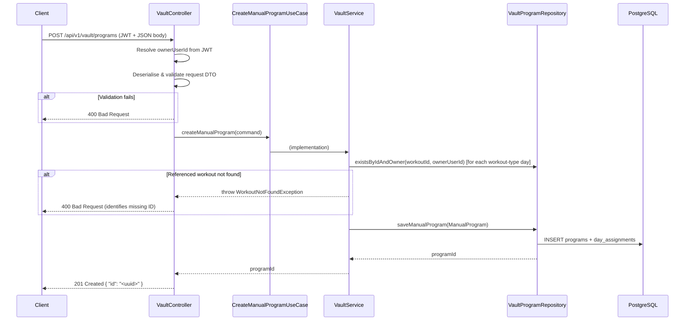
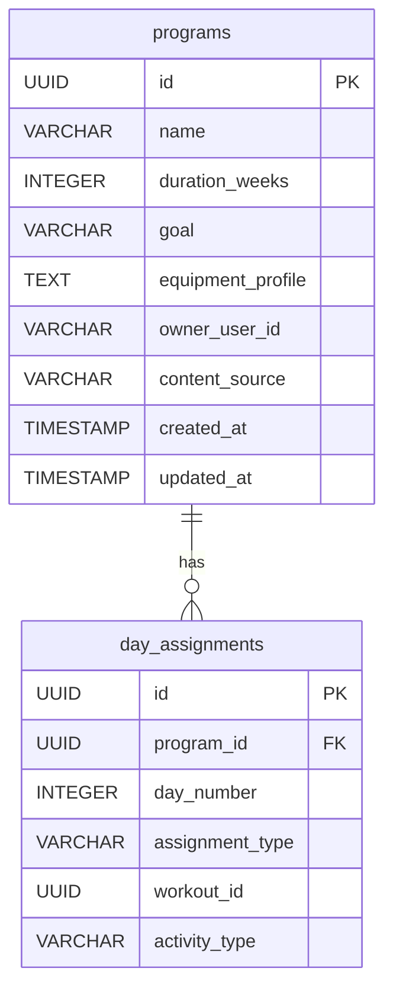

# Design Document: Manual Program Creation Backend Endpoint

## Overview

This design adds a `POST /api/v1/vault/programs` endpoint to the existing `VaultController` in the workout-creator-service. The endpoint accepts a JSON body describing a program name and an ordered list of day assignments (each mapping a day number to either a vault workout reference or an external activity), validates the input, verifies that all referenced workouts exist in the user's vault, persists the program and its day assignments, and returns `201 Created` with the new program's UUID.

The feature follows the established hexagonal architecture: a new inbound port (`CreateManualProgramUseCase`), an addition to `VaultService` as the application layer implementation, a new `day_assignments` table for persistence, and additions to the `VaultProgramRepository` outbound port.

**Key Design Decision:** Manual programs are stored in the existing `programs` table with `content_source = 'MANUAL'` and `duration_weeks = 0` / `goal = 'Manual Program'`. Day assignments are stored in a new `day_assignments` table rather than reusing the existing `weeks`/`days`/`sections`/`exercises` hierarchy, because manual program days reference existing workouts or external activities rather than containing inline exercise definitions.

## Architecture



## Components and Interfaces

### Request/Response DTOs

**Request DTO** — `CreateManualProgramRequest` (in `vault/adapters/inbound/dto/`):

```java
public record CreateManualProgramRequest(
    @NotBlank(message = "Program name is required")
    @Size(max = 255, message = "Program name must not exceed 255 characters")
    String programName,

    @NotNull(message = "At least one day assignment is required")
    @Size(min = 1, message = "At least one day assignment is required")
    List<@Valid DayAssignmentRequest> days
) {}
```

**Day Assignment DTO** — `DayAssignmentRequest` (nested or separate record):

```java
public record DayAssignmentRequest(
    @Min(value = 1, message = "Day number must be positive")
    int dayNumber,

    @NotBlank(message = "Day type is required")
    String type,       // "workout" or "activity"

    String workoutId,  // required when type = "workout"
    String activityType // required when type = "activity"
) {}
```

**Response DTO** — `CreateProgramResponse`:

```java
public record CreateProgramResponse(String id) {}
```

### Domain Model

**`ManualProgram`** (in `vault/domain/`):

```java
public record ManualProgram(
    UUID id,
    String name,
    String ownerUserId,
    ContentSource contentSource,  // always MANUAL
    List<DayAssignment> dayAssignments,
    Instant createdAt,
    Instant updatedAt
) {}
```

**`DayAssignment`** (in `vault/domain/`):

```java
public record DayAssignment(
    int dayNumber,
    DayAssignmentType type,
    UUID workoutId,       // non-null when type = WORKOUT
    String activityType   // non-null when type = ACTIVITY
) {}
```

**`DayAssignmentType`** enum (in `vault/domain/`):

```java
public enum DayAssignmentType {
    WORKOUT,
    ACTIVITY
}
```

### Inbound Port

**`CreateManualProgramUseCase`** (in `vault/ports/inbound/`):

```java
public interface CreateManualProgramUseCase {
    UUID createManualProgram(CreateManualProgramCommand command);
}
```

**`CreateManualProgramCommand`** (in `vault/ports/inbound/`):

```java
public record CreateManualProgramCommand(
    String programName,
    String ownerUserId,
    List<DayAssignment> dayAssignments
) {}
```

### Controller Addition

A new `@PostMapping` method added to the existing `VaultController`:

```java
@PostMapping(consumes = MediaType.APPLICATION_JSON_VALUE,
             produces = MediaType.APPLICATION_JSON_VALUE)
public ResponseEntity<?> createManualProgram(
        @Valid @RequestBody CreateManualProgramRequest request,
        HttpServletRequest httpRequest) {

    // Custom validation: conditional fields, duplicate day numbers
    validateDayAssignments(request.days(), httpRequest);

    String ownerUserId = resolveOwnerUserId();
    CreateManualProgramCommand command = mapToCommand(request, ownerUserId);
    UUID programId = createManualProgramUseCase.createManualProgram(command);

    return ResponseEntity.status(HttpStatus.CREATED)
            .body(new CreateProgramResponse(programId.toString()));
}
```

### Service Implementation

The `VaultService` implements `CreateManualProgramUseCase`:

1. Verify all workout-type day assignments reference workouts that exist in the user's vault (calls `existsByIdAndOwner` for each).
2. Construct a `ManualProgram` domain object with a generated UUID, `ContentSource.MANUAL`, and current timestamp.
3. Delegate to `VaultProgramRepository.saveManualProgram(ManualProgram)`.
4. Return the generated UUID.

### Outbound Port Addition

New method on `VaultProgramRepository`:

```java
void saveManualProgram(ManualProgram program);
```

The existing `existsByIdAndOwner(UUID id, String ownerUserId)` method is reused for workout existence verification.

### Adapter (JPA Repository)

The outbound adapter implements `saveManualProgram` by:
1. Inserting a row into `programs` (id, name, duration_weeks=0, goal='Manual Program', equipment_profile='[]', owner_user_id, content_source='MANUAL', created_at, updated_at).
2. Batch-inserting rows into `day_assignments` for each day assignment.

## Data Models

### New Table: `day_assignments`

Flyway migration `V103__create_day_assignments.sql`:

```sql
CREATE TABLE day_assignments (
    id              UUID PRIMARY KEY DEFAULT gen_random_uuid(),
    program_id      UUID         NOT NULL REFERENCES programs (id) ON DELETE CASCADE,
    day_number      INTEGER      NOT NULL,
    assignment_type VARCHAR(20)  NOT NULL,  -- 'WORKOUT' or 'ACTIVITY'
    workout_id      UUID,                    -- FK to programs.id when type = WORKOUT
    activity_type   VARCHAR(100),            -- e.g. 'Soccer', 'Swimming' when type = ACTIVITY
    UNIQUE (program_id, day_number)
);

CREATE INDEX idx_day_assignments_program ON day_assignments (program_id);
```

**Design Decisions:**

| Decision | Rationale | Trade-off |
|----------|-----------|-----------|
| New `day_assignments` table vs reusing `weeks`/`days` | Manual programs have a flat day→workout/activity mapping, not a hierarchical weeks→days→sections→exercises structure. Reusing the existing schema would require nullable columns and convoluted queries. | Slightly more schema surface area, but cleaner separation of concerns. |
| `workout_id` as a UUID column without FK constraint to `programs` | Referenced workouts may be deleted later. A hard FK would prevent workout deletion without cascading to the manual program. Existence is verified at creation time. | Dangling references are possible if a workout is deleted after program creation. Future: consider soft-delete or event-driven cleanup. |
| Store manual programs in `programs` table with `content_source='MANUAL'` | Reuses existing infrastructure (listing, search, delete). The program appears in the vault alongside AI-generated and uploaded programs. | `duration_weeks`, `goal`, and `equipment_profile` are meaningless for manual programs but required NOT NULL in the schema. We use sentinel values (0, 'Manual Program', '[]'). |
| Validation in controller (bean validation + custom) vs service | Bean validation catches structural issues (null, blank, size) at the HTTP boundary. Custom validation (conditional fields, duplicates) stays in the controller helper. Business validation (workout existence) stays in the service. Clear separation of concerns. | Slightly more code in the controller, but matches existing patterns. |

### Entity Relationship



## Correctness Properties

*A property is a characteristic or behavior that should hold true across all valid executions of a system — essentially, a formal statement about what the system should do. Properties serve as the bridge between human-readable specifications and machine-verifiable correctness guarantees.*

### Property 1: Whitespace-only program names are rejected

*For any* string composed entirely of whitespace characters (including null and empty string), submitting it as the `programName` in a creation request SHALL result in a validation failure (400 Bad Request) and no program being persisted.

**Validates: Requirements 2.1**

### Property 2: Conditional required field validation

*For any* day assignment where `type` is `"workout"` and `workoutId` is null or blank, OR where `type` is `"activity"` and `activityType` is null or blank, the creation request SHALL be rejected with 400 Bad Request without any persistence occurring.

**Validates: Requirements 3.2, 3.3**

### Property 3: Non-positive day numbers are rejected

*For any* day assignment with a `dayNumber` less than 1 (zero or negative), the creation request SHALL be rejected with 400 Bad Request.

**Validates: Requirements 3.4**

### Property 4: Duplicate day numbers are rejected

*For any* list of day assignments containing two or more entries with the same `dayNumber`, the creation request SHALL be rejected with 400 Bad Request indicating day numbers must be unique.

**Validates: Requirements 3.5**

### Property 5: Non-existent workout references are rejected

*For any* day assignment of type `"workout"` referencing a `workoutId` that does not exist in the authenticated user's vault, the service SHALL reject the request with 400 Bad Request and the error message SHALL identify the specific workout ID that was not found.

**Validates: Requirements 4.1, 4.2**

### Property 6: Manual program persistence round-trip

*For any* valid `CreateManualProgramCommand` (valid name, valid day assignments with all referenced workouts existing), persisting the manual program and then retrieving it by the returned ID SHALL produce a `ManualProgram` with:
- The same program name
- The same owner user ID
- `contentSource` equal to `MANUAL`
- An equivalent set of day assignments (same day numbers, types, workout IDs, and activity types)

**Validates: Requirements 5.1, 5.2, 5.3**

## Error Handling

| Scenario | HTTP Status | Response Shape | Source |
|----------|-------------|----------------|--------|
| Bean validation failure (blank name, null days, size exceeded) | 400 | `ValidationErrorResponse` with `errors` array | Spring `MethodArgumentNotValidException` → new handler in `GlobalExceptionHandler` |
| Custom validation failure (conditional fields, duplicates) | 400 | `ErrorResponse` with descriptive `message` | Controller helper returns `ResponseEntity` directly |
| Referenced workout not found in user's vault | 400 | `ErrorResponse` identifying the missing workout ID | New `WorkoutNotFoundException` thrown from service → handled by `GlobalExceptionHandler` |
| Malformed JSON body | 400 | `ErrorResponse` — "Request body could not be parsed" | Existing `HttpMessageNotReadableException` handler |
| Missing/invalid JWT | 401 | Spring Security default | Existing security filter chain |
| Unexpected database error | 500 | `ErrorResponse` — "An unexpected error occurred" | Existing generic `Exception` handler |

**New Exception Class:** `WorkoutNotFoundException` (in `common/exception/`):

```java
public class WorkoutNotFoundException extends RuntimeException {
    private final UUID workoutId;

    public WorkoutNotFoundException(UUID workoutId) {
        super("Workout not found in vault: " + workoutId);
        this.workoutId = workoutId;
    }

    public UUID getWorkoutId() { return workoutId; }
}
```

**New Handler in `GlobalExceptionHandler`:**

```java
@ExceptionHandler(WorkoutNotFoundException.class)
public ResponseEntity<ErrorResponse> handleWorkoutNotFound(
        WorkoutNotFoundException ex, HttpServletRequest request) {
    HttpStatus status = HttpStatus.BAD_REQUEST;
    ErrorResponse body = new ErrorResponse(
            status.value(), status.getReasonPhrase(),
            ex.getMessage(), request.getRequestURI(), Instant.now());
    return ResponseEntity.status(status).body(body);
}
```

**Bean Validation Handler** (new addition to `GlobalExceptionHandler` if not already present):

```java
@ExceptionHandler(MethodArgumentNotValidException.class)
public ResponseEntity<ValidationErrorResponse> handleMethodArgumentNotValid(
        MethodArgumentNotValidException ex, HttpServletRequest request) {
    List<FieldError> fieldErrors = ex.getBindingResult().getFieldErrors().stream()
            .map(e -> new ValidationErrorResponse.FieldError(e.getField(), e.getDefaultMessage()))
            .toList();
    HttpStatus status = HttpStatus.BAD_REQUEST;
    ValidationErrorResponse body = new ValidationErrorResponse(
            status.value(), "Validation Failed", fieldErrors,
            request.getRequestURI(), Instant.now());
    return ResponseEntity.status(status).body(body);
}
```

## Testing Strategy

### Property-Based Tests (jqwik)

Property-based testing is appropriate here because the validation and persistence logic operates over a large input space (arbitrary strings, integers, UUID combinations) with universal properties that must hold.

**Library:** jqwik (already in the project)
**Configuration:** `@Property(tries = 100)` minimum per property
**Test class:** `ManualProgramPropertyTest` in `src/test/java/.../workoutcreator/property/`

Each property from the Correctness Properties section maps to a single `@Property` test method:

| Property | Test Method | Tag |
|----------|-------------|-----|
| Property 1 | `whitespaceNameIsRejected` | Feature: workout-creator-service-manual-program, Property 1: Whitespace-only program names are rejected |
| Property 2 | `conditionalRequiredFieldsEnforced` | Feature: workout-creator-service-manual-program, Property 2: Conditional required field validation |
| Property 3 | `nonPositiveDayNumbersRejected` | Feature: workout-creator-service-manual-program, Property 3: Non-positive day numbers are rejected |
| Property 4 | `duplicateDayNumbersRejected` | Feature: workout-creator-service-manual-program, Property 4: Duplicate day numbers are rejected |
| Property 5 | `nonExistentWorkoutReferencesRejected` | Feature: workout-creator-service-manual-program, Property 5: Non-existent workout references are rejected |
| Property 6 | `persistenceRoundTrip` | Feature: workout-creator-service-manual-program, Property 6: Manual program persistence round-trip |

**Generator strategy:**
- Program names: arbitrary strings, whitespace-only strings, strings > 255 chars
- Day assignments: arbitrary combinations of valid/invalid types, day numbers, workout IDs
- For Property 6 (round-trip): generate fully valid commands with mocked repository that stores and retrieves in-memory

### Unit Tests (JUnit 5 + Mockito)

- **`CreateManualProgram_ValidCommand_ReturnsProgramId`** — happy path through service
- **`CreateManualProgram_WorkoutNotInVault_ThrowsWorkoutNotFoundException`** — service throws on missing workout
- **`CreateManualProgram_WorkoutInOtherUsersVault_ThrowsWorkoutNotFoundException`** — security: no info leak
- **`CreateManualProgram_DatabaseError_PropagatesAsRuntimeException`** — error handling

### Integration Tests

- **`POST /api/v1/vault/programs` with valid body → 201 + UUID response**
- **`POST /api/v1/vault/programs` without JWT → 401**
- **`POST /api/v1/vault/programs` with malformed JSON → 400**
- **`POST /api/v1/vault/programs` then `GET /api/v1/vault/programs` → new program appears in list**
