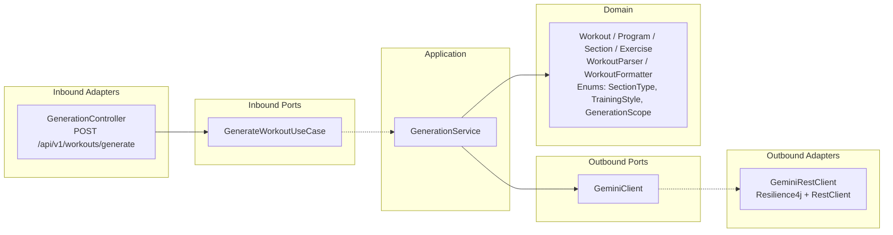
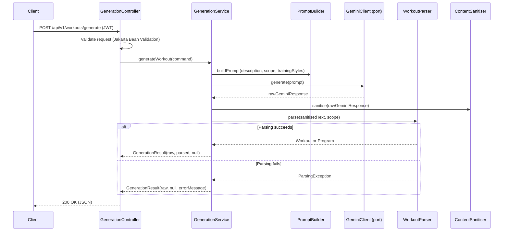
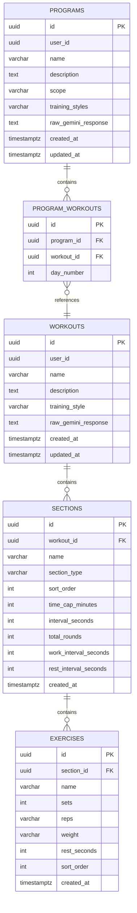

# Design Document — Workout Creator Service MVP1

## Overview

MVP1 of the Workout Creator Service delivers AI-powered Workout and Program generation via Google Gemini. The service accepts a natural language description, a generation scope (day / week / 4-week), and one or more training styles, then calls Gemini with a structured prompt, parses the response into domain objects, and returns both the raw Gemini text and the parsed result to the caller.

The service follows hexagonal architecture with three key concerns in MVP1:

1. **Generation** — orchestrates the prompt construction, Gemini call, response parsing, and result assembly.
2. **Parsing / Formatting** — transforms Gemini text ↔ domain objects with a round-trip correctness guarantee.
3. **Schema Management** — Flyway migrations (V100–V199) establish the PostgreSQL tables for Workouts, Programs, Sections, and Exercises.

Out of scope for MVP1: Vault CRUD, Search/Filter, and persistence of generated workouts. The generation endpoint returns the result but does not save it — persistence is deferred to a later MVP.

### Design Decisions

| Decision | Rationale | Trade-off |
|----------|-----------|-----------|
| Return 200 OK even on parse failure | The user can still read the raw Gemini output. Avoids losing useful content when Gemini returns slightly malformed text. | Callers must check the `parsingError` field to distinguish success from partial failure. |
| Single endpoint for day/week/4-week | Keeps the API surface small. The `scope` field drives prompt construction and response shape internally. | The response is polymorphic — it contains either a `workout` or a `program` depending on scope. |
| No persistence in MVP1 | Reduces scope and lets us validate the generation + parsing pipeline before adding CRUD. | Generated workouts are ephemeral until Vault CRUD is added. |
| Resilience4j circuit breaker on Gemini | Prevents cascading failures when Gemini is slow or down. Required by steering. | Adds configuration complexity. Open-state requests fail fast with 502. |
| Domain objects are pure Java | Required by hexagonal architecture rules. Enables property-based testing without Spring context. | Requires manual mapping between domain and JPA entities in adapters. |

---

## Architecture

### Hexagonal Layers (generation feature)



### Request Flow



### Package Layout

```
com.gmail.ramawthar.priyash.hybridstrength.workoutcreator/
├── WorkoutCreatorApplication.java
├── config/
│   ├── SecurityConfig.java
│   ├── GeminiConfig.java          # Resilience4j + RestClient bean
│   └── FlywayConfig.java          # (if needed beyond auto-config)
├── generation/
│   ├── domain/
│   │   ├── Workout.java
│   │   ├── Program.java
│   │   ├── Section.java
│   │   ├── Exercise.java
│   │   ├── SectionType.java       # enum
│   │   ├── TrainingStyle.java     # enum
│   │   ├── GenerationScope.java   # enum
│   │   ├── GenerationCommand.java # value object for use case input
│   │   ├── GenerationResult.java  # value object for use case output
│   │   ├── WorkoutParser.java     # Gemini text → domain objects
│   │   ├── WorkoutFormatter.java  # domain objects → human-readable text
│   │   └── ContentSanitiser.java  # strip unsafe content from Gemini output
│   ├── ports/
│   │   ├── inbound/
│   │   │   └── GenerateWorkoutUseCase.java
│   │   └── outbound/
│   │       └── GeminiClient.java
│   ├── application/
│   │   └── GenerationService.java
│   └── adapters/
│       ├── inbound/
│       │   ├── GenerationController.java
│       │   └── dto/
│       │       ├── GenerateRequest.java
│       │       └── GenerateResponse.java
│       └── outbound/
│           └── GeminiRestClient.java
└── common/
    ├── dto/
    │   └── ErrorResponse.java
    ├── exception/
    │   ├── GlobalExceptionHandler.java
    │   └── GeminiUnavailableException.java
    └── security/
        └── JwtAuthenticationFilter.java
```

---

## Components and Interfaces

### Inbound Port

```java
/**
 * Use case for AI-powered workout/program generation.
 */
public interface GenerateWorkoutUseCase {
    GenerationResult generate(GenerationCommand command);
}
```

### Outbound Port

```java
/**
 * Port for calling the external Gemini AI service.
 */
public interface GeminiClient {
    /**
     * Sends a structured prompt to Gemini and returns the raw text response.
     * @throws GeminiUnavailableException if Gemini is unreachable, times out,
     *         or the circuit breaker is open.
     */
    String generate(String prompt);
}
```

### Application Service

```java
@Service
public class GenerationService implements GenerateWorkoutUseCase {

    private final GeminiClient geminiClient;

    @Override
    public GenerationResult generate(GenerationCommand command) {
        // 1. Build structured prompt from command fields
        // 2. Call geminiClient.generate(prompt)
        // 3. Sanitise raw response
        // 4. Attempt to parse into Workout or Program
        // 5. Return GenerationResult with raw text + parsed object (or error)
    }
}
```

### Inbound Adapter (Controller)

```java
@RestController
@RequestMapping("/api/v1/workouts")
public class GenerationController {

    private final GenerateWorkoutUseCase generateWorkoutUseCase;

    @PostMapping("/generate")
    public ResponseEntity<GenerateResponse> generate(
            @Valid @RequestBody GenerateRequest request,
            @AuthenticationPrincipal JwtUserDetails user) {
        // Map DTO → GenerationCommand (includes userId from JWT)
        // Call use case
        // Map GenerationResult → GenerateResponse DTO
        // Return 200 OK
    }
}
```

### Outbound Adapter (Gemini Client)

```java
@Component
public class GeminiRestClient implements GeminiClient {

    private final RestClient restClient;

    @Override
    @CircuitBreaker(name = "gemini", fallbackMethod = "geminiUnavailable")
    @TimeLimiter(name = "gemini")
    public String generate(String prompt) {
        // POST to Gemini API with prompt
        // Return raw text response
    }

    private String geminiUnavailable(String prompt, Throwable t) {
        throw new GeminiUnavailableException("Gemini service is unavailable", t);
    }
}
```

### Domain Components

**WorkoutParser** — stateless utility in the domain layer. Accepts sanitised Gemini text and a `GenerationScope`, returns a `Workout` (for day) or `Program` (for week/4-week). Throws a checked `ParsingException` with a human-readable message on failure.

**WorkoutFormatter** — stateless utility in the domain layer. Accepts a `Workout` or `Program` and produces a human-readable text representation. The round-trip property `parse(format(x)) ≡ x` must hold for all valid domain objects.

**ContentSanitiser** — strips HTML tags, script injections, and control characters from Gemini output before parsing. Lives in the domain layer (pure string manipulation, no framework imports).

**PromptBuilder** — constructs the structured prompt string from the user's description, scope, and training styles. Lives in the domain layer.

---

## Data Models

### Domain Objects (Pure Java — no framework imports)

#### Enumerations

```java
public enum GenerationScope {
    DAY, WEEK, FOUR_WEEK
}

public enum TrainingStyle {
    CROSSFIT, HYPERTROPHY, STRENGTH
}

public enum SectionType {
    STRENGTH, AMRAP, EMOM, TABATA, FOR_TIME, ACCESSORY
}
```

#### Exercise

```java
public class Exercise {
    private String name;           // e.g. "Back Squat"
    private int sets;
    private String reps;           // String to support "8-12" ranges or "max"
    private String weight;         // String to support "bodyweight", "135 lbs", percentages
    private Integer restSeconds;   // null for timed section types (AMRAP, EMOM, Tabata, For_Time)
}
```

#### Section

```java
public class Section {
    private String name;           // e.g. "Strength Block"
    private SectionType type;
    private List<Exercise> exercises;

    // Timing fields — populated based on SectionType
    private Integer timeCapMinutes;       // AMRAP, For_Time
    private Integer intervalSeconds;      // EMOM
    private Integer totalRounds;          // EMOM, Tabata
    private Integer workIntervalSeconds;  // Tabata
    private Integer restIntervalSeconds;  // Tabata
}
```

#### Workout

```java
public class Workout {
    private String name;
    private String description;
    private TrainingStyle trainingStyle;
    private List<Section> sections;
}
```

#### Program

```java
public class Program {
    private String name;
    private String description;
    private GenerationScope scope;         // WEEK or FOUR_WEEK
    private List<TrainingStyle> trainingStyles;
    private List<Workout> workouts;        // ordered by day
}
```

#### GenerationCommand (value object — use case input)

```java
public class GenerationCommand {
    private UUID userId;
    private String description;
    private GenerationScope scope;
    private List<TrainingStyle> trainingStyles;
}
```

#### GenerationResult (value object — use case output)

```java
public class GenerationResult {
    private String rawGeminiResponse;
    private Workout workout;          // non-null when scope=DAY and parsing succeeds
    private Program program;          // non-null when scope=WEEK|FOUR_WEEK and parsing succeeds
    private String parsingError;      // non-null when parsing fails
}
```

### REST DTOs

#### GenerateRequest

```java
public record GenerateRequest(
    @NotBlank String description,
    @NotNull GenerationScope scope,
    @NotEmpty List<TrainingStyle> trainingStyles
) {}
```

Custom validation: when `scope == DAY`, `trainingStyles` must contain exactly one element.

#### GenerateResponse

```java
public record GenerateResponse(
    String rawGeminiResponse,
    WorkoutDto workout,          // null when scope != DAY or parsing failed
    ProgramDto program,          // null when scope == DAY or parsing failed
    String parsingError          // null when parsing succeeded
) {}
```

### Database Schema (Flyway V100–V199)

MVP1 creates the tables even though persistence is not yet wired. This establishes the schema for future Vault CRUD.

#### V100 — workouts table

```sql
CREATE TABLE workouts (
    id              UUID PRIMARY KEY DEFAULT gen_random_uuid(),
    user_id         UUID NOT NULL,
    name            VARCHAR(255) NOT NULL,
    description     TEXT,
    training_style  VARCHAR(50) NOT NULL,
    raw_gemini_response TEXT,
    created_at      TIMESTAMP WITH TIME ZONE NOT NULL DEFAULT now(),
    updated_at      TIMESTAMP WITH TIME ZONE NOT NULL DEFAULT now()
);

CREATE INDEX idx_workouts_user_id ON workouts(user_id);
```

#### V101 — sections table

```sql
CREATE TABLE sections (
    id                      UUID PRIMARY KEY DEFAULT gen_random_uuid(),
    workout_id              UUID NOT NULL REFERENCES workouts(id) ON DELETE CASCADE,
    name                    VARCHAR(255) NOT NULL,
    section_type            VARCHAR(50) NOT NULL,
    sort_order              INT NOT NULL,
    time_cap_minutes        INT,
    interval_seconds        INT,
    total_rounds            INT,
    work_interval_seconds   INT,
    rest_interval_seconds   INT,
    created_at              TIMESTAMP WITH TIME ZONE NOT NULL DEFAULT now()
);

CREATE INDEX idx_sections_workout_id ON sections(workout_id);
```

#### V102 — exercises table

```sql
CREATE TABLE exercises (
    id              UUID PRIMARY KEY DEFAULT gen_random_uuid(),
    section_id      UUID NOT NULL REFERENCES sections(id) ON DELETE CASCADE,
    name            VARCHAR(255) NOT NULL,
    sets            INT NOT NULL,
    reps            VARCHAR(50) NOT NULL,
    weight          VARCHAR(100),
    rest_seconds    INT,
    sort_order      INT NOT NULL,
    created_at      TIMESTAMP WITH TIME ZONE NOT NULL DEFAULT now()
);

CREATE INDEX idx_exercises_section_id ON exercises(section_id);
```

#### V103 — programs table

```sql
CREATE TABLE programs (
    id              UUID PRIMARY KEY DEFAULT gen_random_uuid(),
    user_id         UUID NOT NULL,
    name            VARCHAR(255) NOT NULL,
    description     TEXT,
    scope           VARCHAR(50) NOT NULL,
    training_styles VARCHAR(255) NOT NULL,
    raw_gemini_response TEXT,
    created_at      TIMESTAMP WITH TIME ZONE NOT NULL DEFAULT now(),
    updated_at      TIMESTAMP WITH TIME ZONE NOT NULL DEFAULT now()
);

CREATE INDEX idx_programs_user_id ON programs(user_id);
```

#### V104 — program_workouts join table

```sql
CREATE TABLE program_workouts (
    id          UUID PRIMARY KEY DEFAULT gen_random_uuid(),
    program_id  UUID NOT NULL REFERENCES programs(id) ON DELETE CASCADE,
    workout_id  UUID NOT NULL REFERENCES workouts(id) ON DELETE CASCADE,
    day_number  INT NOT NULL,
    UNIQUE (program_id, day_number)
);

CREATE INDEX idx_program_workouts_program_id ON program_workouts(program_id);
```

### Entity Relationship Diagram




---

## Correctness Properties

*A property is a characteristic or behavior that should hold true across all valid executions of a system — essentially, a formal statement about what the system should do. Properties serve as the bridge between human-readable specifications and machine-verifiable correctness guarantees.*

### Property 1: Scope determines result type

*For any* valid `GenerationCommand` with a mocked Gemini response, when the scope is `DAY` the `GenerationResult` shall contain a non-null `workout` and null `program`; when the scope is `WEEK` or `FOUR_WEEK` the result shall contain a non-null `program` and null `workout`.

**Validates: Requirements 1.1, 1.5**

### Property 2: Invalid requests are rejected

*For any* `GenerateRequest` where the description is blank (empty or whitespace-only), or the scope is null, or the trainingStyles list is empty, validation shall reject the request and the system shall not invoke the Gemini client.

**Validates: Requirements 1.2**

### Property 3: DAY scope requires exactly one training style

*For any* `GenerateRequest` with scope `DAY` and a `trainingStyles` list containing more or fewer than exactly one element, validation shall reject the request with a 400 Bad Request response.

**Validates: Requirements 1.4**

### Property 4: Prompt contains all requested training styles

*For any* valid `GenerationCommand`, the structured prompt string produced by `PromptBuilder` shall contain the name of every `TrainingStyle` in the command's `trainingStyles` list.

**Validates: Requirements 1.6**

### Property 5: Parse–format round trip

*For any* valid `Workout` domain object, formatting it with `WorkoutFormatter` and then parsing the resulting text with `WorkoutParser` shall produce a domain object equivalent to the original. Equivalently, `parse(format(workout)) ≡ workout` for all valid workouts. The same property holds for `Program` objects.

**Validates: Requirements 2.1, 3.1, 3.2**

### Property 6: Sanitiser removes unsafe content

*For any* string containing HTML tags (e.g. `<script>`, ``), the `ContentSanitiser` shall produce output that contains none of those tags. The sanitised output shall preserve all plain-text content that is not part of a tag.

**Validates: Requirements 2.3**

### Property 7: Formatted output contains all domain fields

*For any* valid `Workout` domain object, the text produced by `WorkoutFormatter` shall contain every Section name, every Section's `SectionType` name, every Exercise name, and every Exercise's sets, reps, weight (when non-null), and rest seconds (when non-null).

**Validates: Requirements 3.3**

### Property 8: Section timing fields match SectionType

*For any* valid `Section` domain object:
- If `type` is `AMRAP` or `FOR_TIME`, then `timeCapMinutes` shall be non-null and positive, and every Exercise's `restSeconds` shall be null.
- If `type` is `EMOM`, then `intervalSeconds` and `totalRounds` shall be non-null and positive, and every Exercise's `restSeconds` shall be null.
- If `type` is `TABATA`, then `workIntervalSeconds`, `restIntervalSeconds`, and `totalRounds` shall be non-null and positive, and every Exercise's `restSeconds` shall be null.
- If `type` is `STRENGTH` or `ACCESSORY`, then every Exercise's `restSeconds` shall be non-null and positive, and the timed fields (`timeCapMinutes`, `intervalSeconds`, `workIntervalSeconds`, `restIntervalSeconds`, `totalRounds`) shall be null.

**Validates: Requirements 4.2, 4.3, 4.4, 4.5, 4.6, 4.7, 4.8**

### Property 9: Successful generation result structure

*For any* valid `GenerationCommand` where the mocked Gemini response is parseable, the `GenerationResult` shall have a non-null `rawGeminiResponse`, a non-null parsed domain object (Workout or Program), and a null `parsingError`.

**Validates: Requirements 5.1, 5.4**

### Property 10: Failed parse result structure

*For any* valid `GenerationCommand` where the mocked Gemini response is not parseable, the `GenerationResult` shall have a non-null `rawGeminiResponse`, null parsed domain objects, and a non-null `parsingError` containing a human-readable message.

**Validates: Requirements 5.2, 5.3**

---

## Error Handling

### Validation Errors (400 Bad Request)

| Condition | Error Message |
|-----------|---------------|
| Blank description | `"description: must not be blank"` |
| Null scope | `"scope: must not be null"` |
| Empty trainingStyles | `"trainingStyles: must not be empty"` |
| DAY scope with multiple styles | `"trainingStyles: day scope requires exactly one training style"` |
| Invalid enum value for scope | `"scope: must be one of [DAY, WEEK, FOUR_WEEK]"` |
| Invalid enum value for trainingStyle | `"trainingStyles: must contain valid training styles"` |

Validation errors follow the standard `ValidationErrorResponse` shape from `api-standards.md` with field-level `errors` array.

### Gemini Errors (502 Bad Gateway)

| Condition | Handling |
|-----------|----------|
| Gemini returns HTTP error | Catch in `GeminiRestClient`, throw `GeminiUnavailableException`, mapped to 502 by `GlobalExceptionHandler` |
| Gemini times out (>10s) | Resilience4j `TimeLimiter` triggers, throws `TimeoutException`, caught by circuit breaker fallback, mapped to 502 |
| Circuit breaker open | `CallNotPermittedException` thrown immediately, fallback returns `GeminiUnavailableException`, mapped to 502 |

The 502 response uses the standard `ErrorResponse` shape:

```json
{
  "status": 502,
  "error": "Bad Gateway",
  "message": "AI generation service is currently unavailable. Please try again later.",
  "path": "/api/v1/workouts/generate",
  "timestamp": "2026-04-22T10:15:30Z"
}
```

### Parse Failures (200 OK — graceful degradation)

When `WorkoutParser` throws a `ParsingException`, the service catches it and returns a 200 OK with:

```json
{
  "rawGeminiResponse": "... the full Gemini text ...",
  "workout": null,
  "program": null,
  "parsingError": "Unable to parse workout: expected section header at line 5"
}
```

This ensures the user always sees what Gemini returned, even if the structured parse fails.

### Authentication Errors (401 Unauthorised)

Missing or invalid JWT returns 401 via the `JwtAuthenticationFilter` and `SecurityConfig` authentication entry point, using the standard `ErrorResponse` shape. This is consistent with the auth-service pattern.

### Unhandled Exceptions (500 Internal Server Error)

A catch-all handler in `GlobalExceptionHandler` logs the full stack trace and returns a generic 500 response. No internal details are exposed to the caller.

### Resilience4j Configuration

```yaml
resilience4j:
  circuitbreaker:
    instances:
      gemini:
        sliding-window-size: 10
        failure-rate-threshold: 50
        wait-duration-in-open-state: 30s
        permitted-number-of-calls-in-half-open-state: 3
  timelimiter:
    instances:
      gemini:
        timeout-duration: 10s
```

---

## Testing Strategy

### Dual Testing Approach

MVP1 uses both unit tests and property-based tests. Unit tests verify specific examples, edge cases, and integration points. Property tests verify universal correctness properties across randomised inputs.

### Unit Tests (JUnit 5 + Mockito)

Test location: `src/test/java/com/gmail/ramawthar/priyash/hybridstrength/workoutcreator/unit/`

Naming convention: `MethodName_StateUnderTest_ExpectedBehaviour`

| Test Class | Scope |
|------------|-------|
| `GenerationServiceTest` | Use case orchestration — mock GeminiClient, verify result assembly for success, parse failure, and Gemini error paths |
| `WorkoutParserTest` | Specific parsing examples — valid Gemini responses for each SectionType, malformed input, empty input |
| `WorkoutFormatterTest` | Specific formatting examples — each SectionType, edge cases (empty sections, missing optional fields) |
| `ContentSanitiserTest` | Specific sanitisation examples — script tags, HTML entities, clean input passthrough |
| `PromptBuilderTest` | Prompt construction — verify structure for each scope/style combination |
| `GenerationCommandTest` | Domain validation — null checks, invariant enforcement |
| `SectionTest` | Domain invariants — timing field presence based on SectionType |

No Spring context in unit tests. All dependencies injected via constructor with Mockito mocks.

### Property-Based Tests (jqwik)

Test location: `src/test/java/com/gmail/ramawthar/priyash/hybridstrength/workoutcreator/property/`

Library: **jqwik** (minimum 100 iterations per property via `@Property(tries = 100)`)

Each property test references its design document property in a comment tag.

| Test Class | Properties Covered |
|------------|-------------------|
| `GenerationPropertyTest` | Property 1 (scope→result type), Property 2 (invalid rejection), Property 3 (DAY cardinality), Property 9 (success structure), Property 10 (failure structure) |
| `PromptBuilderPropertyTest` | Property 4 (prompt contains styles) |
| `WorkoutParserFormatterPropertyTest` | Property 5 (round-trip) |
| `ContentSanitiserPropertyTest` | Property 6 (unsafe content removal) |
| `WorkoutFormatterPropertyTest` | Property 7 (output contains all fields) |
| `SectionTimingPropertyTest` | Property 8 (timing fields match type) |

Each test method must include a tag comment:
```java
// Feature: workout-creator-service-mvp1, Property 5: Parse-format round trip
@Property(tries = 100)
void formatThenParseShouldRoundTrip(@ForAll("validWorkouts") Workout workout) { ... }
```

**jqwik Generators (Arbitraries)**:
- `validWorkouts` — generates random `Workout` objects with 1–5 sections, each with 1–8 exercises, valid timing fields per SectionType
- `validPrograms` — generates random `Program` objects with 7 or 28 workouts
- `validSections` — generates random `Section` objects with correct timing fields for the randomly chosen SectionType
- `validExercises` — generates random `Exercise` objects with realistic sets (1–10), reps, weight strings
- `invalidGenerateRequests` — generates requests with blank descriptions, null scopes, empty style lists
- `unsafeStrings` — generates strings containing HTML tags, script injections, control characters

### Integration Tests (Testcontainers + @SpringBootTest)

Test location: `src/test/java/com/gmail/ramawthar/priyash/hybridstrength/workoutcreator/integration/`

| Test Class | Scope |
|------------|-------|
| `GenerationIntegrationTest` | Full HTTP round-trip: valid request → 200 with parsed result, invalid request → 400, Gemini failure → 502 |
| `FlywayMigrationIntegrationTest` | Verify all V100–V104 migrations apply cleanly, tables exist with correct columns and constraints |

Integration tests use:
- `@SpringBootTest(webEnvironment = RANDOM_PORT)` with `WebTestClient`
- Testcontainers for PostgreSQL
- WireMock for Gemini API stubbing
- A test JWT signed with a test RSA key pair

### Test Data

- Use builder/factory methods for domain objects (e.g. `WorkoutFixtures.aWorkout()`, `SectionFixtures.anAmrapSection()`)
- Never use production data
- Integration tests use `@Transactional` rollback or explicit teardown
