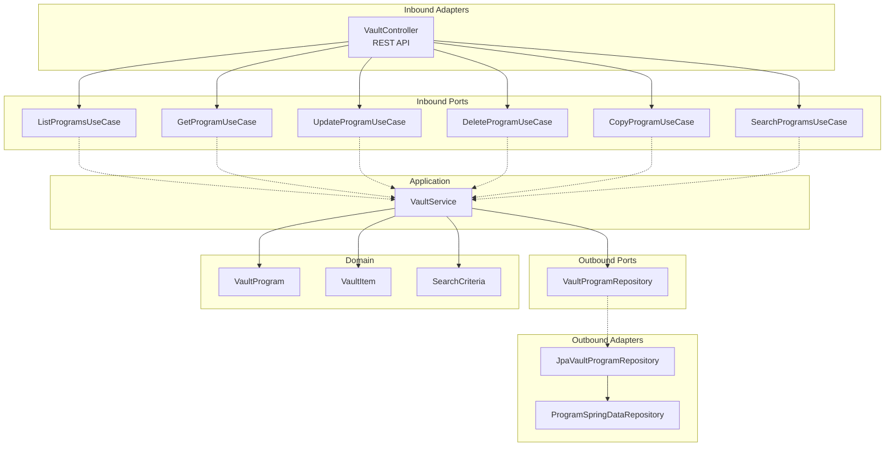
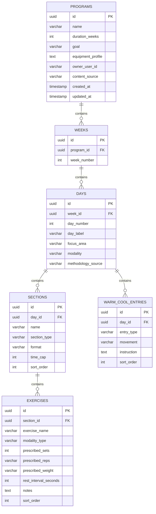

# Design Document — Vault CRUD and Search

## Overview

This design implements the full hexagonal architecture for the `vault` package in the `workout-creator-service`, providing CRUD operations (list, get detail, update, delete, copy) and search/filter functionality for saved workout programs. It also covers the frontend changes: restructuring the Workout menu, adding a Vault search page, a program detail view, and upload success navigation to the Vault.

The vault package currently contains only JPA entities and a Spring Data repository in `adapters/outbound/`. This design adds the missing layers: domain objects, inbound/outbound ports, application services, and REST controllers. The search functionality is implemented within the vault package (not a separate `search` package) since it operates on the same domain and shares the same repository infrastructure.

### Design Decisions

1. **Single vault package** — Search is part of the vault package rather than a separate `search` package. The search operates on the same `programs` table with the same domain objects, and splitting it would create artificial boundaries with cross-package dependencies.

2. **Reuse existing JPA entities** — The vault JPA entities already exist and are used by the upload adapter. The vault outbound adapter will reuse `ProgramSpringDataRepository` and add custom query methods for search and filtering.

3. **403 for not-found and not-owned** — Per security requirements, both "not found" and "not owned" cases return 403 to avoid leaking resource existence.

4. **Full replacement on update** — PUT replaces the entire program structure (weeks, days, sections, exercises, warm-cool entries). This reuses the upload parser for validation and the existing entity mapping logic.

5. **Relevance ordering via CASE expression** — Search relevance (name match > goal match) is implemented with a SQL CASE expression in the repository query, avoiding in-memory sorting.

---

## Architecture

The vault feature follows hexagonal architecture within the `workout-creator-service`:



### Package Layout

```
vault/
├── domain/
│   ├── VaultProgram.java          # Full program with metadata (id, owner, timestamps)
│   ├── VaultItem.java             # Summary for listings
│   └── SearchCriteria.java        # Value object for search/filter params
├── ports/
│   ├── inbound/
│   │   ├── ListProgramsUseCase.java
│   │   ├── GetProgramUseCase.java
│   │   ├── UpdateProgramUseCase.java
│   │   ├── DeleteProgramUseCase.java
│   │   ├── CopyProgramUseCase.java
│   │   └── SearchProgramsUseCase.java
│   └── outbound/
│       └── VaultProgramRepository.java
├── application/
│   └── VaultService.java
└── adapters/
    ├── inbound/
    │   ├── VaultController.java
    │   └── dto/
    │       ├── VaultItemResponse.java
    │       ├── VaultProgramDetailResponse.java
    │       └── PaginatedResponse.java
    └── outbound/
        ├── JpaVaultProgramRepository.java
        ├── ProgramSpringDataRepository.java  (existing — add custom queries)
        ├── ProgramJpaEntity.java             (existing)
        ├── WeekJpaEntity.java                (existing)
        ├── DayJpaEntity.java                 (existing)
        ├── SectionJpaEntity.java             (existing)
        ├── ExerciseJpaEntity.java            (existing)
        └── WarmCoolEntryJpaEntity.java       (existing)
```

---

## Components and Interfaces

### Domain Objects

#### VaultProgram

Represents a full program with all metadata, used for detail retrieval and copy operations.

```java
public record VaultProgram(
    UUID id,
    Program program,          // from common/model
    String ownerUserId,
    ContentSource contentSource,
    Instant createdAt,
    Instant updatedAt
) {}
```

#### VaultItem

Summary representation for listings and search results.

```java
public record VaultItem(
    UUID id,
    String name,
    String goal,
    int durationWeeks,
    List<String> equipmentProfile,
    ContentSource contentSource,
    Instant createdAt,
    Instant updatedAt
) {}
```

#### SearchCriteria

Value object encapsulating search and filter parameters.

```java
public record SearchCriteria(
    String query,           // nullable — keyword search on name/goal
    String focusArea,       // nullable — filter by day focus_area
    String modality         // nullable — filter by day modality
) {
    public boolean hasKeyword() { return query != null && !query.isBlank(); }
    public boolean hasFocusArea() { return focusArea != null && !focusArea.isBlank(); }
    public boolean hasModality() { return modality != null && !modality.isBlank(); }
}
```

### Inbound Ports

```java
public interface ListProgramsUseCase {
    Page<VaultItem> listPrograms(String ownerUserId, Pageable pageable);
}

public interface GetProgramUseCase {
    VaultProgram getProgram(UUID programId, String ownerUserId);
}

public interface UpdateProgramUseCase {
    VaultItem updateProgram(UUID programId, String rawJson, String ownerUserId);
}

public interface DeleteProgramUseCase {
    void deleteProgram(UUID programId, String ownerUserId);
}

public interface CopyProgramUseCase {
    VaultItem copyProgram(UUID programId, String ownerUserId);
}

public interface SearchProgramsUseCase {
    Page<VaultItem> searchPrograms(SearchCriteria criteria, String ownerUserId, Pageable pageable);
}
```

### Outbound Port

```java
public interface VaultProgramRepository {
    Page<VaultItem> findAllByOwner(String ownerUserId, Pageable pageable);
    Optional<VaultProgram> findByIdAndOwner(UUID id, String ownerUserId);
    VaultItem save(VaultProgram program);
    void deleteByIdAndOwner(UUID id, String ownerUserId);
    boolean existsByIdAndOwner(UUID id, String ownerUserId);
    Page<VaultItem> search(SearchCriteria criteria, String ownerUserId, Pageable pageable);
}
```

### Application Service — VaultService

```java
@Service
@Transactional
public class VaultService implements ListProgramsUseCase, GetProgramUseCase,
        UpdateProgramUseCase, DeleteProgramUseCase, CopyProgramUseCase, SearchProgramsUseCase {

    private final VaultProgramRepository vaultProgramRepository;
    private final UploadParser uploadParser;  // reuse for JSON validation on update

    // listPrograms: delegates to repository
    // getProgram: find by id+owner, throw ProgramAccessDeniedException if not found
    // updateProgram: parse JSON via UploadParser, validate, find existing, replace content, save
    // deleteProgram: verify ownership, delete
    // copyProgram: find by id+owner, deep copy with new id, name + " (Copy)", MANUAL source
    // searchPrograms: validate criteria, delegate to repository
}
```

### Inbound Adapter — VaultController

```java
@RestController
@RequestMapping("/api/v1/vault/programs")
public class VaultController {

    // GET /                         → listPrograms (paginated)
    // GET /{id}                     → getProgram (full detail)
    // PUT /{id}                     → updateProgram (full replacement)
    // DELETE /{id}                  → deleteProgram
    // POST /{id}/copy              → copyProgram
    // GET /search                   → searchPrograms (with q, focusArea, modality params)
}
```

### Outbound Adapter — JpaVaultProgramRepository

Implements `VaultProgramRepository` using the existing `ProgramSpringDataRepository` (extended with custom queries) and the JPA entity mapping logic already established in `JpaUploadProgramRepository`.

The entity-to-domain and domain-to-entity mapping logic will be extracted into a shared `ProgramEntityMapper` utility class to avoid duplication between the upload and vault adapters.

### Custom Repository Queries

`ProgramSpringDataRepository` will be extended with:

```java
public interface ProgramSpringDataRepository extends JpaRepository<ProgramJpaEntity, UUID> {

    Page<ProgramJpaEntity> findAllByOwnerUserIdOrderByCreatedAtDesc(
        String ownerUserId, Pageable pageable);

    Optional<ProgramJpaEntity> findByIdAndOwnerUserId(UUID id, String ownerUserId);

    void deleteByIdAndOwnerUserId(UUID id, String ownerUserId);

    boolean existsByIdAndOwnerUserId(UUID id, String ownerUserId);

    // Custom JPQL for search with relevance ordering
    @Query("""
        SELECT DISTINCT p FROM ProgramJpaEntity p
        LEFT JOIN p.weeks w
        LEFT JOIN w.days d
        WHERE p.ownerUserId = :ownerUserId
        AND (:query IS NULL OR LOWER(p.name) LIKE LOWER(CONCAT('%', :query, '%'))
             OR LOWER(p.goal) LIKE LOWER(CONCAT('%', :query, '%')))
        AND (:focusArea IS NULL OR LOWER(d.focusArea) = LOWER(:focusArea))
        AND (:modality IS NULL OR LOWER(CAST(d.modality AS string)) = LOWER(:modality))
        ORDER BY
            CASE WHEN :query IS NOT NULL AND LOWER(p.name) LIKE LOWER(CONCAT('%', :query, '%'))
                 THEN 0 ELSE 1 END,
            p.createdAt DESC
        """)
    Page<ProgramJpaEntity> searchPrograms(
        @Param("ownerUserId") String ownerUserId,
        @Param("query") String query,
        @Param("focusArea") String focusArea,
        @Param("modality") String modality,
        Pageable pageable);
}
```

### Exception Handling

A new domain exception `ProgramAccessDeniedException` will be added to `common/exception/`:

```java
public class ProgramAccessDeniedException extends RuntimeException {
    public ProgramAccessDeniedException() {
        super("Program not found or access denied");
    }
}
```

The `GlobalExceptionHandler` will be extended with:

```java
@ExceptionHandler(ProgramAccessDeniedException.class)
public ResponseEntity<ErrorResponse> handleProgramAccessDenied(
        ProgramAccessDeniedException ex, HttpServletRequest request) {
    HttpStatus status = HttpStatus.FORBIDDEN;
    ErrorResponse body = new ErrorResponse(
        status.value(), "Forbidden", ex.getMessage(),
        request.getRequestURI(), Instant.now());
    return ResponseEntity.status(status).body(body);
}
```

### Database Migration

A new Flyway migration `V102__add_search_indexes.sql` adds indexes to support search and filter queries:

```sql
-- V102: Add indexes for vault search and filter operations
CREATE INDEX idx_programs_name_lower ON programs (LOWER(name));
CREATE INDEX idx_programs_goal_lower ON programs (LOWER(goal));
CREATE INDEX idx_days_focus_area_lower ON days (LOWER(focus_area));
CREATE INDEX idx_days_modality ON days (modality);
```

### Frontend Components

#### Route Structure

```
/vault/search           → VaultSearchPage
/vault/programs/:id     → ProgramDetailPage
/workout/continue       → ComingSoon (placeholder)
```

#### New Frontend Files

```
src/
├── features/vault/
│   ├── VaultSearchPage.tsx        # Search page with input, filters, results
│   ├── ProgramDetailPage.tsx      # Full program detail with actions
│   ├── VaultItemCard.tsx          # Search result card component
│   ├── ProgramJsonEditor.tsx      # Inline JSON editor for edit flow
│   ├── useVaultSearch.ts          # Hook: debounced search + filter state
│   └── useProgram.ts             # Hook: fetch/update/delete/copy program
├── lib/
│   └── vaultApi.ts               # API client functions for vault endpoints
└── types/
    └── vault.ts                  # TypeScript types for vault domain
```

#### TypeScript Types (vault.ts)

```typescript
export interface VaultItem {
  id: string;
  name: string;
  goal: string;
  durationWeeks: number;
  equipmentProfile: string[];
  contentSource: 'AI_GENERATED' | 'UPLOADED' | 'MANUAL';
  createdAt: string;
  updatedAt: string;
}

export interface PaginatedResponse<T> {
  content: T[];
  page: number;
  size: number;
  totalElements: number;
  totalPages: number;
}

export interface VaultProgramDetail {
  id: string;
  name: string;
  goal: string;
  durationWeeks: number;
  equipmentProfile: string[];
  contentSource: 'AI_GENERATED' | 'UPLOADED' | 'MANUAL';
  createdAt: string;
  updatedAt: string;
  weeks: VaultWeek[];
}

export interface VaultWeek {
  weekNumber: number;
  days: VaultDay[];
}

export interface VaultDay {
  dayNumber: number;
  label: string;
  focusArea: string;
  modality: 'CROSSFIT' | 'HYPERTROPHY';
  warmUp: WarmCoolEntry[];
  sections: VaultSection[];
  coolDown: WarmCoolEntry[];
  methodologySource?: string;
}

export interface WarmCoolEntry {
  movement: string;
  instruction: string;
}

export interface VaultSection {
  name: string;
  sectionType: string;
  format?: string;
  timeCap?: number;
  exercises: VaultExercise[];
}

export interface VaultExercise {
  name: string;
  modalityType?: string;
  sets: number;
  reps: string;
  weight?: string;
  restSeconds?: number;
  notes?: string;
}
```

---

## Data Models

### Entity Relationship (existing schema — no structural changes)



### API Response Shapes

**Paginated listing (GET /api/v1/vault/programs, GET /api/v1/vault/programs/search):**

```json
{
  "content": [
    {
      "id": "uuid",
      "name": "Hybrid Strength 4-Week",
      "goal": "Build strength and conditioning",
      "durationWeeks": 4,
      "equipmentProfile": ["Barbell", "Pull-up Bar"],
      "contentSource": "UPLOADED",
      "createdAt": "2025-01-15T10:30:00Z",
      "updatedAt": "2025-01-15T10:30:00Z"
    }
  ],
  "page": 0,
  "size": 20,
  "totalElements": 1,
  "totalPages": 1
}
```

**Program detail (GET /api/v1/vault/programs/{id}):**

```json
{
  "id": "uuid",
  "name": "Hybrid Strength 4-Week",
  "goal": "Build strength and conditioning",
  "durationWeeks": 4,
  "equipmentProfile": ["Barbell", "Pull-up Bar"],
  "contentSource": "UPLOADED",
  "createdAt": "2025-01-15T10:30:00Z",
  "updatedAt": "2025-01-15T10:30:00Z",
  "weeks": [
    {
      "weekNumber": 1,
      "days": [
        {
          "dayNumber": 1,
          "label": "Push Day",
          "focusArea": "Push",
          "modality": "HYPERTROPHY",
          "warmUp": [{"movement": "Arm Circles", "instruction": "30 seconds each direction"}],
          "sections": [
            {
              "name": "Tier 1: Compound",
              "sectionType": "STRENGTH",
              "format": "Sets/Reps",
              "timeCap": null,
              "exercises": [
                {
                  "name": "Bench Press",
                  "modalityType": null,
                  "sets": 4,
                  "reps": "6-8",
                  "weight": "80% 1RM",
                  "restSeconds": 120,
                  "notes": "Control the eccentric"
                }
              ]
            }
          ],
          "coolDown": [{"movement": "Chest Stretch", "instruction": "30 seconds each side"}],
          "methodologySource": null
        }
      ]
    }
  ]
}
```

---

## Correctness Properties

*A property is a characteristic or behavior that should hold true across all valid executions of a system — essentially, a formal statement about what the system should do. Properties serve as the bridge between human-readable specifications and machine-verifiable correctness guarantees.*

### Property 1: Ownership Enforcement

*For any* program owned by user A and *for any* user B (where B ≠ A), attempting to get, update, delete, or copy that program as user B SHALL result in a `ProgramAccessDeniedException` (403 Forbidden). Additionally, *for any* non-existent program ID, any operation SHALL also result in a 403.

**Validates: Requirements 1.4, 2.3, 2.4, 3.2, 3.3, 5.4, 5.5**

### Property 2: Listing Returns Only Owner's Programs in Correct Order

*For any* set of programs belonging to multiple users, listing programs for user A SHALL return only programs where `ownerUserId == A`, and the results SHALL be ordered by `createdAt` descending.

**Validates: Requirements 1.1**

### Property 3: VaultItem Mapping Completeness

*For any* valid `VaultProgram` domain object, mapping it to a `VaultItem` SHALL produce a result containing all required fields (`id`, `name`, `goal`, `durationWeeks`, `equipmentProfile`, `contentSource`, `createdAt`, `updatedAt`) with values matching the source.

**Validates: Requirements 1.2**

### Property 4: Program Detail Round-Trip

*For any* valid `Program` domain object, saving it to the vault and then retrieving it by ID SHALL produce a `VaultProgram` whose `program` field is equal to the original `Program`.

**Validates: Requirements 1.3**

### Property 5: Pagination Invariants

*For any* collection of N programs belonging to a user and *for any* valid page size S (1 ≤ S ≤ 100), paginating through all pages SHALL yield exactly N total items with no duplicates and no omissions, and each page SHALL contain at most S items.

**Validates: Requirements 1.6, 4.5**

### Property 6: Update Replaces Content

*For any* existing program and *for any* valid new program JSON, updating the program SHALL result in the stored program's content matching the new JSON (parsed to domain), while preserving the original `id`.

**Validates: Requirements 2.1**

### Property 7: Update Preserves Immutable Fields and Sets Timestamp

*For any* program update, the `contentSource` and `ownerUserId` SHALL remain unchanged from their pre-update values, and `updatedAt` SHALL be ≥ the time immediately before the update was issued.

**Validates: Requirements 2.2, 2.7**

### Property 8: Invalid JSON Rejected on Update

*For any* JSON string that fails Upload_Schema validation, submitting it as a PUT update SHALL result in a validation error (400) with at least one field-level error, and the existing program SHALL remain unchanged.

**Validates: Requirements 2.5**

### Property 9: Delete Removes Program

*For any* program owned by user A, after user A deletes it, attempting to retrieve that program SHALL result in a `ProgramAccessDeniedException`.

**Validates: Requirements 3.1, 3.5**

### Property 10: Search Returns Matching Results for Authenticated User Only

*For any* keyword query Q and *for any* set of programs belonging to multiple users, searching as user A SHALL return only programs where `ownerUserId == A` AND (`name` contains Q case-insensitively OR `goal` contains Q case-insensitively).

**Validates: Requirements 4.1, 4.2**

### Property 11: Empty Query Rejected

*For any* string composed entirely of whitespace (including empty string), submitting it as the `q` search parameter SHALL result in a 400 Bad Request response.

**Validates: Requirements 4.3**

### Property 12: Search Relevance Ordering

*For any* search query Q where results include both name-matching and goal-only-matching programs, all name-matching programs SHALL appear before goal-only-matching programs in the results, and within each group results SHALL be ordered by `createdAt` descending.

**Validates: Requirements 4.7**

### Property 13: Combined Filter Enforcement

*For any* combination of filter parameters (focusArea, modality) applied to a search, every program in the results SHALL contain at least one Day matching each specified filter criterion. When no keyword `q` is provided, all programs matching the filters SHALL be returned.

**Validates: Requirements 4.8, 4.9, 4.10, 4.11**

### Property 14: Copy Produces Complete Deep Copy with Correct Metadata

*For any* program, copying it SHALL produce a new program where: (a) the new ID differs from the original, (b) the name equals the original name + " (Copy)", (c) `contentSource` is `MANUAL`, (d) `createdAt` and `updatedAt` are set to the current time, and (e) the full program structure (weeks, days, sections, exercises, warm-up, cool-down) is identical to the original.

**Validates: Requirements 5.1, 5.2, 5.3**

### Property 15: Content Source Does Not Affect Behavior

*For any* two programs with identical structure but different `contentSource` values (AI_GENERATED, UPLOADED, MANUAL), all vault operations (list, get, update, delete, search, copy) SHALL produce equivalent results (differing only in the `contentSource` field itself).

**Validates: Requirements 6.4**

---

## Error Handling

| Scenario | HTTP Status | Error Shape | Message |
|----------|-------------|-------------|---------|
| Program not found or not owned | 403 Forbidden | `ErrorResponse` | "Program not found or access denied" |
| Invalid JSON on update | 400 Bad Request | `ValidationErrorResponse` | Field-level errors array |
| Empty/blank search query | 400 Bad Request | `ErrorResponse` | "Search query must not be empty" |
| Missing/invalid JWT | 401 Unauthorised | `ErrorResponse` | "Authentication is required to access this resource" |
| Page size > 100 | 400 Bad Request | `ErrorResponse` | "Page size must not exceed 100" |
| Invalid UUID path parameter | 400 Bad Request | `ErrorResponse` | "Invalid program ID format" |
| Unexpected server error | 500 Internal Server Error | `ErrorResponse` | "An unexpected error occurred" |

### Error Handling Strategy

- **Ownership checks** always happen before any mutation. The service layer throws `ProgramAccessDeniedException` which the `GlobalExceptionHandler` maps to 403.
- **Validation errors** on update reuse the existing `UploadParser` and `UploadValidationException` flow, producing the same field-level error shape as the upload endpoint.
- **Search validation** (empty query) is checked in the application service before hitting the database.
- **Pagination bounds** are enforced in the controller: `size` is clamped to max 100 via `@Max(100)` annotation.

---

## Testing Strategy

### Property-Based Tests (jqwik)

Property-based testing is appropriate for this feature because the vault operations involve pure domain logic (mapping, filtering, ordering, ownership checks) with clear input/output behavior and universal properties that hold across a wide input space.

**Library:** jqwik (already in pom.xml)
**Configuration:** Minimum 100 iterations per property (`@Property(tries = 100)`)
**Tag format:** `Feature: workout-creator-service-vault, Property {number}: {property_text}`

Each correctness property (1–15) will be implemented as a dedicated `@Property` test in `VaultPropertyTest.java`. Tests will use jqwik `@Provide` methods to generate random `Program` domain objects, user IDs, and search criteria.

Key generators needed:
- `Arbitrary<Program>` — random valid programs with 1–4 weeks, 1–7 days per week, 1–5 sections per day
- `Arbitrary<String>` — random owner user IDs (UUID strings)
- `Arbitrary<SearchCriteria>` — random search/filter combinations
- `Arbitrary<String>` — random valid/invalid JSON for update testing

### Unit Tests (JUnit 5 + Mockito)

- **VaultService** — test each use case method with mocked `VaultProgramRepository`
- **SearchCriteria** — test validation logic (empty query detection)
- **ProgramEntityMapper** — test entity↔domain mapping for edge cases
- **VaultController** — test request parameter binding and response status codes

### Integration Tests (@SpringBootTest)

- Full request/response cycle for each endpoint (happy path + key failures)
- Upload → Vault retrieval integration (Requirement 6)
- Search with filters against real PostgreSQL
- Pagination across multiple pages
- JWT authentication enforcement (401 without token)

### Frontend Tests (Vitest + React Testing Library)

- **VaultSearchPage** — renders search input, filters, results; handles loading/empty/error states
- **ProgramDetailPage** — renders metadata, expandable weeks/days, action buttons
- **Home.tsx** — Workout menu expansion with correct sub-options
- **UploadPage** — "View in Vault" link after successful upload
- **useVaultSearch** — debounce behavior, filter state management
- **useProgram** — fetch/update/delete/copy state management
