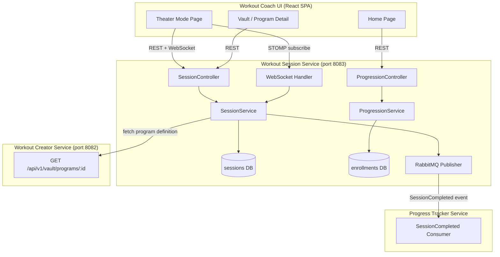

# Design Document — Workout Session Service: Active Workout

## Overview

The Workout Session Service is a new Spring Boot microservice (port 8083) responsible for active workout execution, session state management, and program progression tracking. It provides the backend for Theater Mode — a distraction-free workout UI — and manages the lifecycle of workout sessions from start through completion.

**Key responsibilities:**
- Create and manage workout sessions (start, pause, resume, end)
- Track exercise completion and rest timers within a session
- Manage program enrollments and advance the day pointer on session completion
- Publish `SessionCompleted` events to RabbitMQ for the Progress Tracker Service
- Push real-time session state updates to the frontend via WebSocket/STOMP

**Design decisions and rationale:**
- **Hexagonal architecture** — consistent with all other services in the platform; keeps domain logic framework-free and testable.
- **Session state persisted server-side** — enables resume across devices and browser crashes. The frontend is a thin view layer that fetches state on load.
- **WebSocket for real-time updates** — avoids polling; STOMP provides topic-based subscriptions per session.
- **Separate `program_enrollments` table** — decouples program progression from individual sessions, allowing standalone sessions without affecting program state.

**Trade-offs:**
- Server-side session state adds write load on every exercise checkoff. Acceptable at expected scale (single-user sessions, not high-throughput).
- Fetching program definitions from the Workout Creator Service on session start adds latency. Mitigated by caching the snapshot in the session record.

---

## Architecture

### Hexagonal Layers

```
workout-session-service/
└── src/main/java/com/gmail/ramawthar/priyash/hybridstrength/workoutsession/
    ├── WorkoutSessionApplication.java
    ├── config/
    │   ├── SecurityConfig.java
    │   ├── WebSocketConfig.java
    │   ├── RabbitMQConfig.java
    │   └── FlywayConfig.java
    ├── session/                          # Active session management
    │   ├── domain/
    │   │   ├── Session.java
    │   │   ├── SessionStatus.java
    │   │   ├── SectionProgress.java
    │   │   ├── ExerciseLog.java
    │   │   └── TimerConfig.java
    │   ├── ports/
    │   │   ├── inbound/
    │   │   │   ├── StartSessionUseCase.java
    │   │   │   ├── UpdateSessionUseCase.java
    │   │   │   ├── PauseSessionUseCase.java
    │   │   │   ├── EndSessionUseCase.java
    │   │   │   └── GetSessionUseCase.java
    │   │   └── outbound/
    │   │       ├── SessionRepository.java
    │   │       ├── WorkoutFetcher.java
    │   │       └── SessionEventPublisher.java
    │   ├── application/
    │   │   └── SessionService.java
    │   └── adapters/
    │       ├── inbound/
    │       │   ├── SessionController.java
    │       │   ├── SessionWebSocketHandler.java
    │       │   └── dto/
    │       └── outbound/
    │           ├── JpaSessionRepository.java
    │           ├── RestWorkoutFetcher.java
    │           └── RabbitSessionEventPublisher.java
    ├── progression/                      # Program enrollment and day pointer
    │   ├── domain/
    │   │   ├── ProgramEnrollment.java
    │   │   ├── EnrollmentStatus.java
    │   │   └── SkipRecord.java
    │   ├── ports/
    │   │   ├── inbound/
    │   │   │   ├── EnrollProgramUseCase.java
    │   │   │   ├── AdvanceDayUseCase.java
    │   │   │   ├── SkipDayUseCase.java
    │   │   │   └── GetEnrollmentUseCase.java
    │   │   └── outbound/
    │   │       └── EnrollmentRepository.java
    │   ├── application/
    │   │   └── ProgressionService.java
    │   └── adapters/
    │       ├── inbound/
    │       │   ├── ProgressionController.java
    │       │   └── dto/
    │       └── outbound/
    │           └── JpaEnrollmentRepository.java
    └── common/
        ├── dto/
        │   └── ErrorResponse.java
        ├── exception/
        │   ├── GlobalExceptionHandler.java
        │   ├── SessionNotFoundException.java
        │   ├── SessionAlreadyCompleteException.java
        │   └── EnrollmentNotFoundException.java
        ├── security/
        │   └── JwtAuthenticationFilter.java
        └── event/
            └── SessionCompletedEvent.java
```

### Component Interaction Diagram



---

## Components and Interfaces

### Inbound Ports

| Port | Method | Description |
|------|--------|-------------|
| `StartSessionUseCase` | `startSession(userId, programId, weekNumber, dayNumber, standalone)` | Creates a new session, fetches workout definition from Vault, returns session ID |
| `GetSessionUseCase` | `getSession(sessionId, userId)` | Returns current session state for rendering |
| `UpdateSessionUseCase` | `completeExercise(sessionId, userId, sectionIndex, exerciseIndex)` | Marks exercise done, persists state |
| `UpdateSessionUseCase` | `advanceSection(sessionId, userId, targetSectionIndex)` | Moves to next/previous section |
| `PauseSessionUseCase` | `pauseSession(sessionId, userId)` | Persists state, marks session PAUSED |
| `EndSessionUseCase` | `endSession(sessionId, userId)` | Marks session COMPLETED, publishes event, advances program pointer if applicable |
| `EnrollProgramUseCase` | `enrollProgram(userId, programId, programName)` | Creates enrollment at week 1, day 1; ends any existing active enrollment |
| `AdvanceDayUseCase` | `advanceDay(enrollmentId, userId)` | Moves pointer to next day/week |
| `SkipDayUseCase` | `skipDay(enrollmentId, userId)` | Advances pointer and records skip |
| `GetEnrollmentUseCase` | `getActiveEnrollment(userId)` | Returns current active enrollment with next day info |

### Outbound Ports

| Port | Method | Description |
|------|--------|-------------|
| `SessionRepository` | `save(Session)`, `findById(id)`, `findActiveByUserId(userId)` | Persistence for session state |
| `EnrollmentRepository` | `save(ProgramEnrollment)`, `findActiveByUserId(userId)` | Persistence for program enrollments |
| `WorkoutFetcher` | `fetchProgram(programId, jwt)` | REST call to Workout Creator Service |
| `SessionEventPublisher` | `publishSessionCompleted(event)` | Publishes to RabbitMQ with retry |

### Application Services

**SessionService** orchestrates:
1. On `startSession`: calls `WorkoutFetcher` to get program definition, creates `Session` domain object with workout snapshot, persists it, returns session ID.
2. On `completeExercise`: loads session, delegates to domain logic to mark exercise complete, persists updated state, pushes WebSocket update.
3. On `endSession`: marks complete, publishes `SessionCompleted` event, calls `AdvanceDayUseCase` if session is part of a program enrollment.

**ProgressionService** orchestrates:
1. On `enrollProgram`: ends any existing active enrollment (marks as REPLACED), creates new enrollment at day 1.
2. On `advanceDay`: increments day pointer; if past last day of week, increments week; if past last week, marks enrollment COMPLETED.
3. On `skipDay`: same as advance but also persists a `SkipRecord`.

---

## Data Models

### Domain Objects

#### Session

```java
public class Session {
    private UUID id;
    private String userId;
    private UUID programId;           // nullable for standalone
    private UUID enrollmentId;        // nullable for standalone
    private int weekNumber;
    private int dayNumber;
    private SessionStatus status;     // IN_PROGRESS, PAUSED, COMPLETED
    private int currentSectionIndex;
    private List<SectionProgress> sectionProgresses;
    private String workoutSnapshot;   // JSON snapshot of the day definition
    private Instant startedAt;
    private Instant pausedAt;         // nullable
    private Instant completedAt;      // nullable
    private Instant lastPersistedAt;
}
```

#### SessionStatus (enum)

```java
public enum SessionStatus {
    IN_PROGRESS,
    PAUSED,
    COMPLETED
}
```

#### SectionProgress

```java
public class SectionProgress {
    private int sectionIndex;
    private String sectionName;
    private SectionType sectionType;
    private List<ExerciseLog> exerciseLogs;
    private boolean completed;
}
```

#### ExerciseLog

```java
public class ExerciseLog {
    private int exerciseIndex;
    private String exerciseName;
    private boolean completed;
    private Instant completedAt;      // nullable
}
```

#### ProgramEnrollment

```java
public class ProgramEnrollment {
    private UUID id;
    private String userId;
    private UUID programId;
    private String programName;
    private int currentWeek;
    private int currentDay;
    private int totalWeeks;
    private int totalDaysPerWeek;     // max days across all weeks
    private EnrollmentStatus status;  // ACTIVE, COMPLETED, REPLACED
    private Instant enrolledAt;
    private Instant completedAt;      // nullable
    private List<SkipRecord> skips;
}
```

#### EnrollmentStatus (enum)

```java
public enum EnrollmentStatus {
    ACTIVE,
    COMPLETED,
    REPLACED
}
```

#### SkipRecord

```java
public class SkipRecord {
    private int weekNumber;
    private int dayNumber;
    private Instant skippedAt;
}
```

### Database Schema (PostgreSQL — Flyway V200–V299)

#### V200__create_sessions.sql

```sql
CREATE TABLE sessions (
    id              UUID PRIMARY KEY,
    user_id         VARCHAR(255) NOT NULL,
    program_id      UUID,
    enrollment_id   UUID,
    week_number     INT NOT NULL,
    day_number      INT NOT NULL,
    status          VARCHAR(20) NOT NULL DEFAULT 'IN_PROGRESS',
    current_section_index INT NOT NULL DEFAULT 0,
    workout_snapshot JSONB NOT NULL,
    section_progresses JSONB NOT NULL DEFAULT '[]',
    started_at      TIMESTAMP WITH TIME ZONE NOT NULL,
    paused_at       TIMESTAMP WITH TIME ZONE,
    completed_at    TIMESTAMP WITH TIME ZONE,
    last_persisted_at TIMESTAMP WITH TIME ZONE NOT NULL,

    CONSTRAINT chk_session_status CHECK (status IN ('IN_PROGRESS', 'PAUSED', 'COMPLETED'))
);

CREATE INDEX idx_sessions_user_id ON sessions(user_id);
CREATE INDEX idx_sessions_user_status ON sessions(user_id, status);
```

#### V201__create_program_enrollments.sql

```sql
CREATE TABLE program_enrollments (
    id              UUID PRIMARY KEY,
    user_id         VARCHAR(255) NOT NULL,
    program_id      UUID NOT NULL,
    program_name    VARCHAR(500) NOT NULL,
    current_week    INT NOT NULL DEFAULT 1,
    current_day     INT NOT NULL DEFAULT 1,
    total_weeks     INT NOT NULL,
    total_days_per_week INT NOT NULL,
    status          VARCHAR(20) NOT NULL DEFAULT 'ACTIVE',
    enrolled_at     TIMESTAMP WITH TIME ZONE NOT NULL,
    completed_at    TIMESTAMP WITH TIME ZONE,

    CONSTRAINT chk_enrollment_status CHECK (status IN ('ACTIVE', 'COMPLETED', 'REPLACED'))
);

CREATE INDEX idx_enrollments_user_id ON program_enrollments(user_id);
CREATE INDEX idx_enrollments_user_status ON program_enrollments(user_id, status);
```

#### V202__create_skip_records.sql

```sql
CREATE TABLE skip_records (
    id              UUID PRIMARY KEY,
    enrollment_id   UUID NOT NULL REFERENCES program_enrollments(id),
    week_number     INT NOT NULL,
    day_number      INT NOT NULL,
    skipped_at      TIMESTAMP WITH TIME ZONE NOT NULL
);

CREATE INDEX idx_skips_enrollment ON skip_records(enrollment_id);
```

### REST API Endpoints

#### Session Endpoints (`/api/v1/sessions`)

| Method | Path | Description | Request Body | Response |
|--------|------|-------------|--------------|----------|
| POST | `/api/v1/sessions` | Start a new session | `StartSessionRequest` | 201 + `SessionResponse` |
| GET | `/api/v1/sessions/{id}` | Get session state | — | 200 + `SessionResponse` |
| GET | `/api/v1/sessions/active` | Get user's active session (if any) | — | 200 + `SessionResponse` or 204 |
| PATCH | `/api/v1/sessions/{id}/exercises` | Mark exercise complete | `CompleteExerciseRequest` | 200 + `SessionResponse` |
| PATCH | `/api/v1/sessions/{id}/section` | Navigate to section | `AdvanceSectionRequest` | 200 + `SessionResponse` |
| POST | `/api/v1/sessions/{id}/pause` | Pause session | — | 200 + `SessionResponse` |
| POST | `/api/v1/sessions/{id}/resume` | Resume paused session | — | 200 + `SessionResponse` |
| POST | `/api/v1/sessions/{id}/end` | End/complete session | — | 200 + `SessionResponse` |

#### Progression Endpoints (`/api/v1/enrollments`)

| Method | Path | Description | Request Body | Response |
|--------|------|-------------|--------------|----------|
| POST | `/api/v1/enrollments` | Enroll in a program | `EnrollRequest` | 201 + `EnrollmentResponse` |
| GET | `/api/v1/enrollments/active` | Get active enrollment | — | 200 + `EnrollmentResponse` or 204 |
| POST | `/api/v1/enrollments/{id}/skip` | Skip current day | — | 200 + `EnrollmentResponse` |

#### Request/Response DTOs

```java
// StartSessionRequest
record StartSessionRequest(
    UUID programId,
    int weekNumber,
    int dayNumber,
    boolean standalone  // true = don't affect enrollment
) {}

// CompleteExerciseRequest
record CompleteExerciseRequest(
    int sectionIndex,
    int exerciseIndex
) {}

// AdvanceSectionRequest
record AdvanceSectionRequest(
    int targetSectionIndex
) {}

// EnrollRequest
record EnrollRequest(
    UUID programId,
    String programName
) {}

// SessionResponse
record SessionResponse(
    UUID id,
    String status,
    int currentSectionIndex,
    List<SectionProgressResponse> sectionProgresses,
    Object workoutSnapshot,  // deserialized day definition
    Instant startedAt,
    Instant pausedAt,
    Instant completedAt
) {}

// EnrollmentResponse
record EnrollmentResponse(
    UUID id,
    UUID programId,
    String programName,
    int currentWeek,
    int currentDay,
    int totalWeeks,
    String status,
    Instant enrolledAt,
    NextDayInfo nextDay  // nullable when COMPLETED
) {}

// NextDayInfo — included in enrollment response for home screen "Next Step"
record NextDayInfo(
    String programName,
    int weekNumber,
    int dayNumber,
    String dayLabel
) {}
```

### WebSocket Contract

**Endpoint:** `ws://localhost:8083/ws/sessions`  
**Protocol:** STOMP over WebSocket  
**Authentication:** JWT passed as query parameter on connect (`?token=<jwt>`)

**Subscription topic:** `/topic/sessions/{sessionId}`

**Message types pushed to client:**

```json
{
  "type": "SESSION_STATE_UPDATE",
  "payload": {
    "sessionId": "uuid",
    "status": "IN_PROGRESS",
    "currentSectionIndex": 1,
    "sectionProgresses": [...],
    "lastPersistedAt": "2026-01-15T10:30:00Z"
  }
}
```

```json
{
  "type": "SESSION_COMPLETED",
  "payload": {
    "sessionId": "uuid",
    "completedAt": "2026-01-15T11:00:00Z"
  }
}
```

The frontend subscribes on Theater Mode route load and unsubscribes on unmount.

### RabbitMQ Event Contract

**Exchange:** `session.events` (topic exchange)  
**Routing key:** `session.completed`  
**Queue:** `progress-tracker.session-completed` (bound by Progress Tracker Service)

```json
{
  "eventId": "uuid",
  "occurredAt": "2026-01-15T11:00:00Z",
  "userId": "user-uuid-string",
  "sessionId": "uuid",
  "programId": "uuid or null",
  "weekNumber": 2,
  "dayNumber": 3,
  "standalone": false,
  "sectionProgresses": [
    {
      "sectionName": "Tier 1: Compound",
      "sectionType": "STRENGTH",
      "completed": true,
      "exerciseLogs": [
        {
          "exerciseName": "Back Squat",
          "completed": true,
          "completedAt": "2026-01-15T10:45:00Z"
        }
      ]
    }
  ],
  "startedAt": "2026-01-15T10:00:00Z",
  "completedAt": "2026-01-15T11:00:00Z"
}
```

**Retry strategy:** Exponential backoff — initial delay 1s, multiplier 2, max 5 attempts. On final failure, log at ERROR level with event payload for manual replay.

### Frontend Components (Theater Mode)

**Route:** `/workout/session/:sessionId` (protected)

```
TheaterModePage
├── SectionNavigator          # "Section 2 of 4" + prev/next buttons
├── TimerDisplay              # Countdown (AMRAP), Stopwatch (Strength), Interval (Tabata/EMOM)
├── ExerciseChecklist         # List of exercises with checkboxes
│   └── ExerciseRow           # Single exercise with sets/reps and check control
├── RestTimerOverlay          # Countdown overlay after exercise checkoff
├── NextUpIndicator           # Shows next exercise or next section name
├── SessionControls           # Pause / End Workout / Leave buttons
└── FinishWorkoutPrompt       # Shown when all sections complete
```

**State management:** `useSession` hook manages:
- Fetching session state from REST on mount
- STOMP subscription for real-time updates
- Optimistic UI updates on exercise checkoff (with server confirmation via WebSocket)

**Timer logic:** Runs entirely client-side (browser `setInterval`). The server does not track timer ticks — only exercise completion events. Rest timer duration comes from the exercise definition's `restSeconds` field; user adjustments are local-only per requirement 1.5.

---

## Correctness Properties

*A property is a characteristic or behavior that should hold true across all valid executions of a system — essentially, a formal statement about what the system should do. Properties serve as the bridge between human-readable specifications and machine-verifiable correctness guarantees.*

### Property 1: Session initialization produces valid state

*For any* valid program definition (with 1+ sections, each with 1+ exercises), starting a session should produce a Session with status `IN_PROGRESS`, `currentSectionIndex = 0`, and `sectionProgresses` containing one entry per section in the workout definition, each with all exercises marked as not completed.

**Validates: Requirements 1.1**

### Property 2: Exercise completion records and returns rest duration

*For any* session in `IN_PROGRESS` status and any valid (sectionIndex, exerciseIndex) pair within that session's bounds, completing the exercise should mark it as completed with a non-null `completedAt` timestamp, and the rest timer duration returned should equal the exercise definition's `restSeconds` value (or a default if null).

**Validates: Requirements 1.4**

### Property 3: Next-up computation correctness

*For any* session state with a known current section index and set of completed exercises, the "next up" value should be: the first uncompleted exercise in the current section (if any remain), or the name of the next section (if the current section is fully complete and more sections exist), or empty (if all sections are complete).

**Validates: Requirements 1.7, 4.9**

### Property 4: Pause preserves session state

*For any* session in `IN_PROGRESS` status with any amount of section progress, pausing should transition the status to `PAUSED` and preserve all `sectionProgresses` data (section indices, exercise completion states, and timestamps) unchanged.

**Validates: Requirements 1.10**

### Property 5: End session preserves logged progress

*For any* session in `IN_PROGRESS` or `PAUSED` status with any amount of logged progress (0 to all exercises complete), ending the session should transition the status to `COMPLETED`, set a non-null `completedAt` timestamp, and preserve all existing `sectionProgresses` and `exerciseLogs` unchanged.

**Validates: Requirements 1.11**

### Property 6: Day pointer advancement

*For any* program enrollment at position (week W, day D) where (W, D) is not the final position in the program, both completing a session for that day and skipping that day should advance the pointer to the same next valid position: (W, D+1) if more days remain in the week, or (W+1, 1) if D is the last day of week W.

**Validates: Requirements 2.1, 2.7**

### Property 7: Skip records creation

*For any* program enrollment at position (week W, day D), skipping should create a `SkipRecord` with `weekNumber = W`, `dayNumber = D`, and a non-null `skippedAt` timestamp, in addition to advancing the pointer.

**Validates: Requirements 2.8**

### Property 8: Standalone session enrollment invariant

*For any* user with an active program enrollment at position (week W, day D), starting a standalone session (with `standalone = true`) should not modify the enrollment's `currentWeek`, `currentDay`, or `status` fields.

**Validates: Requirements 2.4, 3.2, 3.5**

### Property 9: Program enrollment replacement

*For any* user (with or without an existing active enrollment), enrolling in a new program should result in exactly one enrollment with status `ACTIVE` for that user, positioned at (week 1, day 1). If a previous active enrollment existed, it should now have status `REPLACED`.

**Validates: Requirements 3.4, 3.7**

### Property 10: Section navigator disabled state

*For any* total section count N ≥ 1 and any current section index I (0 ≤ I < N), the "previous" button should be disabled if and only if I = 0, and the "next" button should be disabled if and only if I = N - 1.

**Validates: Requirements 4.4**

### Property 11: All-complete predicate

*For any* session state, the "all exercises complete" predicate should return true if and only if every exercise in every section has `completed = true`.

**Validates: Requirements 4.10**

---

## Error Handling

### HTTP Error Responses

All errors follow the platform standard `ErrorResponse` shape:

```json
{
  "status": 404,
  "error": "Not Found",
  "message": "Session not found",
  "path": "/api/v1/sessions/abc-123",
  "timestamp": "2026-01-15T10:30:00Z"
}
```

### Error Scenarios

| Scenario | Status | Message |
|----------|--------|---------|
| Session not found | 404 | "Session not found" |
| Session belongs to another user | 403 | "Access denied" |
| Session already completed (attempt to modify) | 409 | "Session is already completed" |
| Invalid section/exercise index | 400 | "Invalid section or exercise index" |
| Enrollment not found | 404 | "Enrollment not found" |
| Program fetch from Workout Creator fails | 502 | "Unable to retrieve workout definition" |
| Invalid request body | 400 | Field-level validation errors |
| Missing/invalid JWT | 401 | "Authentication is required to access this resource" |

### Resilience

- **Workout Creator Service calls:** Wrapped with Resilience4j circuit breaker. Timeout: 5 seconds. If the circuit is open, return 502 immediately rather than waiting.
- **RabbitMQ publishing:** Exponential backoff retry (1s, 2s, 4s, 8s, 16s — 5 attempts max). On final failure, log at ERROR with full event payload for manual replay. Session completion is NOT rolled back on publish failure — the session remains COMPLETED.
- **WebSocket disconnection:** Client reconnects automatically via `@stomp/stompjs` reconnect. Server-side, if a push fails, it's logged at WARN but does not affect session state (client will fetch on reconnect).

### Domain Validation Rules

- `sectionIndex` must be within `[0, totalSections)` range
- `exerciseIndex` must be within `[0, sectionExerciseCount)` range
- Cannot complete an exercise that is already completed (idempotent — returns success without re-recording)
- Cannot pause or end a session that is already COMPLETED
- Cannot resume a session that is not PAUSED

---

## Testing Strategy

### Backend Testing

#### Unit Tests (JUnit 5 + Mockito)

Focus areas:
- **Domain logic:** Session state transitions, day pointer advancement, next-up computation, all-complete predicate
- **Application services:** SessionService and ProgressionService orchestration with mocked outbound ports
- **Naming:** `MethodName_StateUnderTest_ExpectedBehaviour`

#### Property-Based Tests (jqwik)

- **Library:** jqwik (already used across the platform)
- **Configuration:** Minimum 100 iterations per property (`@Property(tries = 100)`)
- **Tag format:** `Feature: workout-session-service-active-workout, Property {number}: {property_text}`
- **Test class:** `SessionPropertyTest`, `ProgressionPropertyTest`, `NavigationPropertyTest`

Each correctness property (1–11) maps to a single `@Property` test method. Generators will produce:
- Random workout definitions (1–5 sections, 1–8 exercises per section, random section types)
- Random session states (varying completion progress)
- Random enrollment positions (week 1–12, day 1–7)

#### Integration Tests (@SpringBootTest)

- Full HTTP request/response cycle for session CRUD
- WebSocket connection and message delivery
- RabbitMQ event publishing (verify message arrives on queue)
- Flyway migration success on startup
- Cross-service call to Workout Creator Service (with WireMock stub)

### Frontend Testing

#### Unit Tests (Vitest + React Testing Library)

- `TheaterModePage` — fetches session on mount, renders sections
- `SectionNavigator` — button disabled states, navigation callbacks
- `ExerciseChecklist` — checkbox interaction, visual completion state
- `RestTimerOverlay` — countdown display, skip button
- `NextUpIndicator` — correct text based on session state
- `useSession` hook — API calls, WebSocket subscription lifecycle
- Timer components — correct timer type per section type

#### E2E Tests (Playwright)

- Start a session from the Vault → Theater Mode renders
- Complete exercises → progress updates in real time
- Pause and resume → state preserved
- End workout → session marked complete, redirected to home

