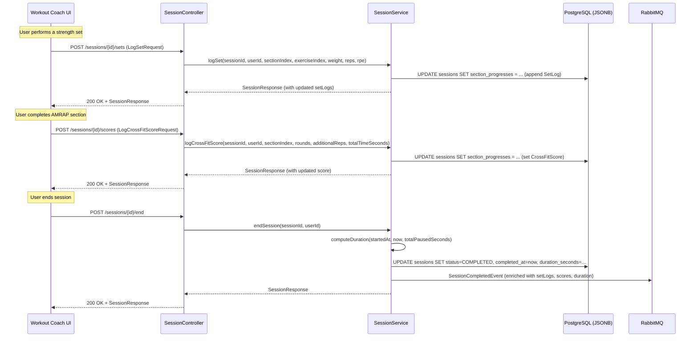

# Design Document — Workout Session Service: Performance Tracking

## Overview

This feature extends the existing workout-session-service to capture live performance data during active sessions. Currently, the service tracks exercise completion (checked/unchecked) but not the actual numbers — weight, reps, RPE for strength work, or rounds/reps/time for CrossFit-style sections.

**What this adds:**
- `SetLog` value object on `ExerciseLog` — captures weight, reps, RPE per set for strength exercises
- `CrossFitScore` value object on `SectionProgress` — captures rounds, additional reps, and time for AMRAP/EMOM/FOR_TIME sections
- `FOR_TIME` added to the `SectionType` enum
- Duration tracking — total active time excluding paused periods
- Enriched `SessionCompleted` event with all performance data for downstream analytics
- New REST endpoints for logging sets and scores
- Frontend components: set logging inputs, round counter, score entry, prescription display, elapsed timer, empty-session guard

**Design decisions:**
- **Extend existing domain objects** rather than creating new aggregate roots. `SetLog` lives inside `ExerciseLog`, `CrossFitScore` lives inside `SectionProgress`. This keeps the session as a single aggregate with one transactional boundary.
- **JSONB storage unchanged** — the `section_progresses` JSONB column already stores the full session state tree. Adding nested SetLog/CrossFitScore data requires no schema migration, only Jackson serialization updates.
- **New columns for timing** — `total_paused_seconds` on the `sessions` table to track cumulative pause duration, enabling accurate active-time computation on session end.
- **Overwrite semantics for CrossFitScore** — only one score per section. Simplifies the model (no score history within a single session) and matches the UX where the user enters their final score once.

**Trade-offs:**
- Storing all set logs in JSONB means no SQL-level querying of individual sets. Acceptable because the Progress Tracker Service (downstream consumer) handles analytics, not the session service.
- The round counter state is persisted in the session's `SectionProgress` JSONB on every increment. This adds a write per tap, but AMRAP rounds are infrequent (one tap every 1–3 minutes) so the load is negligible.

---

## Architecture

### Modified Hexagonal Layers

The feature extends the existing `session/` package. No new top-level feature packages are needed.

```
workout-session-service/
└── src/main/java/.../workoutsession/
    └── session/
        ├── domain/
        │   ├── Session.java              # (modified) — adds duration computation
        │   ├── SectionProgress.java      # (modified) — adds CrossFitScore field
        │   ├── ExerciseLog.java          # (modified) — adds List<SetLog>
        │   ├── SetLog.java               # (NEW) — value object for a single strength set
        │   ├── CrossFitScore.java        # (NEW) — value object for section score
        │   ├── SectionType.java          # (modified) — adds FOR_TIME
        │   └── SessionStatus.java        # (unchanged)
        ├── ports/
        │   └── inbound/
        │       ├── LogSetUseCase.java         # (NEW)
        │       ├── LogCrossFitScoreUseCase.java  # (NEW)
        │       └── ...existing ports...
        ├── application/
        │   └── SessionService.java       # (modified) — implements new use cases
        ├── adapters/
        │   ├── inbound/
        │   │   ├── SessionController.java    # (modified) — new endpoints
        │   │   └── dto/
        │   │       ├── LogSetRequest.java         # (NEW)
        │   │       ├── LogCrossFitScoreRequest.java  # (NEW)
        │   │       ├── SetLogResponse.java        # (NEW)
        │   │       ├── CrossFitScoreResponse.java # (NEW)
        │   │       ├── SessionResponse.java       # (modified) — includes performance data
        │   │       ├── ExerciseLogResponse.java   # (modified) — includes setLogs
        │   │       └── SectionProgressResponse.java # (modified) — includes crossFitScore
        │   └── outbound/
        │       └── RabbitSessionEventPublisher.java  # (unchanged — event shape changes)
        └── ...
    └── common/
        └── event/
            └── SessionCompletedEvent.java  # (modified) — adds durationSeconds field
```

### Component Interaction (Performance Tracking Flow)



---

## Components and Interfaces

### New Inbound Ports

| Port | Method | Description |
|------|--------|-------------|
| `LogSetUseCase` | `logSet(sessionId, userId, sectionIndex, exerciseIndex, weight, reps, rpe)` | Appends a SetLog to the specified exercise |
| `LogCrossFitScoreUseCase` | `logCrossFitScore(sessionId, userId, sectionIndex, rounds, additionalReps, totalTimeSeconds)` | Sets/overwrites the CrossFitScore on the specified section |

### New REST Endpoints

| Method | Path | Description | Request Body | Response |
|--------|------|-------------|--------------|----------|
| POST | `/api/v1/sessions/{id}/sets` | Log a strength set | `LogSetRequest` | 200 + `SessionResponse` |
| POST | `/api/v1/sessions/{id}/scores` | Log a CrossFit score | `LogCrossFitScoreRequest` | 200 + `SessionResponse` |

### Modified REST Responses

The existing `SessionResponse`, `SectionProgressResponse`, and `ExerciseLogResponse` are extended with performance fields. All new fields are additive (backward compatible for existing consumers).

### New Frontend Components

```
workout-coach-ui/src/features/theater/
├── SetLogForm.tsx              # (NEW) Weight/Reps/RPE inputs per set
├── SetLogList.tsx              # (NEW) Displays logged sets for an exercise
├── RoundCounter.tsx            # (NEW) Tap-based AMRAP round counter
├── CrossFitScoreForm.tsx       # (NEW) Score entry (rounds, additional reps, time)
├── ExercisePrescription.tsx    # (NEW) Displays prescribed sets/reps/weight/notes
├── SectionHeader.tsx           # (NEW) Section name + time cap + format descriptor
├── ElapsedTimer.tsx            # (NEW) Running elapsed time (excludes paused)
├── EmptySessionGuard.tsx       # (NEW) Confirmation prompt for empty sessions
├── ExerciseChecklist.tsx       # (MODIFIED) Integrates SetLogForm and ExercisePrescription
├── SessionControls.tsx         # (MODIFIED) Integrates EmptySessionGuard
└── TheaterModePage.tsx         # (MODIFIED) Adds ElapsedTimer, RoundCounter, SectionHeader
```

---

## Data Models

### New Domain Objects

#### SetLog (Value Object)

```java
public class SetLog {
    private final int setNumber;        // 1-based sequential within the exercise
    private final BigDecimal weight;    // kg, positive
    private final int repetitions;      // positive integer
    private final BigDecimal rpe;       // nullable, 1.0–10.0 in 0.5 increments
    private final Instant loggedAt;     // when the set was recorded

    // Validation in constructor:
    // - weight > 0
    // - repetitions > 0
    // - rpe == null OR (rpe >= 1.0 AND rpe <= 10.0 AND rpe % 0.5 == 0)
}
```

#### CrossFitScore (Value Object)

```java
public class CrossFitScore {
    private final int rounds;              // non-negative
    private final int additionalReps;      // non-negative
    private final Integer totalTimeSeconds; // nullable; required and positive for FOR_TIME
    private final Instant loggedAt;        // when the score was recorded

    // Validation in constructor:
    // - rounds >= 0
    // - additionalReps >= 0
    // - totalTimeSeconds == null OR totalTimeSeconds > 0
}
```

### Modified Domain Objects

#### ExerciseLog (extended)

```java
public class ExerciseLog {
    // ...existing fields...
    private final int exerciseIndex;
    private final String exerciseName;
    private final Integer restSeconds;
    private boolean completed;
    private Instant completedAt;

    // NEW
    private final List<SetLog> setLogs;  // ordered chronologically

    public void addSetLog(SetLog setLog) { ... }
    public List<SetLog> getSetLogs() { ... }
}
```

#### SectionProgress (extended)

```java
public class SectionProgress {
    // ...existing fields...
    private final int sectionIndex;
    private final String sectionName;
    private final SectionType sectionType;
    private final List<ExerciseLog> exerciseLogs;
    private boolean completed;

    // NEW
    private CrossFitScore crossFitScore;  // nullable, one per section
    private int roundCount;               // AMRAP round counter state (persisted for navigation)

    public void setCrossFitScore(CrossFitScore score) { ... }
    public CrossFitScore getCrossFitScore() { ... }
    public void setRoundCount(int count) { ... }
    public int getRoundCount() { ... }
}
```

#### SectionType (extended)

```java
public enum SectionType {
    STRENGTH,
    AMRAP,
    TABATA,
    EMOM,
    FOR_TIME  // NEW
}
```

#### Session (extended)

```java
public class Session {
    // ...existing fields...

    // NEW
    private long totalPausedSeconds;   // cumulative seconds spent in PAUSED state
    private Integer durationSeconds;   // computed on end: (endTime - startTime) - totalPausedSeconds

    // Modified pause() — records pause start time (already does via pausedAt)
    // Modified resume logic — accumulates paused duration into totalPausedSeconds
    // Modified end() — computes durationSeconds

    public boolean hasPerformanceData() {
        // Returns true if any ExerciseLog has non-empty setLogs
        // OR any SectionProgress has a non-null crossFitScore
    }
}
```

### Database Changes

#### V203__add_session_timing_columns.sql

```sql
ALTER TABLE sessions ADD COLUMN total_paused_seconds BIGINT NOT NULL DEFAULT 0;
ALTER TABLE sessions ADD COLUMN duration_seconds INTEGER;
```

No changes to the `section_progresses` JSONB column structure — the new `setLogs`, `crossFitScore`, and `roundCount` fields are serialized/deserialized by Jackson automatically.

### Updated Request/Response DTOs

#### LogSetRequest

```java
public record LogSetRequest(
    @NotNull int sectionIndex,
    @NotNull int exerciseIndex,
    @NotNull @DecimalMin(value = "0.01") BigDecimal weight,
    @NotNull @Min(1) int repetitions,
    @DecimalMin("1.0") @DecimalMax("10.0") BigDecimal rpe  // nullable
) {}
```

#### LogCrossFitScoreRequest

```java
public record LogCrossFitScoreRequest(
    @NotNull int sectionIndex,
    @NotNull @Min(0) int rounds,
    @NotNull @Min(0) int additionalReps,
    @Min(1) Integer totalTimeSeconds  // nullable; required for FOR_TIME
) {}
```

#### ExerciseLogResponse (extended)

```java
public record ExerciseLogResponse(
    int exerciseIndex,
    String exerciseName,
    Integer restSeconds,
    boolean completed,
    Instant completedAt,
    List<SetLogResponse> setLogs  // NEW — empty list if no sets logged
) {}
```

#### SetLogResponse

```java
public record SetLogResponse(
    int setNumber,
    BigDecimal weight,
    int repetitions,
    BigDecimal rpe,       // nullable
    Instant loggedAt
) {}
```

#### SectionProgressResponse (extended)

```java
public record SectionProgressResponse(
    int sectionIndex,
    String sectionName,
    String sectionType,
    List<ExerciseLogResponse> exerciseLogs,
    boolean completed,
    CrossFitScoreResponse crossFitScore,  // NEW — nullable
    int roundCount                         // NEW — AMRAP counter state
) {}
```

#### CrossFitScoreResponse

```java
public record CrossFitScoreResponse(
    int rounds,
    int additionalReps,
    Integer totalTimeSeconds,  // nullable
    Instant loggedAt
) {}
```

#### SessionResponse (extended)

```java
public record SessionResponse(
    UUID id,
    String status,
    int currentSectionIndex,
    List<SectionProgressResponse> sectionProgresses,
    Object workoutSnapshot,
    Instant startedAt,
    Instant pausedAt,
    Instant completedAt,
    Integer durationSeconds  // NEW — null until session ends
) {}
```

### Updated SessionCompletedEvent

```java
public record SessionCompletedEvent(
    UUID eventId,
    Instant occurredAt,
    String userId,
    UUID sessionId,
    UUID programId,
    int weekNumber,
    int dayNumber,
    boolean standalone,
    List<SectionProgress> sectionProgresses,  // now includes setLogs + crossFitScore
    Instant startedAt,
    Instant completedAt,
    Integer durationSeconds  // NEW — active time in seconds, excluding paused time
) {}
```

The `sectionProgresses` field already carries the full domain objects (serialized via Jackson). Since `ExerciseLog` now contains `setLogs` and `SectionProgress` now contains `crossFitScore`, the event payload is automatically enriched without changing the event's field list (beyond adding `durationSeconds`).

### Updated Frontend Types

```typescript
// session.ts additions

export type SectionType = 'STRENGTH' | 'AMRAP' | 'EMOM' | 'TABATA' | 'FOR_TIME';

export interface SetLog {
  setNumber: number;
  weight: number;       // kg
  repetitions: number;
  rpe: number | null;   // 1.0–10.0 in 0.5 increments
  loggedAt: string;     // ISO-8601
}

export interface CrossFitScore {
  rounds: number;
  additionalReps: number;
  totalTimeSeconds: number | null;
  loggedAt: string;     // ISO-8601
}

export interface ExerciseLog {
  exerciseIndex: number;
  exerciseName: string;
  completed: boolean;
  completedAt: string | null;
  setLogs: SetLog[];           // NEW
}

export interface SectionProgress {
  sectionIndex: number;
  sectionName: string;
  sectionType: SectionType;
  exerciseLogs: ExerciseLog[];
  completed: boolean;
  crossFitScore: CrossFitScore | null;  // NEW
  roundCount: number;                    // NEW
}

export interface SessionResponse {
  id: string;
  status: SessionStatus;
  currentSectionIndex: number;
  sectionProgresses: SectionProgressResponse[];
  workoutSnapshot: unknown;
  startedAt: string;
  pausedAt: string | null;
  completedAt: string | null;
  durationSeconds: number | null;  // NEW
}

// New request types
export interface LogSetRequest {
  sectionIndex: number;
  exerciseIndex: number;
  weight: number;
  repetitions: number;
  rpe: number | null;
}

export interface LogCrossFitScoreRequest {
  sectionIndex: number;
  rounds: number;
  additionalReps: number;
  totalTimeSeconds: number | null;
}
```

---

## Correctness Properties

*A property is a characteristic or behavior that should hold true across all valid executions of a system — essentially, a formal statement about what the system should do. Properties serve as the bridge between human-readable specifications and machine-verifiable correctness guarantees.*

### Property 1: Valid set log persistence and association

*For any* active session with a STRENGTH section, and any valid set log data (weight > 0, repetitions > 0, RPE either null or in [1.0, 10.0] in 0.5 increments), logging the set at a valid (sectionIndex, exerciseIndex) should append a SetLog to that ExerciseLog with the correct weight, repetitions, RPE, and a non-null timestamp at or after the submission time.

**Validates: Requirements 1.1, 1.2, 1.3**

### Property 2: Multiple sets stored in chronological order

*For any* sequence of N valid set logs submitted to the same exercise (N ≥ 1), the resulting ExerciseLog should contain exactly N SetLog entries with setNumbers 1 through N, and each entry's loggedAt timestamp should be less than or equal to the next entry's loggedAt timestamp.

**Validates: Requirements 1.6**

### Property 3: Invalid set log rejection preserves state

*For any* set log data where weight ≤ 0, or repetitions ≤ 0, or RPE is non-null and outside [1.0, 10.0] or not a multiple of 0.5, the service should reject the request and the session's state (including all existing SetLog entries) should remain unchanged.

**Validates: Requirements 1.7**

### Property 4: Valid CrossFit score persistence and association

*For any* active session with a scored section (AMRAP, EMOM, or FOR_TIME), and any valid CrossFitScore data (rounds ≥ 0, additionalReps ≥ 0, totalTimeSeconds > 0 when section is FOR_TIME), logging the score at a valid sectionIndex should set the CrossFitScore on that SectionProgress with the correct values and a non-null timestamp.

**Validates: Requirements 2.1, 2.2, 2.3, 2.4, 2.5**

### Property 5: Invalid CrossFit score rejection

*For any* CrossFitScore data where rounds < 0, or additionalReps < 0, or totalTimeSeconds ≤ 0 for a FOR_TIME section, the service should reject the request and the session's state should remain unchanged.

**Validates: Requirements 2.6**

### Property 6: CrossFit score overwrite semantics

*For any* section that already has a CrossFitScore, submitting a new valid score should replace the previous score entirely. The section should contain exactly one CrossFitScore (the latest), not a list.

**Validates: Requirements 2.7**

### Property 7: Round counter increment/decrement with floor at zero

*For any* sequence of increment and decrement actions applied to a round counter starting at zero, the resulting count should equal max(0, total_increments − total_decrements). The count should never be negative.

**Validates: Requirements 3.1, 3.3**

### Property 8: SessionCompleted event contains all performance data and timing

*For any* completed session (with or without performance data), the SessionCompleted event should contain: all existing fields (eventId, occurredAt, userId, sessionId, programId, weekNumber, dayNumber, standalone, startedAt, completedAt), all SetLog entries for every ExerciseLog, the CrossFitScore (or null) for every SectionProgress, and the durationSeconds field. No exercises or sections should be omitted from the event regardless of whether they have performance data.

**Validates: Requirements 4.1, 4.2, 4.3, 4.4, 7.6**

### Property 9: Has-performance-data predicate correctness

*For any* session state, the `hasPerformanceData()` predicate should return true if and only if at least one ExerciseLog has a non-empty setLogs list OR at least one SectionProgress has a non-null crossFitScore.

**Validates: Requirements 5.1, 5.4**

### Property 10: Duration computation excludes paused time

*For any* session timeline consisting of a start time, zero or more (pause, resume) pairs, and an end time, the computed durationSeconds should equal (endTime − startTime) − totalPausedSeconds, where totalPausedSeconds is the sum of all (resumeTime − pauseTime) intervals. The duration should always be non-negative.

**Validates: Requirements 7.3**

---

## Error Handling

### New Error Scenarios

| Scenario | Status | Message |
|----------|--------|---------|
| Set log with invalid weight (≤ 0) | 400 | "Weight must be greater than zero" |
| Set log with invalid reps (≤ 0) | 400 | "Repetitions must be at least 1" |
| Set log with invalid RPE (outside 1.0–10.0 or not 0.5 increment) | 400 | "RPE must be between 1.0 and 10.0 in 0.5 increments" |
| CrossFit score with negative rounds | 400 | "Rounds must be non-negative" |
| CrossFit score with negative additional reps | 400 | "Additional reps must be non-negative" |
| CrossFit score with non-positive time (FOR_TIME) | 400 | "Total time must be greater than zero for For Time sections" |
| Log set on non-STRENGTH section | 400 | "Set logging is only available for STRENGTH sections" |
| Log CrossFit score on non-scored section | 400 | "Score logging is only available for AMRAP, EMOM, or FOR_TIME sections" |
| Log set/score on completed session | 409 | "Session is already completed" |
| Log set/score on another user's session | 403 | "Access denied" |

### Existing Error Handling (unchanged)

All existing error scenarios (session not found, invalid section/exercise index, etc.) continue to apply. The `GlobalExceptionHandler` handles validation errors from Jakarta Bean Validation annotations on the new request DTOs.

### Validation Strategy

- **Domain-level validation** in `SetLog` and `CrossFitScore` constructors — throws `IllegalArgumentException` for invalid state. This ensures the domain is always consistent regardless of entry point.
- **Controller-level validation** via Jakarta Bean Validation annotations on `LogSetRequest` and `LogCrossFitScoreRequest` — provides user-friendly 400 responses before reaching the domain.
- **RPE 0.5-increment validation** — custom validator annotation `@RpeValue` or validated in the domain constructor since Jakarta doesn't natively support "multiple of 0.5" constraints.

---

## Testing Strategy

### Backend Testing

#### Unit Tests (JUnit 5 + Mockito)

Focus areas:
- **SetLog construction** — valid/invalid inputs, RPE validation (0.5 increments, nullable)
- **CrossFitScore construction** — valid/invalid inputs, FOR_TIME requires totalTimeSeconds
- **ExerciseLog.addSetLog()** — appends correctly, maintains order
- **SectionProgress.setCrossFitScore()** — overwrites previous, validates section type
- **Session.hasPerformanceData()** — various combinations of empty/non-empty data
- **Session duration computation** — various pause/resume sequences
- **SessionService.logSet()** — orchestration with mocked repository
- **SessionService.logCrossFitScore()** — orchestration with mocked repository
- **SessionService.endSession()** — event includes performance data and duration
- **Naming:** `MethodName_StateUnderTest_ExpectedBehaviour`

#### Property-Based Tests (jqwik)

- **Library:** jqwik (already used across the platform)
- **Configuration:** Minimum 100 iterations per property (`@Property(tries = 100)`)
- **Tag format:** `Feature: workout-session-service-performance-tracking, Property {number}: {property_text}`
- **Test classes:** `SetLogPropertyTest`, `CrossFitScorePropertyTest`, `SessionPerformancePropertyTest`, `DurationPropertyTest`

Each correctness property (1–10) maps to a single `@Property` test method. Generators will produce:
- Random valid/invalid SetLog data (weight as BigDecimal 0.01–500, reps 1–100, RPE null or 1.0–10.0 in 0.5 steps)
- Random valid/invalid CrossFitScore data (rounds 0–50, additionalReps 0–30, totalTimeSeconds 1–7200)
- Random session structures (1–5 sections, 1–8 exercises per section, random section types including FOR_TIME)
- Random session timelines (start, 0–5 pause/resume pairs, end) with realistic timestamps

#### Integration Tests (@SpringBootTest)

- POST `/api/v1/sessions/{id}/sets` — happy path, validation errors, wrong section type
- POST `/api/v1/sessions/{id}/scores` — happy path per section type, overwrite, validation errors
- POST `/api/v1/sessions/{id}/end` — verify enriched event arrives on RabbitMQ queue with performance data
- Verify JSONB round-trip: log sets → fetch session → verify setLogs present in response
- Verify duration computation end-to-end: start → pause → resume → end → check durationSeconds

### Frontend Testing

#### Unit Tests (Vitest + React Testing Library)

- `SetLogForm` — input validation, submission, disabled states
- `SetLogList` — renders logged sets correctly
- `RoundCounter` — increment, decrement, floor at zero, display
- `CrossFitScoreForm` — appropriate fields per section type, validation
- `ExercisePrescription` — displays present fields, hides absent fields
- `SectionHeader` — time cap display, format descriptor
- `ElapsedTimer` — correct elapsed computation excluding paused time
- `EmptySessionGuard` — shows prompt when no data, skips when data exists
- `useSession` hook — new API calls for logSet and logCrossFitScore

#### E2E Tests (Playwright)

- Start session → log strength sets → verify sets appear in checklist
- Start AMRAP session → use round counter → submit score → verify persistence
- End session with no data → verify empty-session prompt appears
- End session with data → verify no prompt, session completes
- Verify elapsed timer runs and pauses correctly
