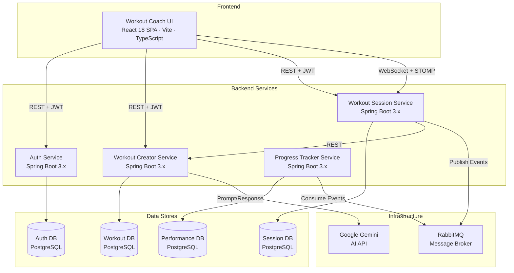
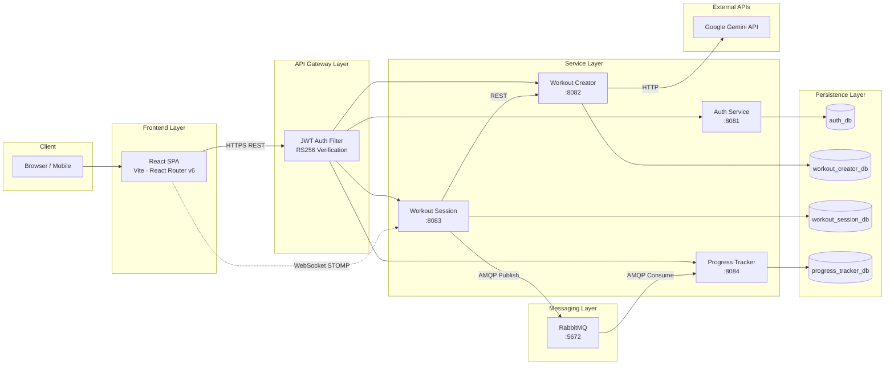
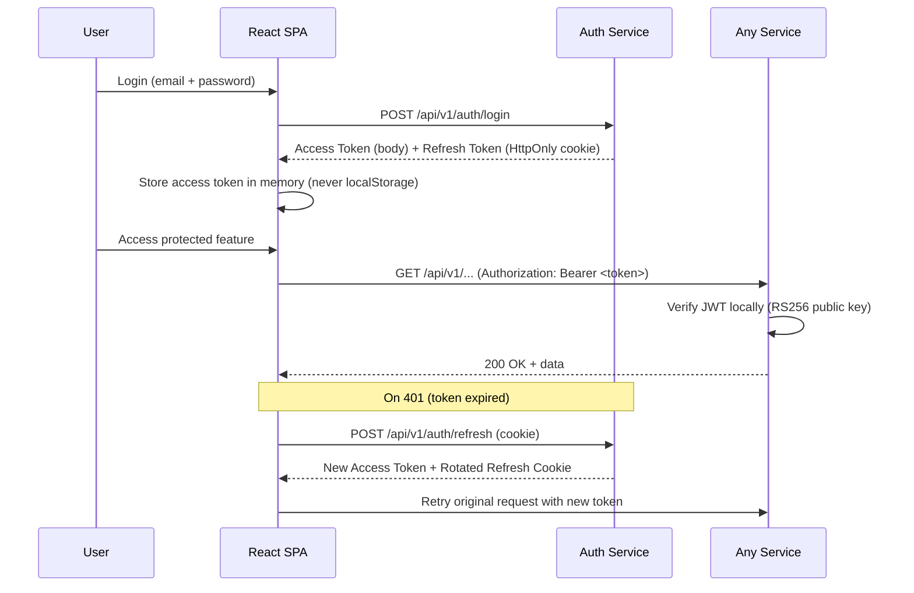
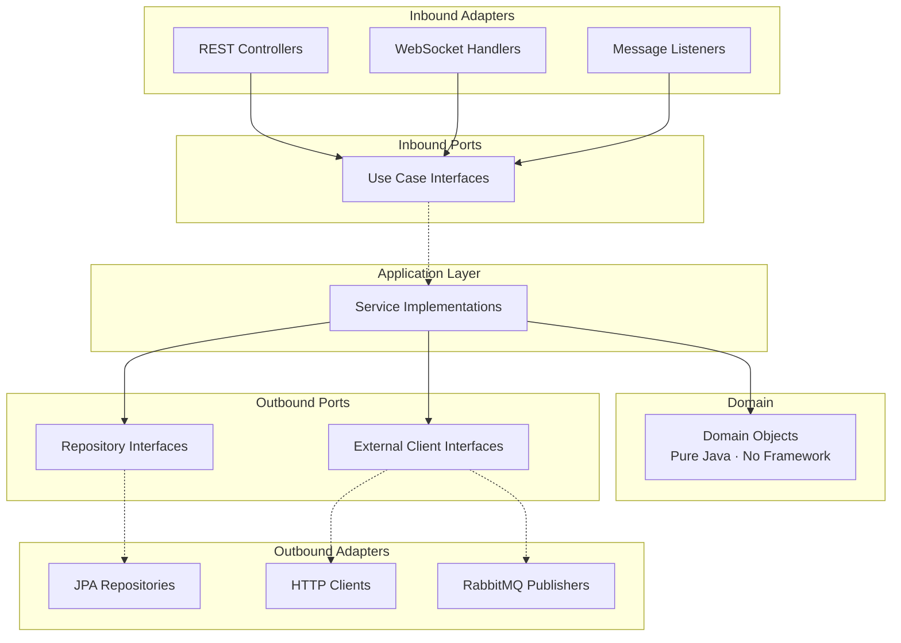
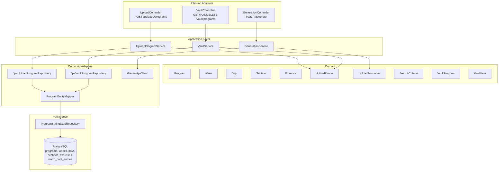
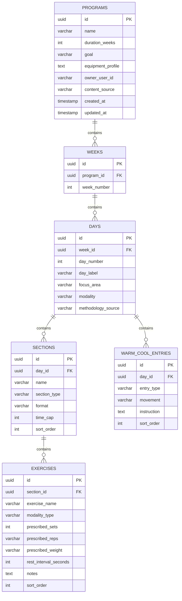

# HybridStrength — Architecture, Design & Status Diagrams

---

## 1. Component Diagram

All logical components of the HybridStrength platform and their responsibilities.



### Component Responsibilities

| Component | Responsibility |
|-----------|---------------|
| **Workout Coach UI** | React SPA — auth flows, workout generation, vault management, upload, theater mode, progress dashboard |
| **Auth Service** | User registration, login, JWT issuance (RS256), refresh tokens, admin user management |
| **Workout Creator Service** | AI workout generation (Gemini), program upload/parse/validate, Vault CRUD, search & filter |
| **Workout Session Service** | Theater Mode state, live performance logging, rest timers, program progression, event publishing |
| **Progress Tracker Service** | Dashboard analytics, 1RM calculations, benchmark tracking, muscle heat map, PR detection |
| **RabbitMQ** | Async event bus — `SessionCompleted` events from Session → Progress Tracker |
| **Google Gemini** | External AI for natural language → structured workout generation |

---

## 2. End-to-End Architecture Diagram

Shows the full request/data flow from user interaction through all layers.



### Communication Patterns

| Pattern | From → To | Protocol | Purpose |
|---------|-----------|----------|---------|
| Synchronous | UI → Services | REST/JSON over HTTPS | All CRUD operations |
| Synchronous | Session → Creator | REST/JSON | Fetch workout definitions |
| Asynchronous | Session → Progress | RabbitMQ (AMQP) | `SessionCompleted` events |
| Real-time | UI ↔ Session | WebSocket + STOMP | Live timer updates, session state |
| External | Creator → Gemini | HTTPS | AI workout generation |

### Security Flow



---

## 3. Full System Design

### Hexagonal Architecture (per service)

Each microservice follows the same internal layering:



### Workout Creator Service — Internal Design



### Database Schema (Workout Creator Service)



---

## 4. Screen Flows

### Current Application Routes

```mermaid
flowchart TD
    START[App Launch] --> AUTH_CHECK{Authenticated?}

    AUTH_CHECK -->|No| LOGIN[/login<br/>Login Page]
    AUTH_CHECK -->|Yes| HOME[/<br/>Home Page]

    LOGIN -->|Register link| REGISTER[/register<br/>Registration Page]
    REGISTER -->|Success| LOGIN
    LOGIN -->|Success| HOME

    HOME --> NW[New Workout Menu]
    HOME --> PERF[/my-performance<br/>Coming Soon]
    HOME --> WK[Workout Menu]

    NW --> ASK_GEMINI[/new-workout<br/>Ask Gemini · Coming Soon]
    NW --> UPLOAD[/upload<br/>Upload Program]

    WK --> CONTINUE[/workout/continue<br/>Continue with Program · Coming Soon]
    WK --> SEARCH[/vault/search<br/>Vault Search Page]

    UPLOAD -->|Success| VAULT_LINK[View in Vault link]
    VAULT_LINK --> DETAIL

    SEARCH -->|Select result| DETAIL[/vault/programs/:id<br/>Program Detail Page]
    DETAIL -->|Delete| SEARCH
    DETAIL -->|Copy| DETAIL_COPY[/vault/programs/:newId<br/>Copy Detail Page]
    DETAIL -->|Edit JSON| EDITOR[Inline JSON Editor]
    EDITOR -->|Save| DETAIL
```

### Home Page Menu Structure

```
┌─────────────────────────────────────────┐
│              HOME SCREEN                 │
├─────────────────────────────────────────┤
│                                         │
│  ┌─────────────────────────────────┐    │
│  │  🏋️ New Workout  [expandable]   │    │
│  │    ├── Ask Gemini               │    │
│  │    └── Upload Program           │    │
│  └─────────────────────────────────┘    │
│                                         │
│  ┌─────────────────────────────────┐    │
│  │  📊 My Performance              │    │
│  └─────────────────────────────────┘    │
│                                         │
│  ┌─────────────────────────────────┐    │
│  │  💪 Workout  [expandable]       │    │
│  │    ├── Continue with Program    │    │
│  │    └── Search for a workout     │    │
│  └─────────────────────────────────┘    │
│                                         │
│  [Logout]                               │
└─────────────────────────────────────────┘
```

### Upload Flow

```
┌──────────┐    ┌──────────────┐    ┌──────────────┐    ┌─────────────┐
│  File    │───▶│  Structured  │───▶│   Uploading  │───▶│   Success   │
│  Picker  │    │   Preview    │    │  (disabled)  │    │ + Vault Link│
└──────────┘    └──────────────┘    └──────────────┘    └─────────────┘
                       │                                        
                       ▼                                        
                ┌──────────────┐                               
                │  JSON Editor │                               
                │  (optional)  │                               
                └──────────────┘                               
```

### Vault Search & Detail Flow

```
┌─────────────────────────────────────────────────────────┐
│  VAULT SEARCH PAGE  (/vault/search)                     │
├─────────────────────────────────────────────────────────┤
│  [Search input ___________] [🔍]                        │
│  Focus Area: [All ▼]   Modality: [All ▼]               │
│                                                         │
│  ┌─────────────────────────────────────────────┐        │
│  │ Program Name          │ Goal │ Weeks │ Source│        │
│  ├───────────────────────┼──────┼───────┼──────┤        │
│  │ Hybrid Strength 4-Wk  │ Str  │  4    │ ⬆️   │        │
│  │ Push Pull Legs         │ Hyp  │  1    │ 🤖   │        │
│  └─────────────────────────────────────────────┘        │
└─────────────────────────────────────────────────────────┘
                          │ click
                          ▼
┌─────────────────────────────────────────────────────────┐
│  PROGRAM DETAIL PAGE  (/vault/programs/:id)             │
├─────────────────────────────────────────────────────────┤
│  Name: Hybrid Strength 4-Week                           │
│  Goal: Build strength    Duration: 4 weeks              │
│  Equipment: Barbell, Pull-up Bar                        │
│  Source: UPLOADED                                       │
│                                                         │
│  [Delete] [Edit JSON] [Copy]                            │
│                                                         │
│  ▶ Week 1                                              │
│    ▶ Day 1 — Push (Hypertrophy)                        │
│      Warm-up: Arm Circles (30s each direction)          │
│      Section: Tier 1 Compound                           │
│        • Bench Press — 4×6-8 @ 80% 1RM (120s rest)     │
│      Cool-down: Chest Stretch (30s each side)           │
│    ▶ Day 2 — Pull (Hypertrophy)                        │
│  ▶ Week 2                                              │
│  ▶ Week 3                                              │
│  ▶ Week 4                                              │
└─────────────────────────────────────────────────────────┘
```

---

## 5. Requirements Status & Spec Mapping

### Legend

| Status | Meaning |
|--------|---------|
| ✅ | Fully implemented and tested |
| 🔨 | Partially implemented (some tasks remaining) |
| 📋 | Spec created, not yet implemented |
| 🚫 | Deferred / TODO |

### Requirements Completion Matrix

| # | Requirement | Status | Implementing Spec(s) |
|---|-------------|--------|---------------------|
| 1 | User Registration and Authentication | ✅ | `auth-service-mvp1` |
| 2 | Admin User Management | 📋 | `auth-service-mvp2` (requirements only) |
| 3 | AI-Powered Workout & Program Generation | 📋 | `workout-creator-service` (requirements only) |
| 4 | Workout and Program CRUD (Vault) | ✅ | `workout-creator-service-vault` |
| 5 | Vault Search and Filter | ✅ | `workout-creator-service-vault` |
| 6 | Active Workout — Theater Mode | 📋 | `workout-session-service` (requirements only) |
| 7 | Live Performance Logging | 📋 | `workout-session-service` (requirements only) |
| 8 | Session State and Program Progression | 📋 | `workout-session-service` (requirements only) |
| 9 | Progress Dashboard | 📋 | `progress-tracker-service` (requirements only) |
| 10 | CrossFit and Benchmark Tracking | 📋 | `progress-tracker-service` (requirements only) |
| 11 | Muscle Activation Heat Map | 📋 | `progress-tracker-service` (requirements only) |
| 12 | Workout Coach UI — Navigation & Home | ✅ | `workout-coach-ui-mvp1` |
| 13 | Data Integrity and Service Isolation | 🔨 | `platform` (requirements only; enforced in implemented services) |
| 14 | Schema Management and Database Standards | ✅ | Enforced across `auth-service-mvp1`, `workout-creator-service-upload`, `workout-creator-service-vault` |
| 15 | Workout and Program Upload (via UI) | ✅ | `workout-creator-service-upload` |
| 16 | Workout Ingest via Email | 🚫 | Deferred |
| 17 | Workout Photo Upload and AI Processing | 🚫 | Deferred |
| 18 | Workout Ingest via Email — Photo + JSON | 🚫 | Deferred |

### Detailed Spec → Implementation Mapping

#### ✅ Completed Specs (with tasks.md fully checked off)

| Spec | What It Delivers | Tasks |
|------|-----------------|-------|
| `auth-service-mvp1` | Registration, login, JWT (RS256), refresh tokens, bcrypt hashing, security filter, exception handling | 13 tasks — all ✅ |
| `workout-coach-ui-mvp1` | React SPA scaffold, auth context, login/register pages, home page, protected routing, API client with interceptors | 9 task groups — all ✅ |
| `workout-creator-service-upload` | Upload endpoint, validate endpoint, UploadParser, UploadFormatter, JPA persistence, frontend upload flow (file picker, preview, JSON editor) | 11 task groups — all ✅ |
| `workout-creator-service-vault` | Vault CRUD (list, get, update, delete, copy), search with filters, frontend vault pages, home menu restructure, 15 property-based tests, unit tests, integration tests | 17 task groups — 15 ✅, 1 in progress, 1 optional |

#### 📋 Specs with Requirements Only (no design/tasks yet)

| Spec | Scope | Blocked By |
|------|-------|-----------|
| `auth-service-mvp2` | Admin user management (list users, deactivate accounts) | Nothing — ready to spec |
| `workout-creator-service` (main) | AI generation via Gemini, round-trip property | Nothing — ready to spec |
| `workout-session-service` | Theater Mode, live logging, program progression, WebSocket | Workout Creator Service API (for fetching definitions) |
| `progress-tracker-service` | Dashboard, 1RM, benchmarks, heat map | Session Service (for `SessionCompleted` events) |
| `workout-coach-ui` (main) | Full UI spec including theater mode, progress views | Session + Progress services |
| `platform` | Cross-service contracts, data isolation rules | Reference spec — no implementation tasks |

### What's Left — Prioritised Backlog

```
Priority 1 (Ready Now):
  ├── AI Workout Generation (Gemini integration)
  ├── Admin User Management (auth-service-mvp2)
  └── Vault integration tests (task 15 — just completed)

Priority 2 (Depends on Generation):
  ├── Workout Session Service (Theater Mode)
  └── Session UI components

Priority 3 (Depends on Session):
  ├── Progress Tracker Service
  ├── Dashboard UI
  └── Benchmark tracking

Deferred (post-MVP):
  ├── Email ingest (Req 16)
  ├── Photo upload + AI extraction (Req 17)
  └── Email photo ingest (Req 18)
```

---

## Summary

**Built so far:**
- Full authentication system (register, login, JWT, refresh)
- React SPA with auth flows and protected routing
- Program upload with validation, preview, and JSON editing
- Complete Vault CRUD (list, get, update, delete, copy)
- Vault search with keyword, focus area, and modality filters
- Frontend vault pages (search, detail, JSON editor)
- Home page with expandable menus
- 15 property-based tests + unit tests + integration tests for vault
- Flyway migrations, hexagonal architecture throughout

**Next up:**
- AI workout generation (Gemini integration)
- Theater Mode (active workout execution)
- Progress dashboard and analytics
