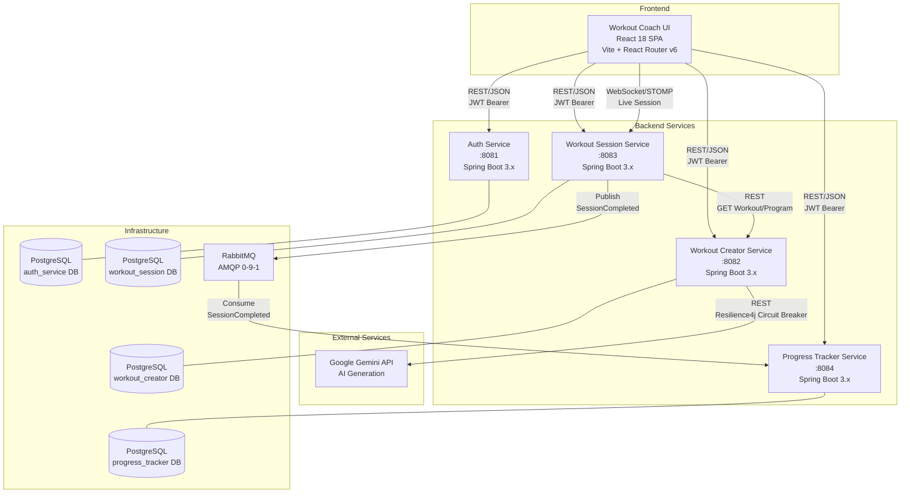
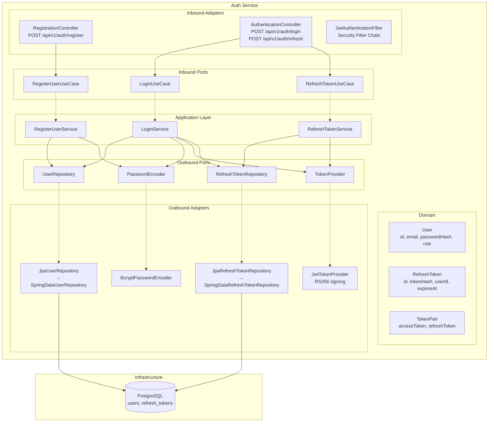
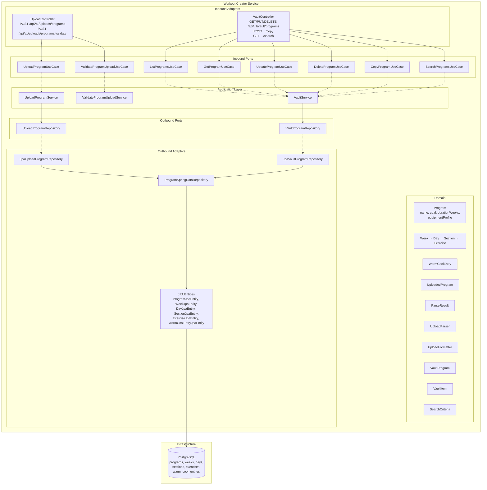
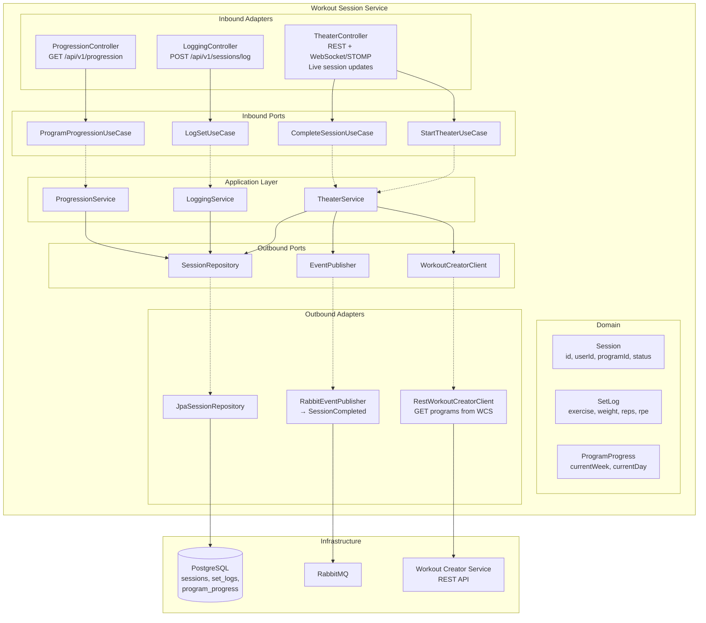
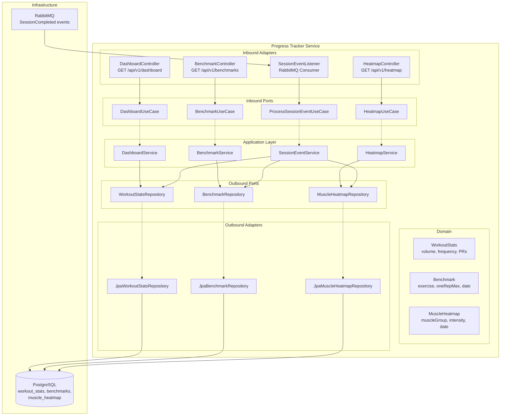
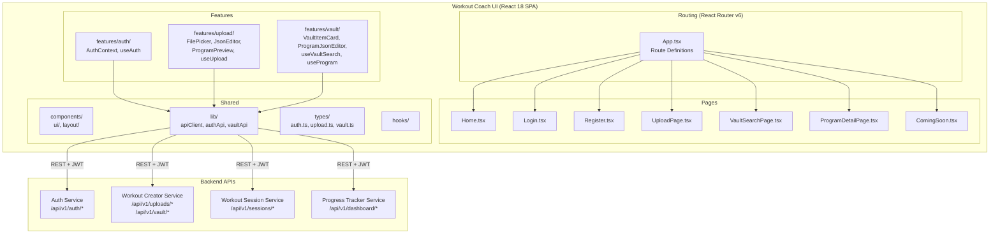
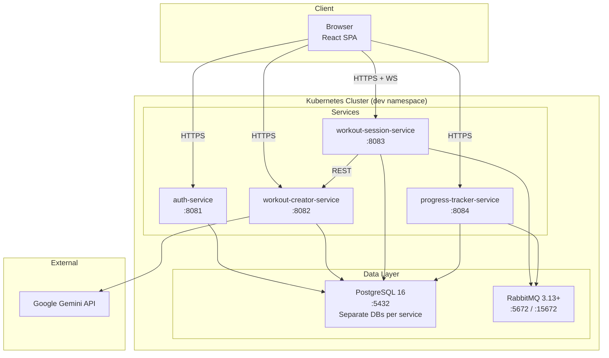
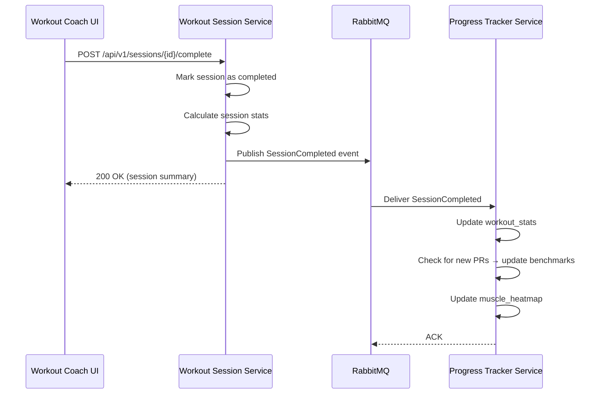
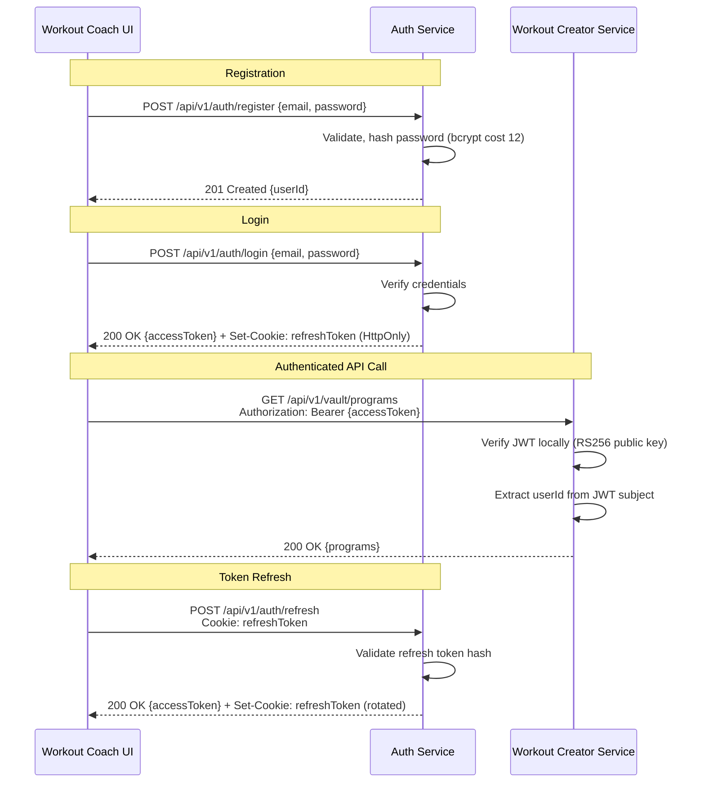

# HybridStrength — Architecture Diagrams

This document contains Mermaid architecture diagrams covering the full HybridStrength platform: service interactions, hexagonal architecture per service, and database schema ownership.

---

## 1. High-Level Service Interaction Diagram



### Communication Patterns Summary

| Pattern | Usage |
|---------|-------|
| **REST (JSON/HTTP)** | All client→service and service→service synchronous calls |
| **JWT (RS256)** | Authentication on every protected endpoint; verified locally per service |
| **RabbitMQ (AMQP)** | Async domain events between services (e.g., `SessionCompleted`) |
| **WebSocket (STOMP)** | Real-time session updates from Workout Session Service to UI |
| **Circuit Breaker** | Resilience4j wrapping Gemini API calls (10s timeout) |

---

## 2. Hexagonal Architecture — Auth Service



### Auth Service — Package Structure

```
authservice/
├── config/                    SecurityConfig, JwtConfig
├── registration/
│   ├── domain/                User
│   ├── ports/inbound/         RegisterUserUseCase
│   ├── ports/outbound/        UserRepository
│   ├── application/           RegisterUserService
│   └── adapters/
│       ├── inbound/           RegistrationController, dto/
│       └── outbound/          JpaUserRepository, SpringDataUserRepository, UserJpaEntity
├── authentication/
│   ├── domain/                RefreshToken, TokenPair
│   ├── ports/inbound/         LoginUseCase, RefreshTokenUseCase
│   ├── ports/outbound/        PasswordEncoder, RefreshTokenRepository, TokenProvider
│   ├── application/           LoginService, RefreshTokenService
│   └── adapters/
│       ├── inbound/           AuthenticationController, dto/
│       └── outbound/          BcryptPasswordEncoder, JpaRefreshTokenRepository,
│                              JwtTokenProvider, RefreshTokenJpaEntity, SpringDataRefreshTokenRepository
└── common/
    ├── dto/                   ErrorResponse, ValidationErrorResponse
    ├── exception/             GlobalExceptionHandler, DuplicateEmailException,
    │                          InvalidCredentialsException, InvalidRefreshTokenException
    └── security/              JwtAuthenticationFilter
```

---

## 3. Hexagonal Architecture — Workout Creator Service



### Workout Creator Service — Package Structure

```
workoutcreator/
├── config/                    SecurityConfig, JwtConfig, JwtProperties, UploadConfig
├── upload/
│   ├── domain/                UploadedProgram, ParseResult, UploadParser,
│   │                          UploadFormatter, UploadValidationError
│   ├── ports/inbound/         UploadProgramUseCase, ValidateProgramUploadUseCase
│   ├── ports/outbound/        UploadProgramRepository
│   ├── application/           UploadProgramService, ValidateProgramUploadService
│   └── adapters/
│       ├── inbound/           UploadController, dto/
│       └── outbound/          JpaUploadProgramRepository
├── vault/
│   ├── domain/                VaultProgram, VaultItem, SearchCriteria
│   ├── ports/inbound/         ListProgramsUseCase, GetProgramUseCase, UpdateProgramUseCase,
│   │                          DeleteProgramUseCase, CopyProgramUseCase, SearchProgramsUseCase
│   ├── ports/outbound/        VaultProgramRepository
│   ├── application/           VaultService
│   └── adapters/
│       ├── inbound/           VaultController, dto/
│       └── outbound/          JpaVaultProgramRepository, ProgramEntityMapper,
│                              ProgramSpringDataRepository, ProgramJpaEntity, WeekJpaEntity,
│                              DayJpaEntity, SectionJpaEntity, ExerciseJpaEntity, WarmCoolEntryJpaEntity
└── common/
    ├── model/                 Program, Week, Day, Section, Exercise, WarmCoolEntry,
    │                          ContentSource, Modality, ModalityType, SectionType
    ├── dto/                   ErrorResponse, ValidationErrorResponse
    ├── exception/             GlobalExceptionHandler, UploadValidationException,
    │                          ProgramAccessDeniedException
    └── security/              JwtAuthenticationFilter
```

---

## 4. Hexagonal Architecture — Workout Session Service (Planned)



---

## 5. Hexagonal Architecture — Progress Tracker Service (Planned)



---

## 6. Frontend Architecture — Workout Coach UI



### Frontend Route Map

| Route | Page | Status |
|-------|------|--------|
| `/login` | Login | ✅ Implemented |
| `/register` | Register | ✅ Implemented |
| `/` | Home | ✅ Implemented |
| `/upload` | UploadPage | ✅ Implemented |
| `/new-workout` | ComingSoon | Placeholder |
| `/my-performance` | ComingSoon | Placeholder |
| `/workout` | ComingSoon | Placeholder |
| `/vault/search` | VaultSearchPage | Planned |
| `/vault/programs/:id` | ProgramDetailPage | Planned |
| `/workout/continue` | ComingSoon | Planned |

---

## 7. Database Schema Ownership

```mermaid
graph LR
    subgraph "Auth Service DB (V001–V099)"
        USERS[users<br/>─────────<br/>id UUID PK<br/>email VARCHAR UNIQUE<br/>password_hash VARCHAR<br/>role VARCHAR<br/>created_at TIMESTAMPTZ<br/>updated_at TIMESTAMPTZ]
        REFRESH[refresh_tokens<br/>─────────<br/>id UUID PK<br/>token_hash VARCHAR UNIQUE<br/>user_id UUID FK→users<br/>expires_at TIMESTAMPTZ<br/>created_at TIMESTAMPTZ]
    end

    subgraph "Workout Creator Service DB (V100–V199)"
        PROGRAMS[programs<br/>─────────<br/>id UUID PK<br/>name VARCHAR<br/>duration_weeks INT<br/>goal VARCHAR<br/>equipment_profile TEXT<br/>owner_user_id VARCHAR<br/>content_source VARCHAR<br/>created_at TIMESTAMPTZ<br/>updated_at TIMESTAMPTZ]
        WEEKS[weeks<br/>─────────<br/>id UUID PK<br/>program_id UUID FK→programs<br/>week_number INT]
        DAYS[days<br/>─────────<br/>id UUID PK<br/>week_id UUID FK→weeks<br/>day_number INT<br/>day_label VARCHAR<br/>focus_area VARCHAR<br/>modality VARCHAR<br/>methodology_source VARCHAR]
        SECTIONS[sections<br/>─────────<br/>id UUID PK<br/>day_id UUID FK→days<br/>name VARCHAR<br/>section_type VARCHAR<br/>format VARCHAR<br/>time_cap INT<br/>sort_order INT]
        EXERCISES[exercises<br/>─────────<br/>id UUID PK<br/>section_id UUID FK→sections<br/>exercise_name VARCHAR<br/>modality_type VARCHAR<br/>prescribed_sets INT<br/>prescribed_reps VARCHAR<br/>prescribed_weight VARCHAR<br/>rest_interval_seconds INT<br/>notes TEXT<br/>sort_order INT]
        WARMCOOL[warm_cool_entries<br/>─────────<br/>id UUID PK<br/>day_id UUID FK→days<br/>entry_type VARCHAR<br/>movement VARCHAR<br/>instruction TEXT<br/>sort_order INT]
    end

    subgraph "Workout Session Service DB (V200–V299)"
        SESSIONS[sessions<br/>─────────<br/>id UUID PK<br/>user_id VARCHAR<br/>program_id UUID<br/>status VARCHAR<br/>started_at TIMESTAMPTZ<br/>completed_at TIMESTAMPTZ]
        SETLOGS[set_logs<br/>─────────<br/>id UUID PK<br/>session_id UUID FK→sessions<br/>exercise_name VARCHAR<br/>set_number INT<br/>weight DECIMAL<br/>reps INT<br/>rpe DECIMAL<br/>logged_at TIMESTAMPTZ]
        PROGRESS[program_progress<br/>─────────<br/>id UUID PK<br/>user_id VARCHAR<br/>program_id UUID<br/>current_week INT<br/>current_day INT<br/>updated_at TIMESTAMPTZ]
    end

    subgraph "Progress Tracker Service DB (V300–V399)"
        STATS[workout_stats<br/>─────────<br/>id UUID PK<br/>user_id VARCHAR<br/>total_volume DECIMAL<br/>session_count INT<br/>period_start DATE<br/>period_end DATE]
        BENCHMARKS[benchmarks<br/>─────────<br/>id UUID PK<br/>user_id VARCHAR<br/>exercise_name VARCHAR<br/>one_rep_max DECIMAL<br/>achieved_at TIMESTAMPTZ]
        HEATMAP[muscle_heatmap<br/>─────────<br/>id UUID PK<br/>user_id VARCHAR<br/>muscle_group VARCHAR<br/>intensity DECIMAL<br/>recorded_at TIMESTAMPTZ]
    end

    %% Relationships within Auth Service
    USERS --> REFRESH

    %% Relationships within Workout Creator Service
    PROGRAMS --> WEEKS
    WEEKS --> DAYS
    DAYS --> SECTIONS
    DAYS --> WARMCOOL
    SECTIONS --> EXERCISES

    %% Relationships within Workout Session Service
    SESSIONS --> SETLOGS
```



### Schema Ownership Rules

| Service | Migration Range | Tables Owned |
|---------|----------------|--------------|
| Auth Service | V001–V099 | `users`, `refresh_tokens` |
| Workout Creator Service | V100–V199 | `programs`, `weeks`, `days`, `sections`, `exercises`, `warm_cool_entries` |
| Workout Session Service | V200–V299 | `sessions`, `set_logs`, `program_progress` |
| Progress Tracker Service | V300–V399 | `workout_stats`, `benchmarks`, `muscle_heatmap` |

**Key constraint:** No service reads from or writes to another service's tables. Cross-service data access goes through REST APIs or RabbitMQ events.

---

## 8. Deployment Topology



---

## 9. Event Flow — Session Completion



---

## 10. Authentication Flow


