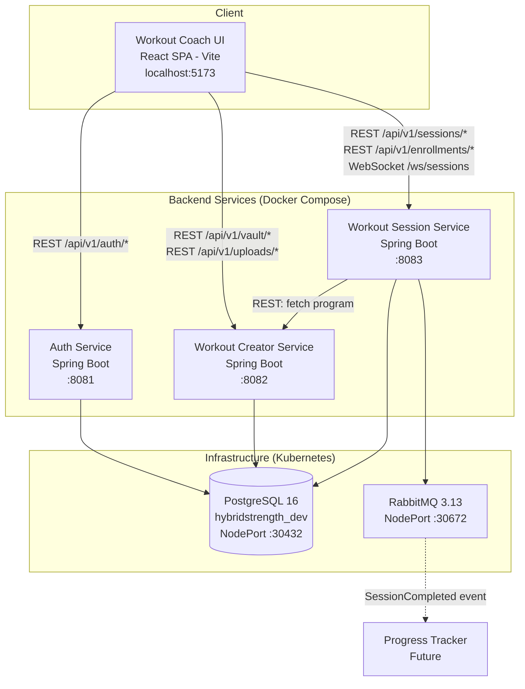
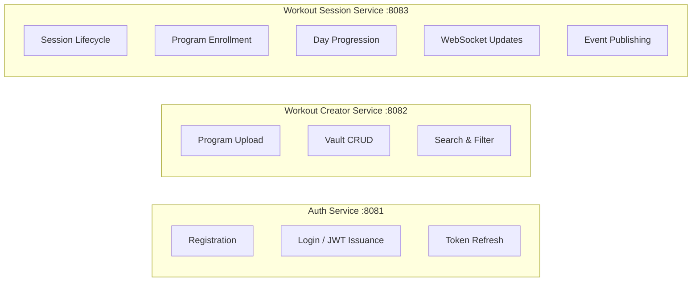
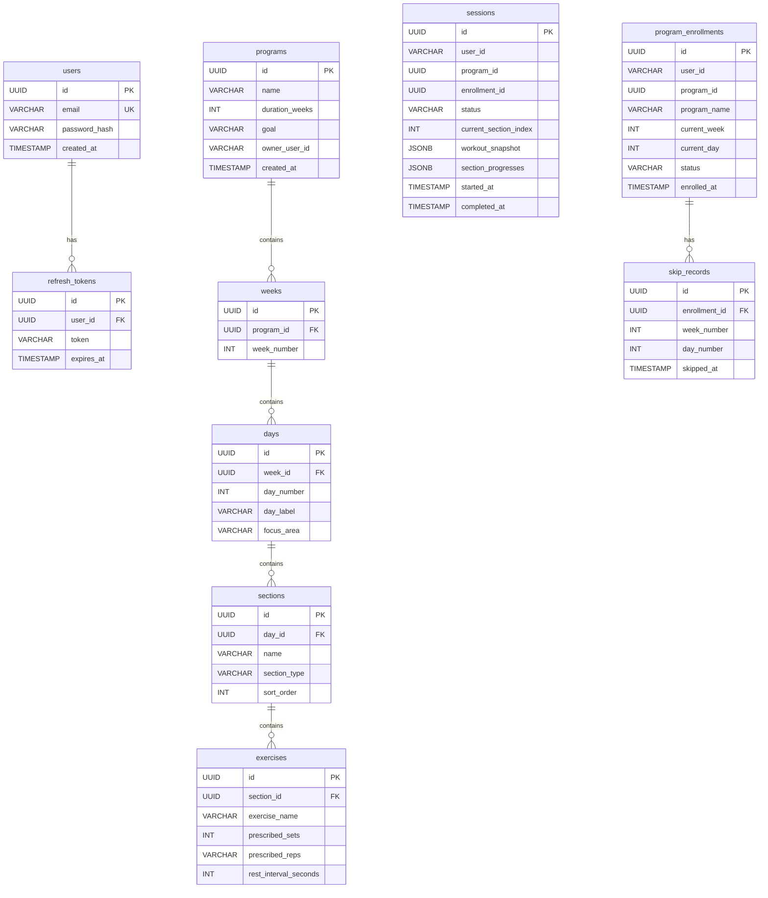
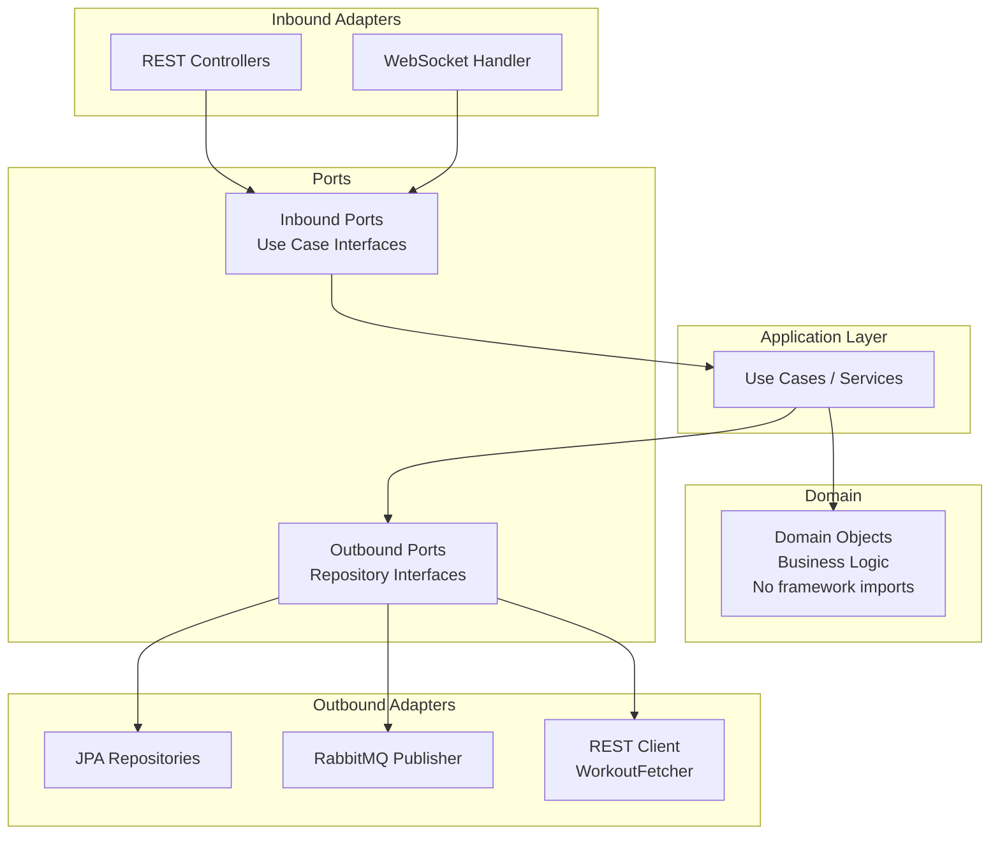
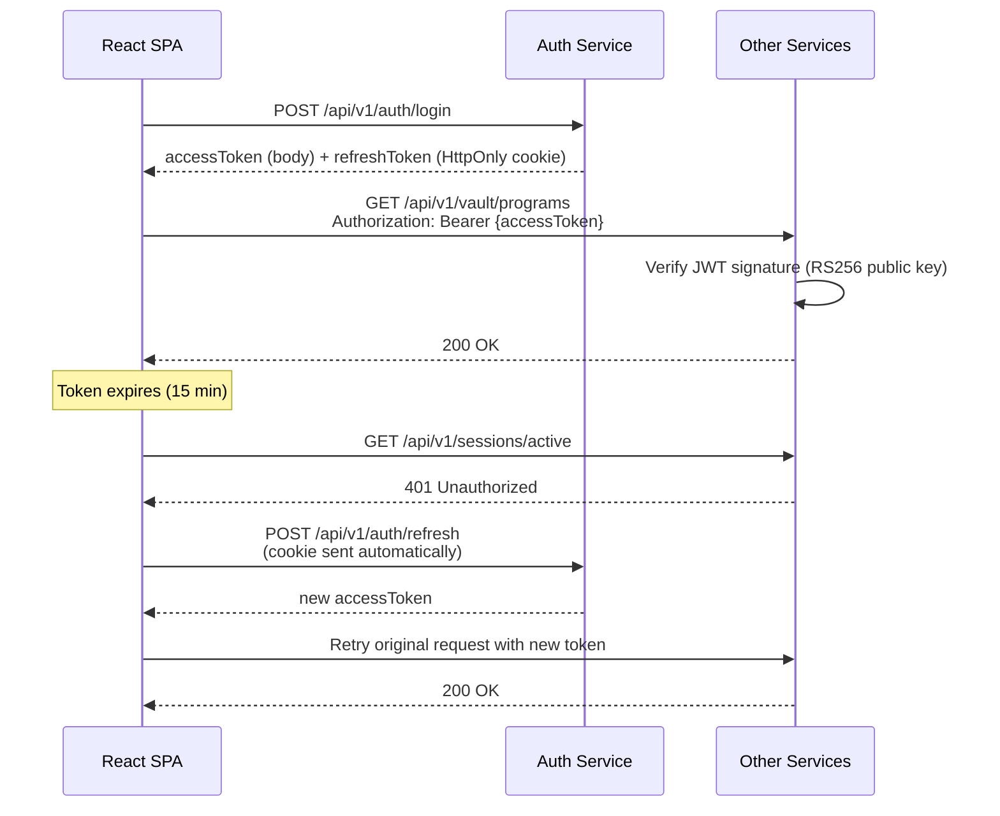
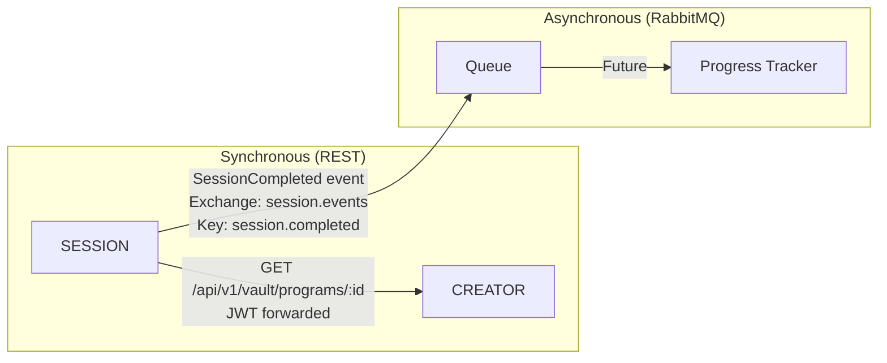
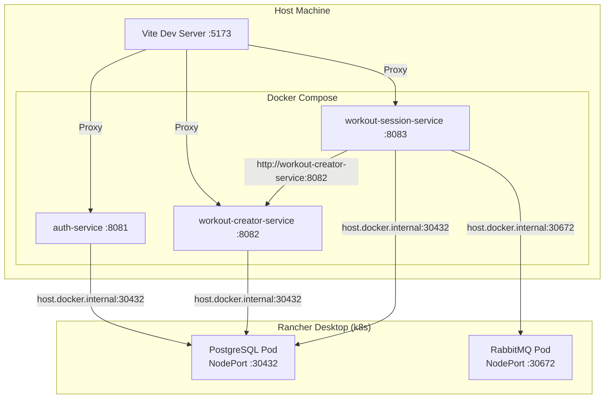

# HybridStrength — Architecture Diagrams

## System Architecture

## Service Responsibilities

## Database Schema (Shared: hybridstrength_dev)

## Hexagonal Architecture (Per Service)

## Authentication Flow

## Inter-Service Communication

## Deployment Topology (Local Dev)

