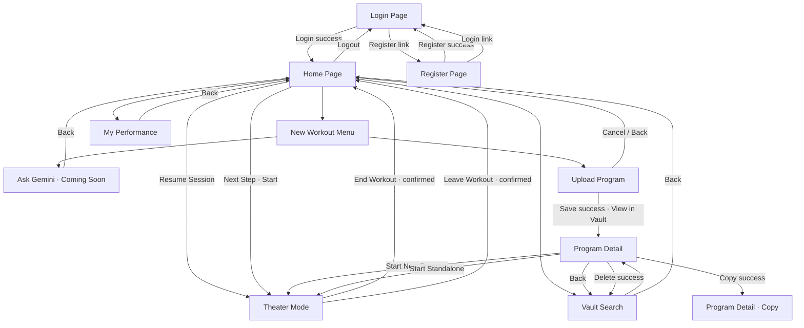
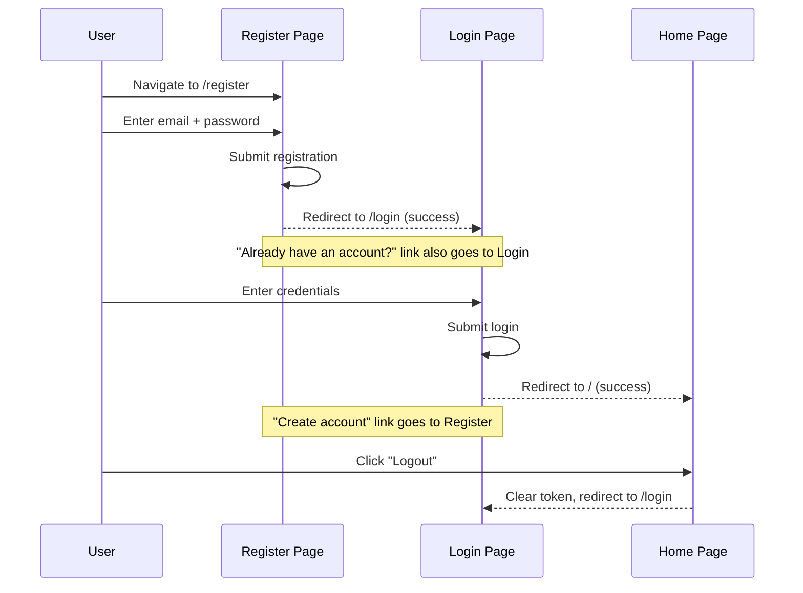
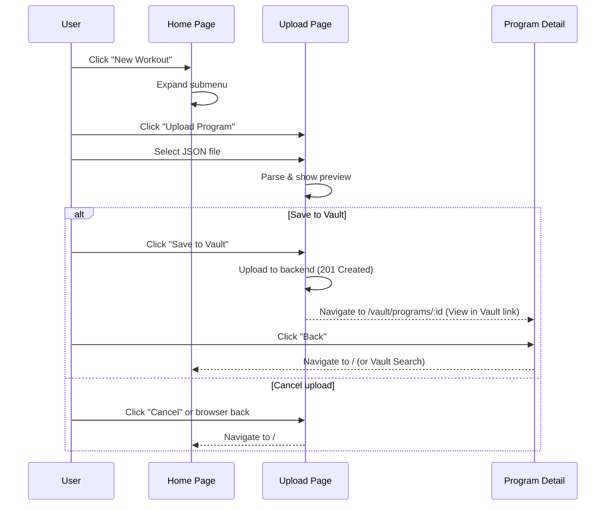
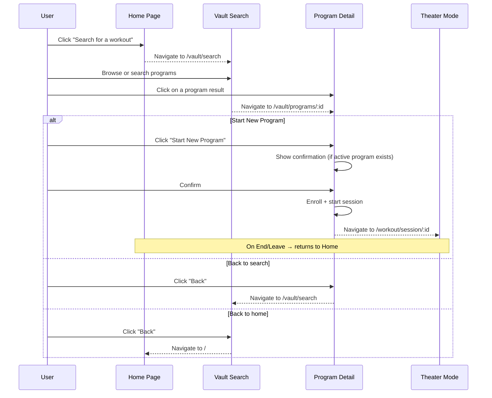
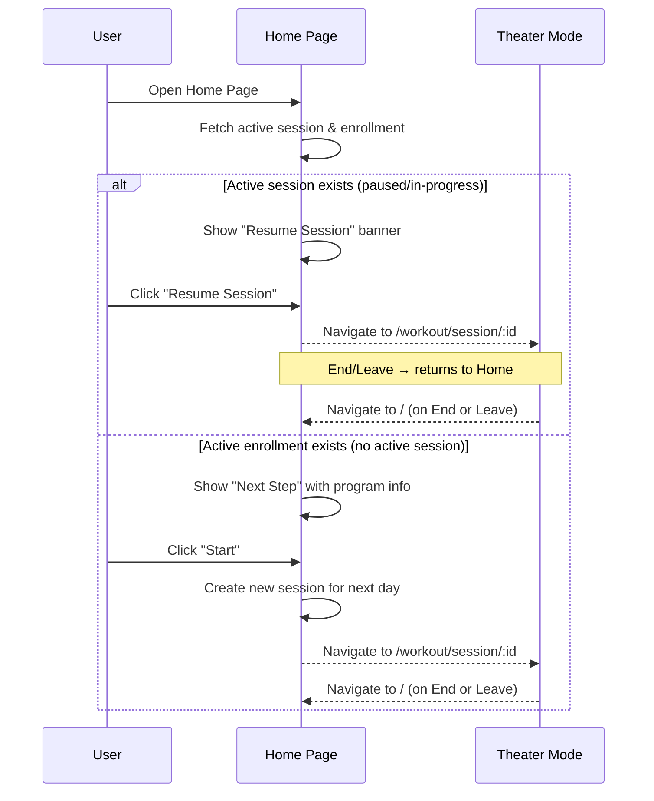
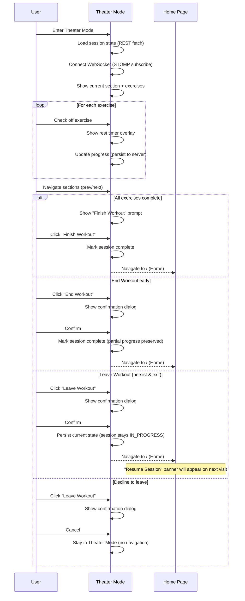
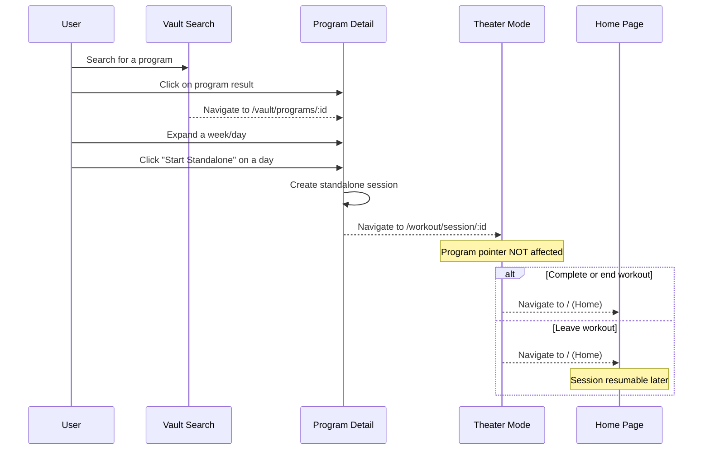
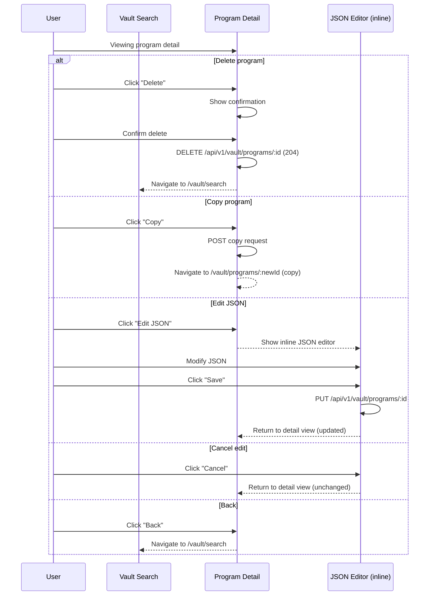

# HybridStrength — Screen Flows

## Navigation Map

## Detailed Screen Flows

### Flow 1: Registration & Login

### Flow 2: Upload a Program

### Flow 3: Start a Program from Vault

### Flow 4: Resume or Continue a Program

### Flow 5: Theater Mode Workout

### Flow 6: Start Standalone Workout from Vault

### Flow 7: Program Detail Actions (Delete, Copy, Edit)

## Page Inventory

| Route | Page | Purpose |
|-------|------|---------|
| `/login` | Login | Email/password authentication |
| `/register` | Register | New account creation |
| `/` | Home | Dashboard with Next Step, Resume, navigation |
| `/upload` | Upload Program | JSON file upload with preview |
| `/vault/search` | Vault Search | Browse and search saved programs |
| `/vault/programs/:id` | Program Detail | View program structure, start/enroll actions |
| `/workout/session/:sessionId` | Theater Mode | Active workout execution UI |
| `/new-workout` | Coming Soon | Placeholder for AI generation |
| `/my-performance` | Coming Soon | Placeholder for analytics |
